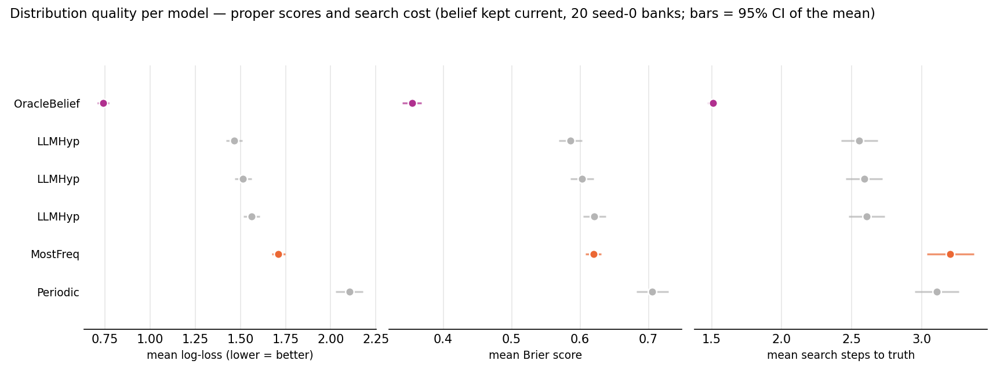
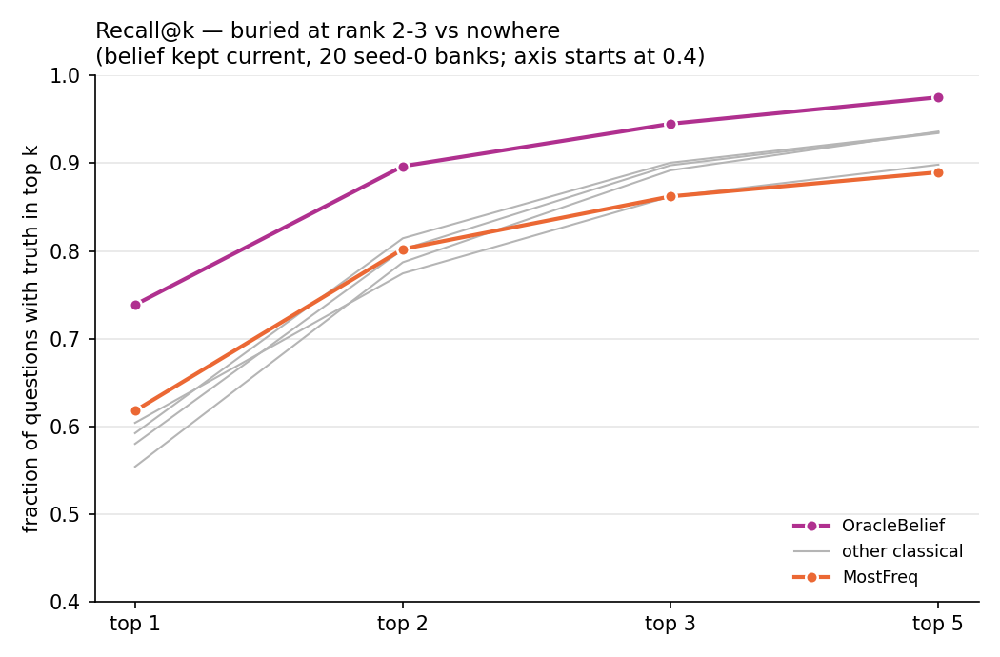
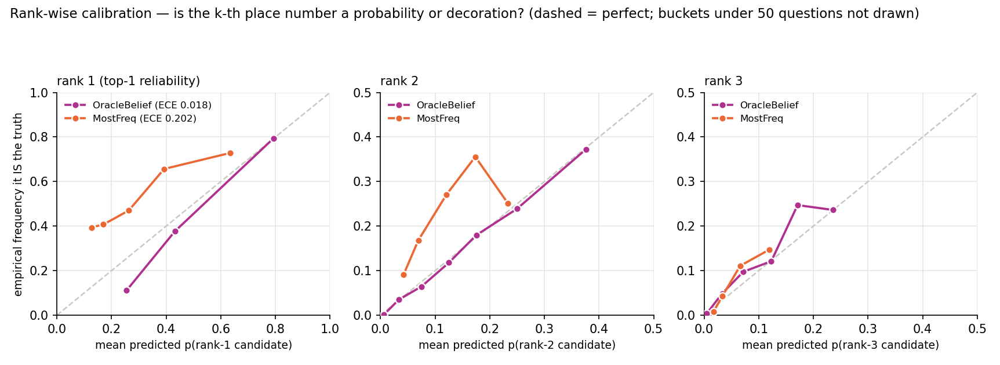

# Distribution quality: are the probabilities right, and is the tail useful

Generated 2026-09-12T20:11:22+00:00 at commit `c11eee99b277` (dirty tree) by `python -m baselines.distribution_metrics`. 2 seed-0 fleet banks, belief kept current, every question scored on the FULL predicted distribution, not just the argmax. Log-loss uses the protocol's 0.001 floor. Search steps = walk receptacles in belief order until the truth is found (what a sequential search pays). ECE = expected calibration error of the top-1 confidence, 10 equal-width buckets.

Ranks here are taken by `(-probability, receptacle_id)`, a deterministic tie-break, while a model's own `argmax` breaks ties with its seeded generator. The two agree on >99.9% of questions for every model except **Markov1** (3.9% ties at the top), which is why its `R@1` sits below its `top-1`; read its rank-based columns — R@k and search steps — as one arbitrary tie-break among many, not as a property of the model.

Confidence intervals are on the figures but narrower than the markers at n=45 000; the ranking of the models is not in question, and the tables carry the numbers.

| model | n | top-1 | log-loss | Brier | search steps | R@1 | R@2 | R@3 | R@5 | ECE |
|---|---|---|---|---|---|---|---|---|---|---|
| OracleBelief | 4500 | 0.739 | 0.739 | 0.354 | 1.51 | 0.739 | 0.897 | 0.945 | 0.975 | 0.018 |
| LLMHyp | 4500 | 0.592 | 1.466 | 0.586 | 2.55 | 0.592 | 0.814 | 0.901 | 0.935 | 0.073 |
| LLMHyp | 4500 | 0.580 | 1.515 | 0.603 | 2.59 | 0.580 | 0.802 | 0.898 | 0.934 | 0.086 |
| LLMHyp | 4500 | 0.554 | 1.562 | 0.621 | 2.60 | 0.554 | 0.787 | 0.892 | 0.936 | 0.086 |
| MostFreq | 4500 | 0.618 | 1.710 | 0.619 | 3.20 | 0.618 | 0.802 | 0.862 | 0.890 | 0.202 |
| Periodic | 4500 | 0.604 | 2.104 | 0.706 | 3.11 | 0.604 | 0.774 | 0.862 | 0.898 | 0.285 |

`per_question.csv.gz` has one row per (model, question) with p(truth), Brier, the truth's rank, and the top-3 probabilities; `metrics.csv` the aggregate rows above.
