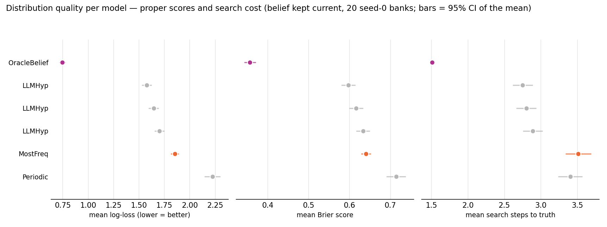
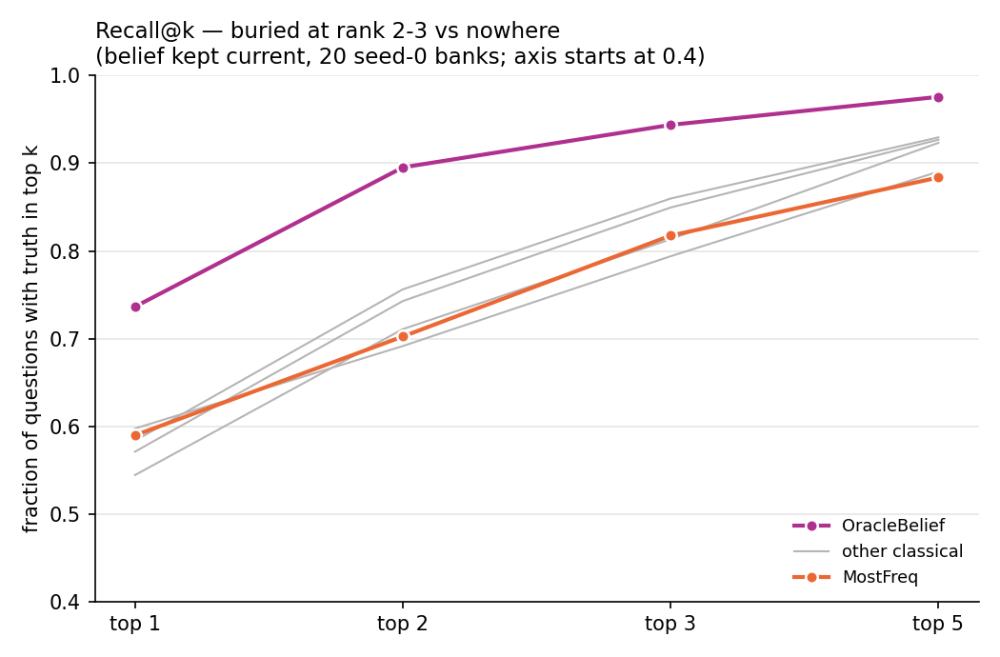
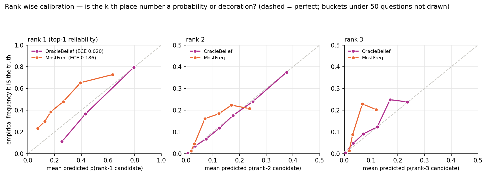

# Distribution quality: are the probabilities right, and is the tail useful

Generated 2026-09-12T08:09:12+00:00 at commit `c11eee99b277` (dirty tree) by `python -m baselines.distribution_metrics`. 2 seed-0 fleet banks, belief kept current, every question scored on the FULL predicted distribution, not just the argmax. Log-loss uses the protocol's 0.001 floor. Search steps = walk receptacles in belief order until the truth is found (what a sequential search pays). ECE = expected calibration error of the top-1 confidence, 10 equal-width buckets.

Ranks here are taken by `(-probability, receptacle_id)`, a deterministic tie-break, while a model's own `argmax` breaks ties with its seeded generator. The two agree on >99.9% of questions for every model except **Markov1** (3.9% ties at the top), which is why its `R@1` sits below its `top-1`; read its rank-based columns — R@k and search steps — as one arbitrary tie-break among many, not as a property of the model.

Confidence intervals are on the figures but narrower than the markers at n=45 000; the ranking of the models is not in question, and the tables carry the numbers.

| model | n | top-1 | log-loss | Brier | search steps | R@1 | R@2 | R@3 | R@5 | ECE |
|---|---|---|---|---|---|---|---|---|---|---|
| OracleBelief | 4500 | 0.736 | 0.745 | 0.356 | 1.51 | 0.736 | 0.895 | 0.944 | 0.976 | 0.020 |
| LLMHyp | 4500 | 0.584 | 1.575 | 0.597 | 2.75 | 0.584 | 0.756 | 0.860 | 0.930 | 0.069 |
| LLMHyp | 4500 | 0.571 | 1.644 | 0.616 | 2.80 | 0.571 | 0.743 | 0.850 | 0.927 | 0.081 |
| LLMHyp | 4500 | 0.544 | 1.700 | 0.633 | 2.89 | 0.544 | 0.711 | 0.813 | 0.923 | 0.084 |
| MostFreq | 4500 | 0.590 | 1.852 | 0.640 | 3.51 | 0.590 | 0.702 | 0.818 | 0.884 | 0.186 |
| Periodic | 4500 | 0.597 | 2.222 | 0.714 | 3.40 | 0.598 | 0.692 | 0.794 | 0.890 | 0.282 |

`per_question.csv.gz` has one row per (model, question) with p(truth), Brier, the truth's rank, and the top-3 probabilities; `metrics.csv` the aggregate rows above.
