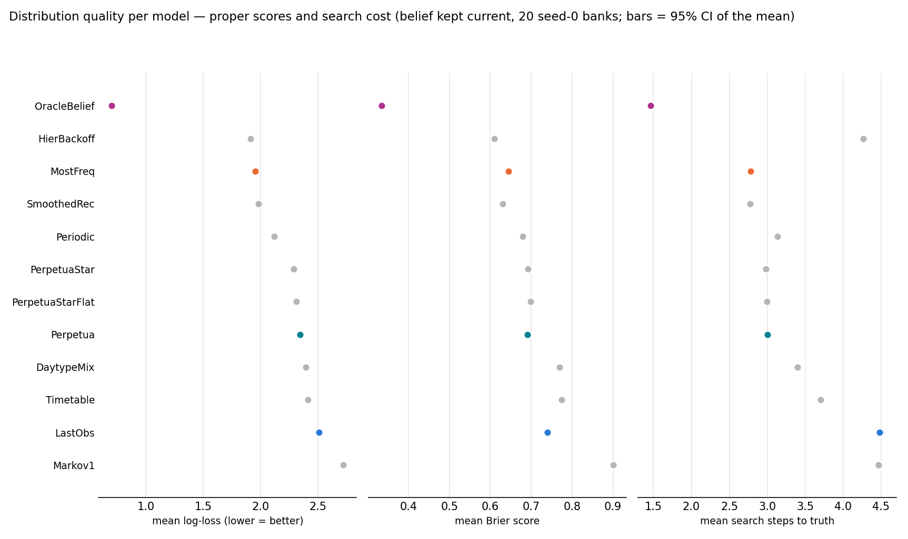
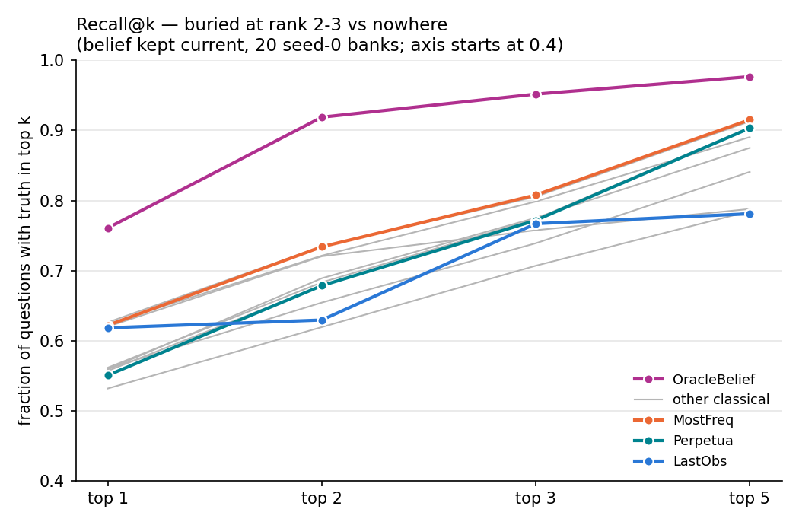
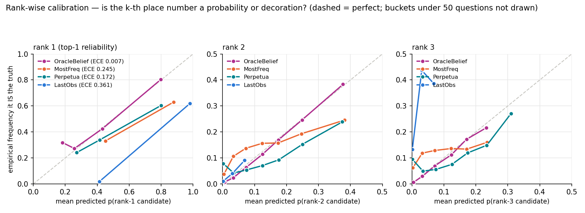

# Distribution quality: are the probabilities right, and is the tail useful

Generated 2026-09-10T06:56:40+00:00 at commit `12f88ce7782b` (dirty tree) by `python -m baselines.distribution_metrics`. 20 seed-0 fleet banks, belief kept current, every question scored on the FULL predicted distribution, not just the argmax. Log-loss uses the protocol's 0.001 floor. Search steps = walk receptacles in belief order until the truth is found (what a sequential search pays). ECE = expected calibration error of the top-1 confidence, 10 equal-width buckets.

Ranks here are taken by `(-probability, receptacle_id)`, a deterministic tie-break, while a model's own `argmax` breaks ties with its seeded generator. The two agree on >99.9% of questions for every model except **Markov1** (3.9% ties at the top), which is why its `R@1` sits below its `top-1`; read its rank-based columns — R@k and search steps — as one arbitrary tie-break among many, not as a property of the model.

Confidence intervals are on the figures but narrower than the markers at n=45 000; the ranking of the models is not in question, and the tables carry the numbers.

| model | n | top-1 | log-loss | Brier | search steps | R@1 | R@2 | R@3 | R@5 | ECE |
|---|---|---|---|---|---|---|---|---|---|---|
| OracleBelief | 45000 | 0.761 | 0.700 | 0.335 | 1.47 | 0.761 | 0.919 | 0.952 | 0.977 | 0.007 |
| HierBackoff | 45000 | 0.620 | 1.911 | 0.609 | 4.26 | 0.620 | 0.720 | 0.758 | 0.788 | 0.171 |
| MostFreq | 45000 | 0.622 | 1.952 | 0.645 | 2.78 | 0.622 | 0.734 | 0.808 | 0.915 | 0.245 |
| SmoothedRec | 45000 | 0.626 | 1.980 | 0.631 | 2.77 | 0.626 | 0.734 | 0.805 | 0.913 | 0.247 |
| Periodic | 45000 | 0.624 | 2.121 | 0.679 | 3.13 | 0.624 | 0.721 | 0.799 | 0.891 | 0.311 |
| PerpetuaStar | 45000 | 0.562 | 2.288 | 0.693 | 2.98 | 0.562 | 0.683 | 0.774 | 0.904 | 0.202 |
| PerpetuaStarFlat | 45000 | 0.557 | 2.315 | 0.698 | 3.00 | 0.557 | 0.678 | 0.771 | 0.904 | 0.201 |
| Perpetua | 45000 | 0.551 | 2.347 | 0.691 | 3.01 | 0.551 | 0.679 | 0.772 | 0.903 | 0.172 |
| DaytypeMix | 45000 | 0.559 | 2.394 | 0.770 | 3.40 | 0.559 | 0.689 | 0.775 | 0.875 | 0.337 |
| Timetable | 45000 | 0.560 | 2.416 | 0.775 | 3.70 | 0.560 | 0.654 | 0.739 | 0.841 | 0.334 |
| LastObs | 45000 | 0.618 | 2.509 | 0.740 | 4.48 | 0.618 | 0.630 | 0.767 | 0.781 | 0.361 |
| Markov1 | 45000 | 0.570 | 2.721 | 0.900 | 4.47 | 0.532 | 0.619 | 0.707 | 0.785 | 0.489 |

`per_question.csv.gz` has one row per (model, question) with p(truth), Brier, the truth's rank, and the top-3 probabilities; `metrics.csv` the aggregate rows above.
