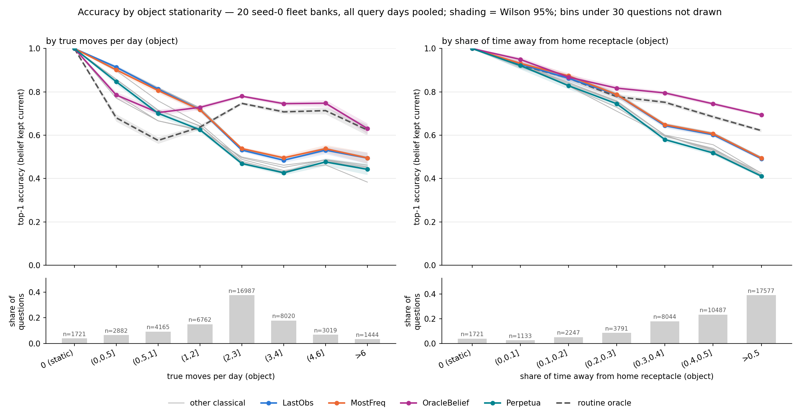
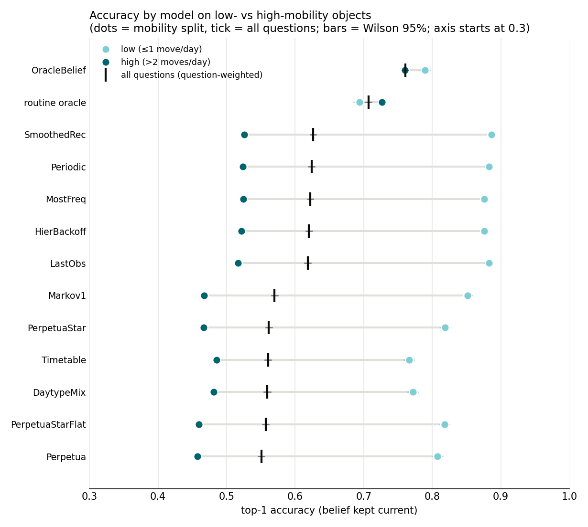

# Accuracy by object stationarity

Generated 2026-09-10T05:01:40+00:00 at commit `230a2701c4d8` (dirty tree) by `python -m baselines.stationarity_figure`. 20 seed-0 fleet banks, belief kept current, all query days pooled, questions pooled across homes. Each object is binned by a ground-truth property of its own trajectory; the columns of every table are bins of that property, so a model's curve shows how it does on objects that move that much. Bins under 30 questions are blank.

The same data collapsed to one row per model: accuracy on low-mobility objects (≤1 true move/day, light dot) vs high-mobility ones (>2, dark dot), black tick = all questions, question-weighted. The tables below are the data view of both figures.

## By true moves per day (object)

| model | 0 (static) | (0,0.5] | (0.5,1] | (1,2] | (2,3] | (3,4] | (4,6] | >6 | all (question-weighted) | mean over bins |
|---|---|---|---|---|---|---|---|---|---|---|
| n | 1721 | 2882 | 4165 | 6762 | 16987 | 8020 | 3019 | 1444 | 45000 | |
| DaytypeMix | 1.000 | 0.787 | 0.667 | 0.626 | 0.496 | 0.451 | 0.486 | 0.454 | 0.559 | 0.621 |
| HierBackoff | 1.000 | 0.902 | 0.806 | 0.718 | 0.534 | 0.493 | 0.540 | 0.492 | 0.620 | 0.686 |
| LastObs | 1.000 | 0.914 | 0.813 | 0.718 | 0.531 | 0.485 | 0.531 | 0.494 | 0.618 | 0.686 |
| Markov1 | 1.000 | 0.898 | 0.759 | 0.654 | 0.489 | 0.437 | 0.463 | 0.384 | 0.570 | 0.635 |
| MostFreq | 1.000 | 0.902 | 0.806 | 0.717 | 0.538 | 0.496 | 0.538 | 0.495 | 0.622 | 0.687 |
| OracleBelief | 1.000 | 0.786 | 0.704 | 0.728 | 0.780 | 0.746 | 0.748 | 0.631 | 0.761 | 0.765 |
| Periodic | 1.000 | 0.910 | 0.815 | 0.724 | 0.538 | 0.495 | 0.535 | 0.492 | 0.624 | 0.689 |
| Perpetua | 1.000 | 0.847 | 0.701 | 0.625 | 0.469 | 0.427 | 0.477 | 0.443 | 0.551 | 0.624 |
| PerpetuaStar | 1.000 | 0.858 | 0.716 | 0.643 | 0.480 | 0.430 | 0.488 | 0.462 | 0.562 | 0.635 |
| PerpetuaStarFlat | 1.000 | 0.857 | 0.715 | 0.642 | 0.474 | 0.423 | 0.479 | 0.450 | 0.557 | 0.630 |
| SmoothedRec | 1.000 | 0.916 | 0.819 | 0.727 | 0.540 | 0.496 | 0.539 | 0.499 | 0.626 | 0.692 |
| Timetable | 1.000 | 0.771 | 0.666 | 0.622 | 0.500 | 0.462 | 0.485 | 0.443 | 0.560 | 0.619 |
| routine oracle | 1.000 | 0.680 | 0.576 | 0.637 | 0.747 | 0.708 | 0.713 | 0.624 | 0.707 | 0.711 |

## By share of time away from home receptacle (object)

| model | 0 (static) | (0,0.1] | (0.1,0.2] | (0.2,0.3] | (0.3,0.4] | (0.4,0.5] | >0.5 | all (question-weighted) | mean over bins |
|---|---|---|---|---|---|---|---|---|---|
| n | 1721 | 1133 | 2247 | 3791 | 8044 | 10487 | 17577 | 45000 | |
| DaytypeMix | 1.000 | 0.926 | 0.826 | 0.729 | 0.594 | 0.539 | 0.418 | 0.559 | 0.719 |
| HierBackoff | 1.000 | 0.933 | 0.872 | 0.787 | 0.644 | 0.604 | 0.493 | 0.620 | 0.762 |
| LastObs | 1.000 | 0.928 | 0.862 | 0.787 | 0.644 | 0.602 | 0.491 | 0.618 | 0.759 |
| Markov1 | 1.000 | 0.919 | 0.844 | 0.753 | 0.601 | 0.556 | 0.425 | 0.570 | 0.728 |
| MostFreq | 1.000 | 0.931 | 0.874 | 0.787 | 0.648 | 0.606 | 0.494 | 0.622 | 0.763 |
| OracleBelief | 1.000 | 0.950 | 0.868 | 0.817 | 0.795 | 0.745 | 0.694 | 0.761 | 0.838 |
| Periodic | 1.000 | 0.928 | 0.867 | 0.791 | 0.652 | 0.607 | 0.498 | 0.624 | 0.763 |
| Perpetua | 1.000 | 0.921 | 0.829 | 0.745 | 0.580 | 0.518 | 0.411 | 0.551 | 0.715 |
| PerpetuaStar | 1.000 | 0.927 | 0.842 | 0.759 | 0.600 | 0.530 | 0.418 | 0.562 | 0.725 |
| PerpetuaStarFlat | 1.000 | 0.924 | 0.837 | 0.755 | 0.599 | 0.524 | 0.412 | 0.557 | 0.721 |
| SmoothedRec | 1.000 | 0.931 | 0.876 | 0.793 | 0.652 | 0.611 | 0.499 | 0.626 | 0.766 |
| Timetable | 1.000 | 0.920 | 0.827 | 0.711 | 0.597 | 0.535 | 0.426 | 0.560 | 0.716 |
| routine oracle | 1.000 | 0.924 | 0.863 | 0.778 | 0.752 | 0.685 | 0.621 | 0.707 | 0.803 |

`cells.csv` has the same counts per household; `objects.csv` lists both measures per object.
