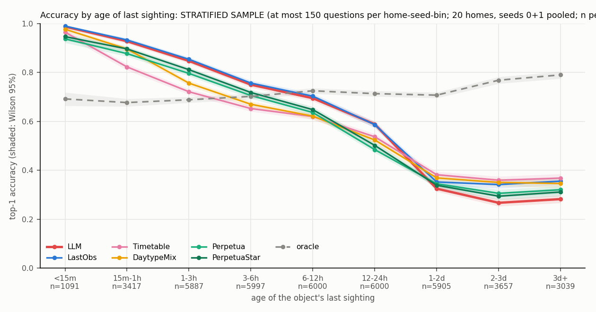
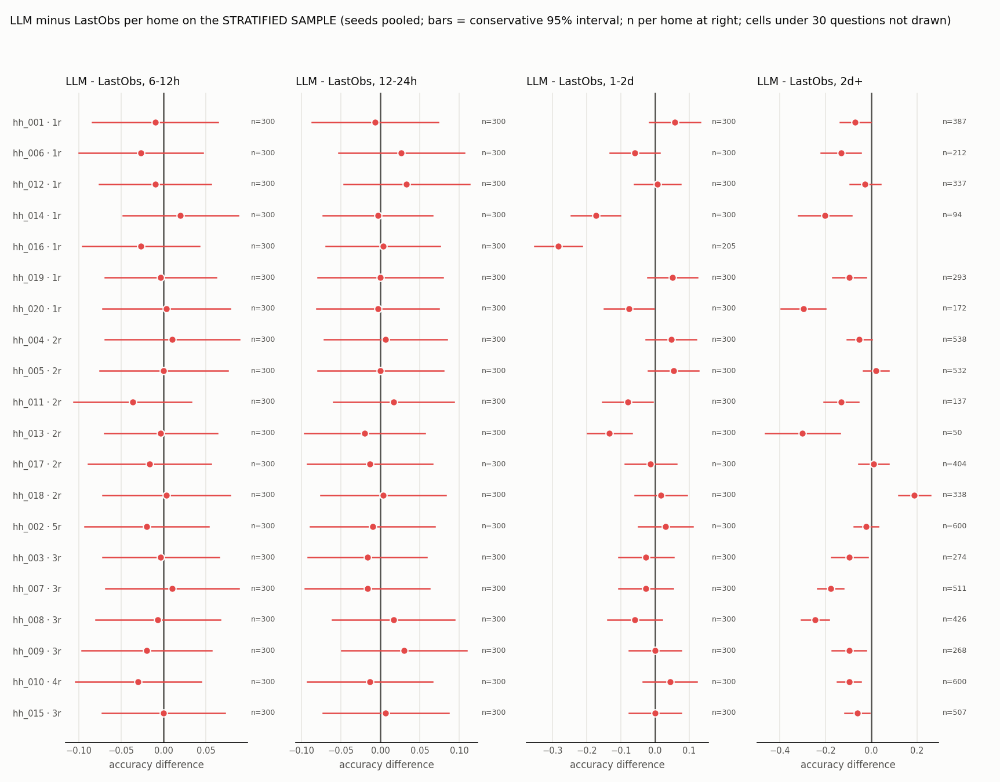
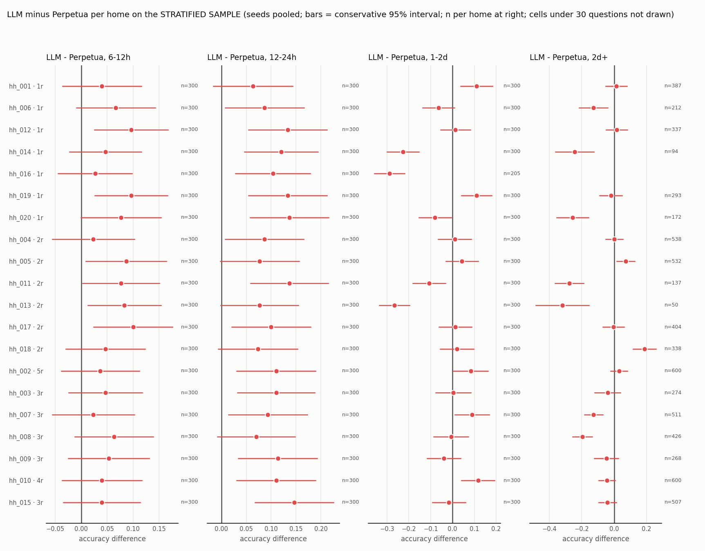
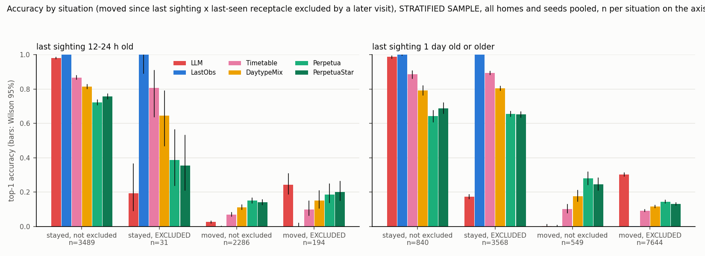

# Naive LLM belief floor (local vLLM) on a stratified sample of the 1x banks

Generated 2026-09-08 18:22 UTC, commit 37c2a3c3b8 (dirty).

**Read every number here as computed on a STRATIFIED SAMPLE**: at most 150 questions per (home, seed, age-of-last-sighting bin), bins with fewer keep all of theirs; n = 40993 of 90000 questions over 20 homes x seeds [0, 1] (28-day banks, 1x patrol rate, banks/baselines/sweep/visits6). Short-age bins are heavily subsampled, long-age bins barely; pooled-over-bins accuracies are therefore NOT comparable to the rate sweep's, per-bin ones are. Every comparator is scored on exactly the same sampled questions. Cells under 30 questions are masked.

LLM: Qwen/Qwen3.8-27B, one vLLM instance, tensor parallel 1, greedy, seed 0, guided JSON True; prompt v1 (no reasoning, no examples, no routine summary; newest 60 sightings; negative evidence since the last sighting; answers ranked, geometric weights 0.5/0.25/... renormalized for log-loss). Fallback on a failed parse or an off-list name is the LastObs answer.

## Sample composition

| age of last sighting | questions in the banks | sampled | share sampled |
|---|---|---|---|
| <15m | 1091 | 1091 | 1.00 |
| 15m-1h | 3423 | 3417 | 1.00 |
| 1-3h | 7882 | 5887 | 0.75 |
| 3-6h | 9713 | 5997 | 0.62 |
| 6-12h | 16019 | 6000 | 0.37 |
| 12-24h | 31556 | 6000 | 0.19 |
| 1-2d | 12975 | 5905 | 0.46 |
| 2-3d | 3884 | 3657 | 0.94 |
| 3d+ | 3457 | 3039 | 0.88 |

## LLM output handling

- LLM questions scored: 40993; answered by the LLM: 40956; fell back to LastObs: 37 (0.09%), of which 0 had no completion at all.
- Completion parse status over the 40073 distinct prompts: {'ok': 40040, 'off_list': 33} (failure rate 0.08%); truncated: 0; mean ranking length 5.00.
- p_top (logged, not used): mean 0.80 when the top answer was right (n=25194), 0.56 when wrong (n=15799).

## 1. Accuracy by age of last sighting

### all homes (20 homes, seeds 0 and 1 pooled; stratified sample, n per row)

| age of last sighting | n (sample) | LLM | LastObs | Timetable | DaytypeMix | Perpetua | PerpetuaStar | oracle |
|---|---|---|---|---|---|---|---|---|
| <15m | 1091 | 0.988 | 0.990 | 0.965 | 0.977 | 0.938 | 0.947 | 0.692 |
| 15m-1h | 3417 | 0.928 | 0.933 | 0.823 | 0.896 | 0.877 | 0.897 | 0.677 |
| 1-3h | 5887 | 0.847 | 0.854 | 0.721 | 0.757 | 0.796 | 0.812 | 0.689 |
| 3-6h | 5997 | 0.750 | 0.757 | 0.653 | 0.670 | 0.706 | 0.718 | 0.702 |
| 6-12h | 6000 | 0.695 | 0.703 | 0.620 | 0.622 | 0.636 | 0.648 | 0.725 |
| 12-24h | 6000 | 0.589 | 0.587 | 0.537 | 0.524 | 0.485 | 0.502 | 0.714 |
| 1-2d | 5905 | 0.325 | 0.352 | 0.382 | 0.369 | 0.345 | 0.339 | 0.708 |
| 2-3d | 3657 | 0.267 | 0.342 | 0.360 | 0.351 | 0.306 | 0.294 | 0.769 |
| 3d+ | 3039 | 0.282 | 0.356 | 0.368 | 0.346 | 0.321 | 0.311 | 0.790 |

### 1-resident homes (7 homes, seeds 0 and 1 pooled; stratified sample, n per row)

| age of last sighting | n (sample) | LLM | LastObs | Timetable | DaytypeMix | Perpetua | PerpetuaStar | oracle |
|---|---|---|---|---|---|---|---|---|
| <15m | 450 | 0.982 | 0.982 | 0.958 | 0.976 | 0.929 | 0.936 | 0.682 |
| 15m-1h | 1527 | 0.919 | 0.928 | 0.790 | 0.887 | 0.857 | 0.876 | 0.675 |
| 1-3h | 2100 | 0.867 | 0.875 | 0.691 | 0.762 | 0.815 | 0.829 | 0.692 |
| 3-6h | 2100 | 0.775 | 0.782 | 0.639 | 0.690 | 0.720 | 0.740 | 0.702 |
| 6-12h | 2100 | 0.728 | 0.735 | 0.622 | 0.629 | 0.663 | 0.671 | 0.717 |
| 12-24h | 2100 | 0.595 | 0.588 | 0.513 | 0.512 | 0.484 | 0.490 | 0.729 |
| 1-2d | 2005 | 0.250 | 0.308 | 0.349 | 0.339 | 0.300 | 0.282 | 0.747 |
| 2-3d | 976 | 0.234 | 0.381 | 0.397 | 0.369 | 0.325 | 0.296 | 0.769 |
| 3d+ | 535 | 0.293 | 0.333 | 0.348 | 0.323 | 0.314 | 0.305 | 0.776 |

### 2-resident homes (6 homes, seeds 0 and 1 pooled; stratified sample, n per row)

| age of last sighting | n (sample) | LLM | LastObs | Timetable | DaytypeMix | Perpetua | PerpetuaStar | oracle |
|---|---|---|---|---|---|---|---|---|
| <15m | 310 | 0.994 | 0.994 | 0.971 | 0.984 | 0.916 | 0.948 | 0.710 |
| 15m-1h | 945 | 0.956 | 0.958 | 0.885 | 0.911 | 0.916 | 0.927 | 0.703 |
| 1-3h | 1768 | 0.847 | 0.852 | 0.764 | 0.755 | 0.800 | 0.803 | 0.685 |
| 3-6h | 1800 | 0.756 | 0.763 | 0.696 | 0.686 | 0.708 | 0.707 | 0.700 |
| 6-12h | 1800 | 0.682 | 0.689 | 0.639 | 0.631 | 0.613 | 0.634 | 0.768 |
| 12-24h | 1800 | 0.583 | 0.584 | 0.553 | 0.548 | 0.491 | 0.511 | 0.713 |
| 1-2d | 1800 | 0.296 | 0.314 | 0.353 | 0.338 | 0.343 | 0.336 | 0.675 |
| 2-3d | 916 | 0.310 | 0.269 | 0.287 | 0.278 | 0.272 | 0.248 | 0.749 |
| 3d+ | 1083 | 0.326 | 0.344 | 0.370 | 0.327 | 0.317 | 0.300 | 0.800 |

### 3+-resident homes (7 homes, seeds 0 and 1 pooled; stratified sample, n per row)

| age of last sighting | n (sample) | LLM | LastObs | Timetable | DaytypeMix | Perpetua | PerpetuaStar | oracle |
|---|---|---|---|---|---|---|---|---|
| <15m | 331 | 0.991 | 0.997 | 0.970 | 0.973 | 0.970 | 0.961 | 0.689 |
| 15m-1h | 945 | 0.914 | 0.917 | 0.815 | 0.896 | 0.872 | 0.899 | 0.656 |
| 1-3h | 2019 | 0.827 | 0.835 | 0.715 | 0.752 | 0.774 | 0.801 | 0.688 |
| 3-6h | 2097 | 0.721 | 0.726 | 0.630 | 0.638 | 0.690 | 0.706 | 0.705 |
| 6-12h | 2100 | 0.673 | 0.683 | 0.602 | 0.606 | 0.630 | 0.637 | 0.697 |
| 12-24h | 2100 | 0.588 | 0.588 | 0.548 | 0.515 | 0.480 | 0.506 | 0.699 |
| 1-2d | 2100 | 0.422 | 0.428 | 0.438 | 0.424 | 0.389 | 0.395 | 0.698 |
| 2-3d | 1765 | 0.263 | 0.358 | 0.377 | 0.378 | 0.313 | 0.317 | 0.778 |
| 3d+ | 1421 | 0.245 | 0.373 | 0.374 | 0.369 | 0.326 | 0.322 | 0.789 |

## 2. Log-loss by age of last sighting (all homes; eps 1e-3; oracle has no distribution)

| age of last sighting | n (sample) | LLM | LastObs | Timetable | DaytypeMix | Perpetua | PerpetuaStar |
|---|---|---|---|---|---|---|---|
| <15m | 1091 | 0.726 | 0.086 | 0.201 | 0.148 | 0.340 | 0.306 |
| 15m-1h | 3417 | 0.890 | 0.476 | 0.948 | 0.618 | 0.710 | 0.613 |
| 1-3h | 5887 | 1.081 | 1.021 | 1.594 | 1.377 | 1.177 | 1.075 |
| 3-6h | 5997 | 1.285 | 1.690 | 1.918 | 1.895 | 1.608 | 1.524 |
| 6-12h | 6000 | 1.443 | 2.056 | 2.142 | 2.132 | 1.942 | 1.873 |
| 12-24h | 6000 | 1.712 | 2.788 | 2.560 | 2.550 | 2.453 | 2.401 |
| 1-2d | 5905 | 2.389 | 3.946 | 3.216 | 3.314 | 3.551 | 3.509 |
| 2-3d | 3657 | 2.315 | 4.036 | 3.405 | 3.565 | 3.985 | 4.051 |
| 3d+ | 3039 | 2.290 | 3.962 | 3.540 | 3.668 | 4.102 | 4.117 |

## 3. Paired per-home-seed comparisons (LLM minus comparator; a pair counts when the home-seed cell has >= 30 sampled questions)

| bin | pair | home-seed pairs | LLM wins | LLM losses | median delta | mean delta |
|---|---|---|---|---|---|---|
| 6-12h | LLM - LastObs | 40 | 10 | 21 | -0.007 | -0.008 |
| 6-12h | LLM - Timetable | 40 | 39 | 0 | +0.073 | +0.075 |
| 6-12h | LLM - DaytypeMix | 40 | 39 | 1 | +0.073 | +0.073 |
| 6-12h | LLM - Perpetua | 40 | 39 | 0 | +0.057 | +0.059 |
| 6-12h | LLM - PerpetuaStar | 40 | 37 | 2 | +0.040 | +0.047 |
| 6-12h | LLM - oracle | 40 | 15 | 22 | -0.010 | -0.030 |
| 12-24h | LLM - LastObs | 40 | 18 | 16 | +0.000 | +0.002 |
| 12-24h | LLM - Timetable | 40 | 35 | 1 | +0.033 | +0.051 |
| 12-24h | LLM - DaytypeMix | 40 | 37 | 1 | +0.063 | +0.065 |
| 12-24h | LLM - Perpetua | 40 | 40 | 0 | +0.107 | +0.104 |
| 12-24h | LLM - PerpetuaStar | 40 | 39 | 0 | +0.087 | +0.087 |
| 12-24h | LLM - oracle | 40 | 5 | 35 | -0.123 | -0.125 |
| 1-2d | LLM - LastObs | 40 | 17 | 22 | -0.020 | -0.031 |
| 1-2d | LLM - Timetable | 40 | 12 | 26 | -0.047 | -0.063 |
| 1-2d | LLM - DaytypeMix | 40 | 12 | 25 | -0.030 | -0.049 |
| 1-2d | LLM - Perpetua | 40 | 18 | 20 | -0.003 | -0.024 |
| 1-2d | LLM - PerpetuaStar | 40 | 19 | 20 | -0.003 | -0.018 |
| 1-2d | LLM - oracle | 40 | 0 | 40 | -0.380 | -0.386 |
| 2d+ | LLM - LastObs | 37 | 7 | 30 | -0.085 | -0.095 |
| 2d+ | LLM - Timetable | 37 | 5 | 32 | -0.117 | -0.110 |
| 2d+ | LLM - DaytypeMix | 37 | 7 | 30 | -0.090 | -0.095 |
| 2d+ | LLM - Perpetua | 37 | 11 | 23 | -0.034 | -0.071 |
| 2d+ | LLM - PerpetuaStar | 37 | 13 | 23 | -0.035 | -0.053 |
| 2d+ | LLM - oracle | 37 | 0 | 37 | -0.519 | -0.520 |

## 4. The four-case split

### last sighting 12-24 h old (stratified sample, n = 6000)

| situation | share | n | LLM | LastObs | Timetable | DaytypeMix | Perpetua | PerpetuaStar | oracle |
|---|---|---|---|---|---|---|---|---|---|
| stayed, not excluded | 0.58 | 3489 | 0.981 | 1.000 | 0.866 | 0.814 | 0.722 | 0.757 | 0.759 |
| stayed, EXCLUDED | 0.01 | 31 | 0.194 | 1.000 | 0.806 | 0.645 | 0.387 | 0.355 | 0.839 |
| moved, not excluded | 0.38 | 2286 | 0.025 | 0.000 | 0.069 | 0.112 | 0.149 | 0.140 | 0.647 |
| moved, EXCLUDED | 0.03 | 194 | 0.242 | 0.000 | 0.098 | 0.149 | 0.186 | 0.201 | 0.660 |

### last sighting 1 day old or older (stratified sample, n = 12601)

| situation | share | n | LLM | LastObs | Timetable | DaytypeMix | Perpetua | PerpetuaStar | oracle |
|---|---|---|---|---|---|---|---|---|---|
| stayed, not excluded | 0.07 | 840 | 0.988 | 1.000 | 0.885 | 0.792 | 0.642 | 0.688 | 0.785 |
| stayed, EXCLUDED | 0.28 | 3568 | 0.173 | 1.000 | 0.894 | 0.805 | 0.655 | 0.651 | 0.847 |
| moved, not excluded | 0.04 | 549 | 0.002 | 0.000 | 0.100 | 0.175 | 0.279 | 0.244 | 0.561 |
| moved, EXCLUDED | 0.61 | 7644 | 0.302 | 0.001 | 0.092 | 0.115 | 0.144 | 0.129 | 0.707 |

## 5. OUT_OF_HOUSE and ON_PERSON

Accuracy on questions whose TRUE answer is OUT_OF_HOUSE or ON_PERSON (the ability the LLM is given from the start):

| age of last sighting | true answer | n (sample) | LLM | LastObs | Timetable | DaytypeMix | Perpetua | PerpetuaStar | oracle |
|---|---|---|---|---|---|---|---|---|---|
| under 12 h | out of house | 1501 | 0.003 | 0.000 | 0.000 | 0.000 | 0.000 | 0.000 | 0.948 |
| under 12 h | on a person | 46 | 0.000 | 0.000 | 0.000 | 0.000 | 0.000 | 0.000 | 0.609 |
| 12-24 h | out of house | 888 | 0.048 | 0.000 | 0.000 | 0.000 | 0.000 | 0.000 | 0.959 |
| 12-24 h | on a person | 39 | 0.077 | 0.000 | 0.000 | 0.000 | 0.000 | 0.000 | 0.513 |
| 1 day or older | out of house | 3340 | 0.620 | 0.001 | 0.000 | 0.001 | 0.000 | 0.000 | 0.960 |
| 1 day or older | on a person | 545 | 0.259 | 0.002 | 0.000 | 0.000 | 0.000 | 0.000 | 0.661 |
| all ages | out of house | 5729 | 0.370 | 0.001 | 0.000 | 0.001 | 0.000 | 0.000 | 0.957 |
| all ages | on a person | 630 | 0.229 | 0.002 | 0.000 | 0.000 | 0.000 | 0.000 | 0.648 |

How often each model ANSWERS out of house / on a person, and how often that answer is right (all sampled questions):

| model | answer | share answered | share true | precision | recall |
|---|---|---|---|---|---|
| LLM | out of house | 0.172 | 0.140 | 0.300 | 0.370 |
| LLM | on a person | 0.065 | 0.015 | 0.054 | 0.229 |
| LastObs | out of house | 0.000 | 0.140 | - | 0.001 |
| LastObs | on a person | 0.000 | 0.015 | - | 0.002 |
| Timetable | out of house | 0.000 | 0.140 | - | 0.000 |
| Timetable | on a person | 0.000 | 0.015 | - | 0.000 |
| DaytypeMix | out of house | 0.000 | 0.140 | - | 0.001 |
| DaytypeMix | on a person | 0.000 | 0.015 | - | 0.000 |
| Perpetua | out of house | 0.000 | 0.140 | - | 0.000 |
| Perpetua | on a person | 0.000 | 0.015 | - | 0.000 |
| PerpetuaStar | out of house | 0.000 | 0.140 | - | 0.000 |
| PerpetuaStar | on a person | 0.000 | 0.015 | - | 0.000 |
| oracle | out of house | 0.149 | 0.140 | 0.895 | 0.957 |
| oracle | on a person | 0.016 | 0.015 | 0.614 | 0.648 |

## 6. Prompts and completions to read

[inspection.md](inspection.md): 100 random sampled questions with prompt, completion, truth and verdict. The single test run is in test/test_run.md; warmup numbers in warmup.md.

