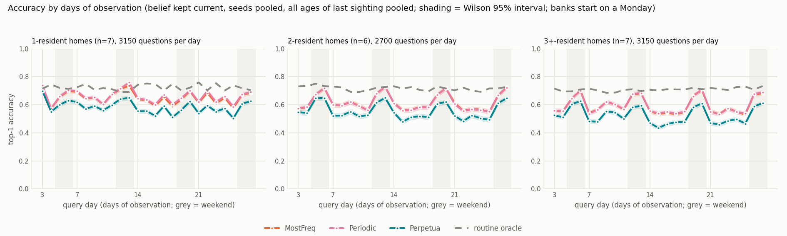
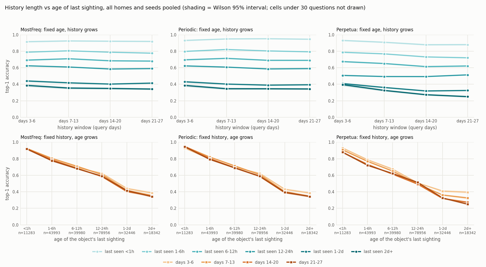
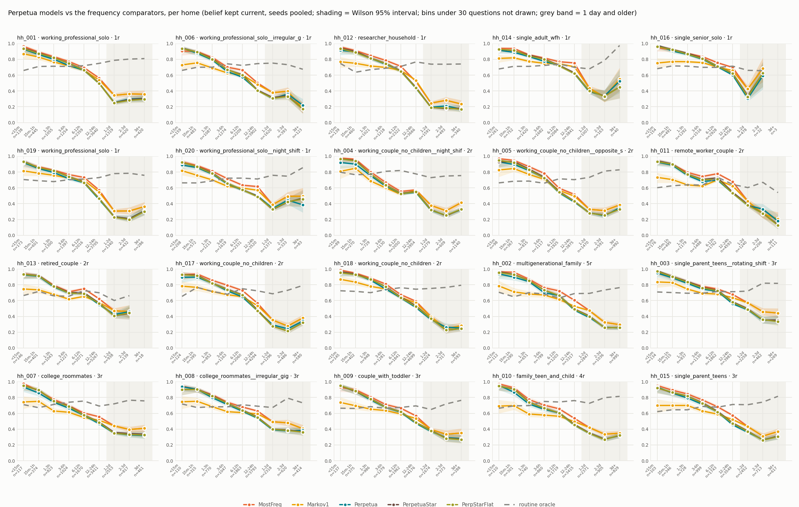
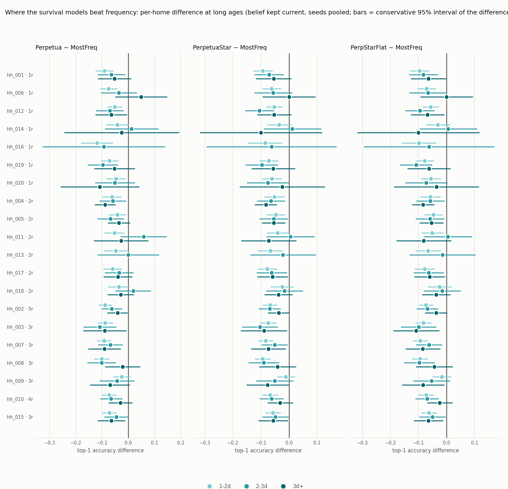

# Per-household passive analysis

20 households x 5 seeds (0, 1, 2, 3, 4), 11 belief models + the routine oracle. Seeds of one home are pooled (equal question counts, so this is the seed mean); the last column of the overview is the largest across-seed range any model showed on that home, the noise floor for reading its row. Commit `37c2a3c3b81a`, run 2026-09-08T09:15:28.

Two evaluation modes over the same questions:

- **kept current** (continuous): the belief is updated with every sighting strictly before each query and answers about now. Query day is the history length; the age of the object's last sighting is recorded per question.
- **frozen forecast**: the bake-off protocol. The belief is frozen at day D and answers questions up to 7 days later, bucketed by horizon; the headline cell is D=7, h=1 (questions 6-24h after the freeze).

The routine oracle predicts from the household's authored rules re-realized under many seeds, with no observations: routine knowledge alone. Not a hard ceiling; a fresh sighting beats it.

## Which homes separate the models (belief kept current)

Sorted by the oracle within resident group, so the most routine-predictable home of each group comes first.

| home | type | res | LastObs | MostFreq | Timetable | Markov1 | Periodic | DaytypeMix | HierBackoff | SmoothedRec | Perpetua | PerpetuaStar | PerpStarFlat | oracle | best | best-median | best-LastObs | oracle-best | seed range | paired best-LastObs (seeds>0) |
|---|---|---|---|---|---|---|---|---|---|---|---|---|---|---|---|---|---|---|---|---|
| hh_001 | working_professional_solo | 1 | 0.610 | 0.613 | 0.551 | 0.582 | 0.615 | 0.562 | 0.613 | 0.617 | 0.558 | 0.566 | 0.561 | 0.742 | SmoothedRec | 0.035 | 0.007 | 0.126 | 0.037 | +0.007 (5/5) |
| hh_006 | working_professional_solo__irregular_gig | 1 | 0.585 | 0.585 | 0.510 | 0.537 | 0.592 | 0.520 | 0.586 | 0.596 | 0.515 | 0.527 | 0.520 | 0.733 | SmoothedRec | 0.058 | 0.010 | 0.138 | 0.054 | +0.010 (5/5) |
| hh_012 | researcher_household | 1 | 0.583 | 0.582 | 0.517 | 0.546 | 0.589 | 0.520 | 0.582 | 0.590 | 0.520 | 0.525 | 0.519 | 0.726 | SmoothedRec | 0.045 | 0.007 | 0.136 | 0.030 | +0.007 (5/5) |
| hh_019 | working_professional_solo | 1 | 0.629 | 0.628 | 0.538 | 0.595 | 0.633 | 0.542 | 0.628 | 0.636 | 0.552 | 0.565 | 0.562 | 0.724 | SmoothedRec | 0.041 | 0.007 | 0.088 | 0.053 | +0.007 (5/5) |
| hh_020 | working_professional_solo__night_shift | 1 | 0.638 | 0.642 | 0.545 | 0.586 | 0.648 | 0.563 | 0.643 | 0.652 | 0.569 | 0.571 | 0.569 | 0.718 | SmoothedRec | 0.065 | 0.013 | 0.066 | 0.068 | +0.013 (5/5) |
| hh_014 | single_adult_wfh | 1 | 0.765 | 0.761 | 0.648 | 0.708 | 0.771 | 0.687 | 0.761 | 0.773 | 0.690 | 0.702 | 0.696 | 0.713 | SmoothedRec | 0.065 | 0.008 | -0.060 | 0.040 | +0.008 (5/5) |
| hh_016 | single_senior_solo | 1 | 0.756 | 0.754 | 0.653 | 0.693 | 0.765 | 0.675 | 0.753 | 0.765 | 0.691 | 0.708 | 0.703 | 0.705 | SmoothedRec | 0.057 | 0.009 | -0.059 | 0.044 | +0.009 (5/5) |
| **1-resident mean** |  | 7 | 0.652 | 0.652 | 0.566 | 0.607 | 0.659 | 0.581 | 0.652 | 0.661 | 0.585 | 0.595 | 0.590 | 0.723 |  | 0.052 | 0.009 | 0.062 |  |  |
| hh_004 | working_couple_no_children__night_shift | 2 | 0.546 | 0.555 | 0.529 | 0.527 | 0.550 | 0.521 | 0.545 | 0.552 | 0.509 | 0.520 | 0.517 | 0.779 | MostFreq | 0.026 | 0.010 | 0.223 | 0.048 | +0.010 (5/5) |
| hh_018 | working_couple_no_children | 2 | 0.625 | 0.629 | 0.597 | 0.593 | 0.628 | 0.596 | 0.624 | 0.631 | 0.575 | 0.590 | 0.584 | 0.746 | SmoothedRec | 0.034 | 0.006 | 0.115 | 0.045 | +0.006 (5/5) |
| hh_017 | working_couple_no_children | 2 | 0.605 | 0.612 | 0.577 | 0.555 | 0.610 | 0.564 | 0.610 | 0.614 | 0.538 | 0.547 | 0.541 | 0.723 | SmoothedRec | 0.037 | 0.009 | 0.110 | 0.044 | +0.009 (5/5) |
| hh_005 | working_couple_no_children__opposite_schedules | 2 | 0.547 | 0.554 | 0.524 | 0.522 | 0.553 | 0.505 | 0.553 | 0.555 | 0.487 | 0.495 | 0.491 | 0.720 | SmoothedRec | 0.032 | 0.009 | 0.164 | 0.051 | +0.009 (5/5) |
| hh_013 | retired_couple | 2 | 0.665 | 0.671 | 0.634 | 0.602 | 0.671 | 0.608 | 0.670 | 0.675 | 0.616 | 0.628 | 0.622 | 0.687 | SmoothedRec | 0.041 | 0.010 | 0.012 | 0.035 | +0.010 (5/5) |
| hh_011 | remote_worker_couple | 2 | 0.686 | 0.690 | 0.603 | 0.611 | 0.693 | 0.608 | 0.690 | 0.699 | 0.599 | 0.615 | 0.604 | 0.650 | SmoothedRec | 0.084 | 0.013 | -0.049 | 0.036 | +0.013 (5/5) |
| **2-resident mean** |  | 6 | 0.612 | 0.618 | 0.577 | 0.568 | 0.618 | 0.567 | 0.615 | 0.621 | 0.554 | 0.566 | 0.560 | 0.717 |  | 0.042 | 0.009 | 0.096 |  |  |
| hh_010 | family_teen_and_child | 4 | 0.537 | 0.543 | 0.509 | 0.486 | 0.544 | 0.507 | 0.539 | 0.545 | 0.477 | 0.485 | 0.481 | 0.750 | SmoothedRec | 0.036 | 0.008 | 0.205 | 0.023 | +0.008 (5/5) |
| hh_007 | college_roommates | 3 | 0.558 | 0.563 | 0.524 | 0.517 | 0.564 | 0.523 | 0.561 | 0.567 | 0.496 | 0.512 | 0.506 | 0.721 | SmoothedRec | 0.043 | 0.009 | 0.154 | 0.048 | +0.009 (5/5) |
| hh_003 | single_parent_teens__rotating_shift | 3 | 0.682 | 0.685 | 0.615 | 0.641 | 0.687 | 0.611 | 0.684 | 0.691 | 0.608 | 0.628 | 0.621 | 0.718 | SmoothedRec | 0.051 | 0.009 | 0.026 | 0.056 | +0.009 (5/5) |
| hh_015 | single_parent_teens | 3 | 0.573 | 0.580 | 0.531 | 0.519 | 0.582 | 0.525 | 0.575 | 0.580 | 0.500 | 0.516 | 0.511 | 0.704 | Periodic | 0.051 | 0.009 | 0.121 | 0.048 | +0.009 (5/5) |
| hh_008 | college_roommates__irregular_gig | 3 | 0.625 | 0.628 | 0.581 | 0.577 | 0.631 | 0.567 | 0.626 | 0.631 | 0.556 | 0.568 | 0.564 | 0.695 | SmoothedRec | 0.051 | 0.006 | 0.064 | 0.041 | +0.006 (5/5) |
| hh_002 | multigenerational_family | 5 | 0.567 | 0.571 | 0.520 | 0.511 | 0.573 | 0.522 | 0.568 | 0.572 | 0.488 | 0.501 | 0.498 | 0.693 | Periodic | 0.051 | 0.005 | 0.121 | 0.036 | +0.005 (5/5) |
| hh_009 | couple_with_toddler | 3 | 0.592 | 0.598 | 0.546 | 0.542 | 0.598 | 0.539 | 0.597 | 0.603 | 0.539 | 0.548 | 0.546 | 0.681 | SmoothedRec | 0.055 | 0.011 | 0.078 | 0.045 | +0.011 (5/5) |
| **3+-resident mean** |  | 7 | 0.591 | 0.596 | 0.547 | 0.542 | 0.597 | 0.542 | 0.593 | 0.598 | 0.523 | 0.537 | 0.532 | 0.709 |  | 0.048 | 0.008 | 0.110 |  |  |

## Same homes under the frozen forecast (D=7, h=1)

| home | type | res | LastObs | MostFreq | Timetable | Markov1 | Periodic | DaytypeMix | HierBackoff | SmoothedRec | Perpetua | PerpetuaStar | PerpStarFlat | oracle | best | best-median | best-LastObs | oracle-best | seed range | paired best-LastObs (seeds>0) |
|---|---|---|---|---|---|---|---|---|---|---|---|---|---|---|---|---|---|---|---|---|
| hh_020 | working_professional_solo__night_shift | 1 | 0.704 | 0.698 | 0.655 | 0.609 | 0.704 | 0.709 | 0.704 | 0.716 | 0.348 | 0.336 | 0.318 | 0.761 | SmoothedRec | 0.018 | 0.011 | 0.045 | 0.185 | +0.011 (2/5) |
| hh_001 | working_professional_solo | 1 | 0.425 | 0.425 | 0.399 | 0.433 | 0.423 | 0.413 | 0.425 | 0.428 | 0.315 | 0.320 | 0.315 | 0.752 | Markov1 | 0.010 | 0.007 | 0.320 | 0.175 | +0.007 (1/5) |
| hh_019 | working_professional_solo | 1 | 0.450 | 0.475 | 0.421 | 0.477 | 0.459 | 0.432 | 0.475 | 0.466 | 0.295 | 0.327 | 0.320 | 0.739 | Markov1 | 0.027 | 0.027 | 0.261 | 0.178 | +0.027 (5/5) |
| hh_014 | single_adult_wfh | 1 | 0.609 | 0.621 | 0.589 | 0.624 | 0.624 | 0.589 | 0.619 | 0.624 | 0.522 | 0.530 | 0.537 | 0.725 | Markov1 | 0.015 | 0.015 | 0.101 | 0.212 | +0.015 (3/5) |
| hh_006 | working_professional_solo__irregular_gig | 1 | 0.435 | 0.435 | 0.405 | 0.414 | 0.438 | 0.447 | 0.435 | 0.428 | 0.292 | 0.292 | 0.271 | 0.722 | DaytypeMix | 0.019 | 0.012 | 0.275 | 0.191 | +0.011 (2/5) |
| hh_012 | researcher_household | 1 | 0.618 | 0.606 | 0.574 | 0.609 | 0.616 | 0.561 | 0.606 | 0.613 | 0.437 | 0.471 | 0.451 | 0.684 | LastObs | 0.011 | 0.000 | 0.066 | 0.307 | +0.000 (0/5) |
| hh_016 | single_senior_solo | 1 | 0.674 | 0.674 | 0.625 | 0.644 | 0.669 | 0.630 | 0.674 | 0.674 | 0.441 | 0.439 | 0.444 | 0.680 | LastObs | 0.030 | 0.000 | 0.007 | 0.265 | +0.000 (0/5) |
| **1-resident mean** |  | 7 | 0.559 | 0.562 | 0.524 | 0.544 | 0.562 | 0.540 | 0.563 | 0.564 | 0.379 | 0.388 | 0.379 | 0.723 |  | 0.018 | 0.010 | 0.154 |  |  |
| hh_004 | working_couple_no_children__night_shift | 2 | 0.521 | 0.536 | 0.515 | 0.509 | 0.524 | 0.551 | 0.536 | 0.533 | 0.399 | 0.420 | 0.408 | 0.792 | DaytypeMix | 0.030 | 0.030 | 0.241 | 0.200 | +0.030 (4/5) |
| hh_018 | working_couple_no_children | 2 | 0.481 | 0.481 | 0.488 | 0.459 | 0.483 | 0.469 | 0.481 | 0.483 | 0.384 | 0.379 | 0.382 | 0.758 | Timetable | 0.007 | 0.007 | 0.271 | 0.261 | +0.007 (3/5) |
| hh_017 | working_couple_no_children | 2 | 0.468 | 0.475 | 0.450 | 0.461 | 0.466 | 0.468 | 0.475 | 0.482 | 0.317 | 0.337 | 0.330 | 0.750 | SmoothedRec | 0.016 | 0.014 | 0.268 | 0.151 | +0.013 (3/5) |
| hh_005 | working_couple_no_children__opposite_schedules | 2 | 0.458 | 0.458 | 0.447 | 0.424 | 0.458 | 0.441 | 0.473 | 0.458 | 0.297 | 0.300 | 0.288 | 0.744 | HierBackoff | 0.026 | 0.014 | 0.271 | 0.152 | +0.014 (2/5) |
| hh_013 | retired_couple | 2 | 0.581 | 0.581 | 0.578 | 0.523 | 0.588 | 0.588 | 0.581 | 0.578 | 0.460 | 0.513 | 0.472 | 0.689 | Periodic | 0.010 | 0.007 | 0.101 | 0.238 | +0.007 (2/5) |
| hh_011 | remote_worker_couple | 2 | 0.587 | 0.575 | 0.563 | 0.570 | 0.578 | 0.566 | 0.575 | 0.583 | 0.420 | 0.420 | 0.415 | 0.663 | LastObs | 0.017 | 0.000 | 0.075 | 0.219 | +0.000 (0/5) |
| **2-resident mean** |  | 6 | 0.516 | 0.518 | 0.507 | 0.491 | 0.516 | 0.514 | 0.520 | 0.519 | 0.379 | 0.395 | 0.383 | 0.733 |  | 0.018 | 0.012 | 0.205 |  |  |
| hh_010 | family_teen_and_child | 4 | 0.384 | 0.394 | 0.382 | 0.384 | 0.387 | 0.389 | 0.392 | 0.394 | 0.319 | 0.334 | 0.317 | 0.768 | MostFreq | 0.010 | 0.010 | 0.374 | 0.156 | +0.010 (3/5) |
| hh_009 | couple_with_toddler | 3 | 0.442 | 0.446 | 0.444 | 0.442 | 0.451 | 0.494 | 0.446 | 0.444 | 0.329 | 0.329 | 0.322 | 0.735 | DaytypeMix | 0.050 | 0.053 | 0.241 | 0.145 | +0.053 (5/5) |
| hh_015 | single_parent_teens | 3 | 0.464 | 0.461 | 0.438 | 0.468 | 0.473 | 0.459 | 0.459 | 0.466 | 0.361 | 0.389 | 0.382 | 0.728 | Periodic | 0.014 | 0.009 | 0.255 | 0.279 | +0.009 (3/5) |
| hh_008 | college_roommates__irregular_gig | 3 | 0.429 | 0.436 | 0.429 | 0.426 | 0.426 | 0.411 | 0.431 | 0.431 | 0.378 | 0.388 | 0.372 | 0.717 | MostFreq | 0.010 | 0.008 | 0.281 | 0.135 | +0.008 (2/5) |
| hh_007 | college_roommates | 3 | 0.421 | 0.426 | 0.410 | 0.398 | 0.431 | 0.424 | 0.421 | 0.426 | 0.319 | 0.338 | 0.336 | 0.714 | Periodic | 0.010 | 0.010 | 0.283 | 0.100 | +0.009 (3/5) |
| hh_003 | single_parent_teens__rotating_shift | 3 | 0.545 | 0.564 | 0.541 | 0.559 | 0.550 | 0.543 | 0.557 | 0.550 | 0.415 | 0.455 | 0.443 | 0.687 | MostFreq | 0.019 | 0.019 | 0.123 | 0.139 | +0.019 (3/5) |
| hh_002 | multigenerational_family | 5 | 0.407 | 0.414 | 0.412 | 0.407 | 0.404 | 0.439 | 0.414 | 0.412 | 0.336 | 0.365 | 0.358 | 0.676 | DaytypeMix | 0.032 | 0.032 | 0.238 | 0.215 | +0.033 (3/5) |
| **3+-resident mean** |  | 7 | 0.442 | 0.449 | 0.436 | 0.441 | 0.446 | 0.451 | 0.446 | 0.446 | 0.351 | 0.371 | 0.361 | 0.718 |  | 0.021 | 0.020 | 0.256 |  |  |

## Age of the last sighting

All homes pooled:

| age of last sighting | n | LastObs | MostFreq | Timetable | Markov1 | Periodic | DaytypeMix | HierBackoff | SmoothedRec | Perpetua | PerpetuaStar | PerpStarFlat | oracle |
|---|---|---|---|---|---|---|---|---|---|---|---|---|---|
| <15m | 2833 | 0.982 | 0.946 | 0.953 | 0.782 | 0.977 | 0.967 | 0.947 | 0.982 | 0.930 | 0.942 | 0.939 | 0.682 |
| 15m-1h | 8450 | 0.938 | 0.911 | 0.833 | 0.769 | 0.935 | 0.900 | 0.911 | 0.938 | 0.884 | 0.901 | 0.898 | 0.689 |
| 1-3h | 19489 | 0.854 | 0.832 | 0.714 | 0.711 | 0.852 | 0.752 | 0.831 | 0.854 | 0.798 | 0.815 | 0.810 | 0.692 |
| 3-6h | 24504 | 0.767 | 0.756 | 0.654 | 0.670 | 0.766 | 0.670 | 0.755 | 0.767 | 0.708 | 0.727 | 0.723 | 0.703 |
| 6-12h | 39980 | 0.698 | 0.691 | 0.612 | 0.633 | 0.697 | 0.615 | 0.691 | 0.698 | 0.636 | 0.646 | 0.641 | 0.723 |
| 12-24h | 78956 | 0.595 | 0.599 | 0.546 | 0.564 | 0.598 | 0.530 | 0.599 | 0.600 | 0.501 | 0.515 | 0.509 | 0.717 |
| 1-2d | 32446 | 0.371 | 0.415 | 0.400 | 0.415 | 0.400 | 0.390 | 0.414 | 0.407 | 0.346 | 0.352 | 0.348 | 0.710 |
| 2-3d | 9740 | 0.328 | 0.351 | 0.346 | 0.351 | 0.347 | 0.339 | 0.345 | 0.347 | 0.293 | 0.287 | 0.284 | 0.763 |
| 3d+ | 8602 | 0.339 | 0.357 | 0.351 | 0.357 | 0.355 | 0.336 | 0.327 | 0.356 | 0.306 | 0.303 | 0.300 | 0.781 |

1-resident homes:

| age of last sighting | n | LastObs | MostFreq | Timetable | Markov1 | Periodic | DaytypeMix | HierBackoff | SmoothedRec | Perpetua | PerpetuaStar | PerpStarFlat | oracle |
|---|---|---|---|---|---|---|---|---|---|---|---|---|---|
| <15m | 1232 | 0.976 | 0.935 | 0.943 | 0.797 | 0.971 | 0.965 | 0.939 | 0.976 | 0.925 | 0.938 | 0.934 | 0.683 |
| 15m-1h | 3804 | 0.935 | 0.902 | 0.807 | 0.783 | 0.932 | 0.899 | 0.902 | 0.935 | 0.875 | 0.890 | 0.888 | 0.691 |
| 1-3h | 8388 | 0.869 | 0.840 | 0.690 | 0.742 | 0.867 | 0.757 | 0.840 | 0.869 | 0.811 | 0.828 | 0.821 | 0.697 |
| 3-6h | 9960 | 0.790 | 0.772 | 0.644 | 0.701 | 0.788 | 0.676 | 0.772 | 0.790 | 0.723 | 0.743 | 0.740 | 0.713 |
| 6-12h | 16249 | 0.720 | 0.710 | 0.607 | 0.667 | 0.718 | 0.622 | 0.710 | 0.720 | 0.652 | 0.660 | 0.656 | 0.717 |
| 12-24h | 26630 | 0.595 | 0.606 | 0.527 | 0.579 | 0.604 | 0.521 | 0.606 | 0.608 | 0.504 | 0.514 | 0.508 | 0.731 |
| 1-2d | 8726 | 0.307 | 0.348 | 0.341 | 0.349 | 0.340 | 0.329 | 0.347 | 0.340 | 0.282 | 0.284 | 0.281 | 0.747 |
| 2-3d | 2466 | 0.341 | 0.362 | 0.350 | 0.362 | 0.354 | 0.337 | 0.363 | 0.356 | 0.302 | 0.287 | 0.283 | 0.765 |
| 3d+ | 1295 | 0.308 | 0.324 | 0.327 | 0.325 | 0.332 | 0.313 | 0.323 | 0.325 | 0.277 | 0.277 | 0.268 | 0.776 |

2-resident homes:

| age of last sighting | n | LastObs | MostFreq | Timetable | Markov1 | Periodic | DaytypeMix | HierBackoff | SmoothedRec | Perpetua | PerpetuaStar | PerpStarFlat | oracle |
|---|---|---|---|---|---|---|---|---|---|---|---|---|---|
| <15m | 778 | 0.988 | 0.954 | 0.967 | 0.789 | 0.985 | 0.969 | 0.952 | 0.988 | 0.927 | 0.943 | 0.941 | 0.675 |
| 15m-1h | 2330 | 0.953 | 0.932 | 0.876 | 0.782 | 0.949 | 0.900 | 0.930 | 0.953 | 0.904 | 0.924 | 0.917 | 0.706 |
| 1-3h | 5566 | 0.849 | 0.831 | 0.753 | 0.708 | 0.847 | 0.747 | 0.829 | 0.849 | 0.796 | 0.809 | 0.806 | 0.689 |
| 3-6h | 7406 | 0.760 | 0.752 | 0.685 | 0.661 | 0.760 | 0.678 | 0.750 | 0.760 | 0.699 | 0.718 | 0.712 | 0.694 |
| 6-12h | 11709 | 0.682 | 0.679 | 0.627 | 0.620 | 0.682 | 0.618 | 0.679 | 0.682 | 0.621 | 0.636 | 0.628 | 0.752 |
| 12-24h | 26682 | 0.595 | 0.596 | 0.562 | 0.564 | 0.596 | 0.549 | 0.596 | 0.597 | 0.507 | 0.523 | 0.515 | 0.713 |
| 1-2d | 7247 | 0.321 | 0.387 | 0.368 | 0.387 | 0.355 | 0.358 | 0.389 | 0.377 | 0.337 | 0.336 | 0.333 | 0.688 |
| 2-3d | 2348 | 0.266 | 0.301 | 0.291 | 0.301 | 0.294 | 0.277 | 0.294 | 0.290 | 0.269 | 0.255 | 0.255 | 0.752 |
| 3d+ | 3434 | 0.338 | 0.369 | 0.355 | 0.369 | 0.358 | 0.323 | 0.324 | 0.363 | 0.317 | 0.307 | 0.306 | 0.781 |

3+-resident homes:

| age of last sighting | n | LastObs | MostFreq | Timetable | Markov1 | Periodic | DaytypeMix | HierBackoff | SmoothedRec | Perpetua | PerpetuaStar | PerpStarFlat | oracle |
|---|---|---|---|---|---|---|---|---|---|---|---|---|---|
| <15m | 823 | 0.985 | 0.956 | 0.955 | 0.751 | 0.981 | 0.968 | 0.955 | 0.985 | 0.942 | 0.945 | 0.943 | 0.685 |
| 15m-1h | 2316 | 0.926 | 0.906 | 0.832 | 0.733 | 0.924 | 0.900 | 0.905 | 0.926 | 0.877 | 0.895 | 0.896 | 0.670 |
| 1-3h | 5535 | 0.838 | 0.819 | 0.710 | 0.669 | 0.834 | 0.750 | 0.819 | 0.838 | 0.781 | 0.802 | 0.798 | 0.688 |
| 3-6h | 7138 | 0.745 | 0.737 | 0.637 | 0.635 | 0.743 | 0.655 | 0.736 | 0.745 | 0.695 | 0.714 | 0.710 | 0.698 |
| 6-12h | 12022 | 0.684 | 0.678 | 0.603 | 0.600 | 0.684 | 0.602 | 0.678 | 0.684 | 0.630 | 0.638 | 0.634 | 0.703 |
| 12-24h | 25644 | 0.595 | 0.594 | 0.548 | 0.548 | 0.595 | 0.520 | 0.594 | 0.595 | 0.490 | 0.508 | 0.503 | 0.707 |
| 1-2d | 16473 | 0.428 | 0.463 | 0.446 | 0.463 | 0.452 | 0.437 | 0.460 | 0.456 | 0.383 | 0.395 | 0.389 | 0.700 |
| 2-3d | 4926 | 0.350 | 0.369 | 0.371 | 0.369 | 0.369 | 0.370 | 0.360 | 0.370 | 0.300 | 0.303 | 0.299 | 0.766 |
| 3d+ | 3873 | 0.349 | 0.358 | 0.355 | 0.358 | 0.361 | 0.356 | 0.330 | 0.360 | 0.306 | 0.308 | 0.305 | 0.782 |

Three basic models only (one frequency, one periodic, one survival) with Wilson 95% bands; every model is in the tables above and in the per-home figure below. All query days are pooled here.

## Learning over days of observation

The same three models by query day, all ages of last sighting pooled. Banks start on a Monday, so query day and weekday are tied: weekend query days are shaded and the weekly ripple is the weekday mix, not learning.

History length and age of the last sighting are confounded: a 3-day-old sighting can only occur late in the history, and a late query day pools more stale sightings. The grid below crosses the two, all homes pooled. Top row: hold the age fixed and let the history grow (a rise is learning). Bottom row: hold the history window fixed and let the age grow (a fall is staleness). Windows from day 7 on are whole weeks, so each holds every weekday once.

Kept current versus frozen forecast at matched ages, LastObs and the best routine model per group:

Every model here uses recent sightings, so at short ages they all sit on LastObs; the informative comparison is at a day or more, against the oracle:

| home | type | res | LastObs 12-24h | LastObs 1-2d | best model 1-2d | oracle 1-2d | LastObs 3d+ | best model 3d+ | oracle 3d+ | routine > LastObs by 0.02 from |
|---|---|---|---|---|---|---|---|---|---|---|
| hh_001 | working_professional_solo | 1 | 0.555 | 0.312 | 0.345 (MostFreq, n=1319) | 0.788 | 0.357 | 0.364 (SmoothedRec, n=420) | 0.810 | 1-2d |
| hh_006 | working_professional_solo__irregular_gig | 1 | 0.487 | 0.346 | 0.378 (SmoothedRec, n=1620) | 0.752 | 0.179 | 0.220 (Timetable, n=123) | 0.675 | 1-2d |
| hh_012 | researcher_household | 1 | 0.514 | 0.220 | 0.246 (MostFreq, n=1591) | 0.739 | 0.197 | 0.235 (MostFreq, n=340) | 0.741 | 12-24h |
| hh_014 | single_adult_wfh | 1 | 0.747 | 0.377 | 0.435 (Markov1, n=1007) | 0.679 | 0.500 | 0.550 (Timetable, n=40) | 0.975 | 1-2d |
| hh_016 | single_senior_solo | 1 | 0.684 | 0.343 | 0.452 (Timetable, n=478) | 0.661 | n=3<30 | n=3<30 | n=3<30 | 1-2d |
| hh_019 | working_professional_solo | 1 | 0.564 | 0.285 | 0.307 (HierBackoff, n=1340) | 0.781 | 0.343 | 0.371 (HierBackoff, n=286) | 0.759 | 1-2d |
| hh_020 | working_professional_solo__night_shift | 1 | 0.597 | 0.312 | 0.389 (HierBackoff, n=1371) | 0.759 | 0.506 | 0.590 (DaytypeMix, n=83) | 0.855 | 12-24h |
| hh_004 | working_couple_no_children__night_shift | 2 | 0.575 | 0.338 | 0.378 (MostFreq, n=1279) | 0.729 | 0.389 | 0.413 (MostFreq, n=1140) | 0.755 | 1-2d |
| hh_005 | working_couple_no_children__opposite_schedules | 2 | 0.519 | 0.289 | 0.333 (HierBackoff, n=1470) | 0.733 | 0.345 | 0.384 (MostFreq, n=992) | 0.829 | 1-2d |
| hh_011 | remote_worker_couple | 2 | 0.680 | 0.322 | 0.433 (HierBackoff, n=1240) | 0.603 | 0.135 | 0.207 (MostFreq, n=111) | 0.541 | 1-2d |
| hh_013 | retired_couple | 2 | 0.620 | 0.349 | 0.479 (HierBackoff, n=938) | 0.601 | n=18<30 | n=18<30 | n=18<30 | 1-2d |
| hh_017 | working_couple_no_children | 2 | 0.565 | 0.309 | 0.359 (HierBackoff, n=1296) | 0.686 | 0.347 | 0.384 (DaytypeMix, n=580) | 0.791 | 1-2d |
| hh_018 | working_couple_no_children | 2 | 0.590 | 0.338 | 0.396 (MostFreq, n=1024) | 0.754 | 0.261 | 0.283 (MostFreq, n=593) | 0.794 | 1-2d |
| hh_002 | multigenerational_family | 5 | 0.607 | 0.455 | 0.474 (MostFreq, n=2847) | 0.691 | 0.292 | 0.308 (DaytypeMix, n=995) | 0.764 | never |
| hh_003 | single_parent_teens__rotating_shift | 3 | 0.681 | 0.530 | 0.571 (MostFreq, n=2258) | 0.720 | 0.424 | 0.446 (SmoothedRec, n=269) | 0.818 | 1-2d |
| hh_007 | college_roommates | 3 | 0.562 | 0.410 | 0.441 (MostFreq, n=2553) | 0.720 | 0.395 | 0.416 (SmoothedRec, n=461) | 0.757 | 1-2d |
| hh_008 | college_roommates__irregular_gig | 3 | 0.628 | 0.465 | 0.494 (MostFreq, n=2318) | 0.673 | 0.428 | 0.428 (LastObs, n=414) | 0.732 | 1-2d |
| hh_009 | couple_with_toddler | 3 | 0.566 | 0.335 | 0.395 (MostFreq, n=1674) | 0.648 | 0.309 | 0.358 (SmoothedRec, n=288) | 0.764 | 1-2d |
| hh_010 | family_teen_and_child | 4 | 0.536 | 0.386 | 0.424 (HierBackoff, n=2371) | 0.727 | 0.334 | 0.349 (SmoothedRec, n=829) | 0.814 | 1-2d |
| hh_015 | single_parent_teens | 3 | 0.575 | 0.389 | 0.432 (Markov1, n=2452) | 0.709 | 0.361 | 0.387 (Periodic, n=617) | 0.815 | 1-2d |

Age is not exogenous. An object the patrol has not seen for days is one it could not see — the share of questions whose true location is out of the house or on a person rises with age (seed-0 banks, all homes pooled):

| age of last sighting | n | ordinary receptacle | out of house | on a person |
|---|---|---|---|---|
| <15m | 525 | 100% | 0% | 0% |
| 15m-1h | 1734 | 98% | 1% | 0% |
| 1-3h | 3993 | 95% | 5% | 0% |
| 3-6h | 4827 | 93% | 7% | 0% |
| 6-12h | 8022 | 88% | 12% | 0% |
| 12-24h | 15691 | 85% | 14% | 1% |
| 1-2d | 6470 | 76% | 21% | 3% |
| 2-3d | 1971 | 67% | 29% | 4% |
| 3d+ | 1767 | 64% | 31% | 5% |

## History: accuracy by query day

`sep` is best model minus the median model over that day window; `95%-of-peak day` is when the best model's 3-day rolling accuracy first reaches 95% of its own peak.

| home | type | res | best model | best d3-5 | best d20+ | sep d3-5 | sep d20+ | LastObs d20+ | oracle d20+ | 95%-of-peak day |
|---|---|---|---|---|---|---|---|---|---|---|
| hh_001 | working_professional_solo | 1 | SmoothedRec | 0.673 | 0.589 | 0.023 | 0.032 | 0.581 | 0.741 | 3 |
| hh_006 | working_professional_solo__irregular_gig | 1 | SmoothedRec | 0.573 | 0.614 | 0.023 | 0.052 | 0.605 | 0.734 | 3 |
| hh_012 | researcher_household | 1 | Periodic | 0.556 | 0.597 | 0.019 | 0.045 | 0.590 | 0.730 | 13 |
| hh_014 | single_adult_wfh | 1 | Periodic | 0.740 | 0.746 | 0.010 | 0.064 | 0.738 | 0.704 | 3 |
| hh_016 | single_senior_solo | 1 | Periodic | 0.780 | 0.748 | 0.025 | 0.046 | 0.738 | 0.702 | 3 |
| hh_019 | working_professional_solo | 1 | SmoothedRec | 0.713 | 0.662 | 0.026 | 0.039 | 0.655 | 0.738 | 3 |
| hh_020 | working_professional_solo__night_shift | 1 | SmoothedRec | 0.599 | 0.646 | 0.023 | 0.058 | 0.633 | 0.726 | 9 |
| hh_004 | working_couple_no_children__night_shift | 2 | MostFreq | 0.557 | 0.554 | 0.005 | 0.025 | 0.544 | 0.783 | 6 |
| hh_005 | working_couple_no_children__opposite_schedules | 2 | SmoothedRec | 0.536 | 0.572 | 0.010 | 0.024 | 0.561 | 0.719 | 13 |
| hh_011 | remote_worker_couple | 2 | SmoothedRec | 0.690 | 0.680 | 0.036 | 0.084 | 0.665 | 0.633 | 8 |
| hh_013 | retired_couple | 2 | SmoothedRec | 0.687 | 0.668 | 0.019 | 0.046 | 0.657 | 0.671 | 4 |
| hh_017 | working_couple_no_children | 2 | SmoothedRec | 0.585 | 0.615 | 0.011 | 0.046 | 0.606 | 0.726 | 7 |
| hh_018 | working_couple_no_children | 2 | SmoothedRec | 0.622 | 0.656 | 0.015 | 0.031 | 0.648 | 0.738 | 14 |
| hh_002 | multigenerational_family | 5 | Periodic | 0.581 | 0.580 | 0.026 | 0.067 | 0.575 | 0.696 | 6 |
| hh_003 | single_parent_teens__rotating_shift | 3 | SmoothedRec | 0.676 | 0.697 | 0.019 | 0.045 | 0.690 | 0.742 | 11 |
| hh_007 | college_roommates | 3 | Periodic | 0.546 | 0.573 | 0.009 | 0.055 | 0.563 | 0.733 | 11 |
| hh_008 | college_roommates__irregular_gig | 3 | SmoothedRec | 0.599 | 0.632 | 0.006 | 0.046 | 0.624 | 0.711 | 10 |
| hh_009 | couple_with_toddler | 3 | SmoothedRec | 0.599 | 0.613 | 0.015 | 0.050 | 0.599 | 0.687 | 6 |
| hh_010 | family_teen_and_child | 4 | SmoothedRec | 0.535 | 0.557 | 0.013 | 0.046 | 0.547 | 0.744 | 20 |
| hh_015 | single_parent_teens | 3 | Periodic | 0.584 | 0.581 | 0.014 | 0.062 | 0.566 | 0.714 | 6 |

## Perpetua and Perpetua*: survival models vs frequency

The three survival models against the two frequency comparators the question is about, one panel per home. Homes are never pooled: a fleet mean would hide which homes the survival machinery helps.

The same comparison as a per-home difference at the three long-age bins, where the models actually diverge:

### Absence signal, fallback, training data

Absence signal (kept current, every home and seed): mean of the largest per-edge presence belief, split by where the object really was. A usable not-in-the-house threshold needs the out-of-house column well below the ordinary one. `n` counts questions; `fallback` is the share of predictions with at least one edge still on the fallback prior.

| model | age of last sighting | n | max belief, ordinary receptacle | max belief, out of house | max belief, on a person | fallback |
|---|---|---|---|---|---|---|
| Perpetua | <15m | 2833 | 0.929 (2817) | 0.870 (16) | - | 0.90 |
| Perpetua | 15m-1h | 8450 | 0.914 (8269) | 0.902 (178) | 0.938 (3) | 0.91 |
| Perpetua | 1-3h | 19489 | 0.879 (18483) | 0.871 (974) | 0.912 (32) | 0.91 |
| Perpetua | 3-6h | 24504 | 0.810 (22731) | 0.782 (1725) | 0.743 (48) | 0.90 |
| Perpetua | 6-12h | 39980 | 0.725 (35350) | 0.690 (4535) | 0.677 (95) | 0.91 |
| Perpetua | 12-24h | 78956 | 0.649 (67530) | 0.556 (10961) | 0.501 (465) | 0.89 |
| Perpetua | 1-2d | 32446 | 0.518 (24543) | 0.403 (6974) | 0.411 (929) | 0.87 |
| Perpetua | 2-3d | 9740 | 0.478 (6259) | 0.430 (3038) | 0.431 (443) | 0.86 |
| Perpetua | 3d+ | 8602 | 0.392 (5336) | 0.376 (2765) | 0.377 (501) | 0.88 |
| PerpetuaStar | <15m | 2833 | 0.914 (2817) | 0.905 (16) | - | 0.90 |
| PerpetuaStar | 15m-1h | 8450 | 0.916 (8269) | 0.911 (178) | 0.662 (3) | 0.91 |
| PerpetuaStar | 1-3h | 19489 | 0.888 (18483) | 0.852 (974) | 0.900 (32) | 0.91 |
| PerpetuaStar | 3-6h | 24504 | 0.821 (22731) | 0.791 (1725) | 0.750 (48) | 0.90 |
| PerpetuaStar | 6-12h | 39980 | 0.746 (35350) | 0.702 (4535) | 0.636 (95) | 0.91 |
| PerpetuaStar | 12-24h | 78956 | 0.686 (67530) | 0.570 (10961) | 0.507 (465) | 0.89 |
| PerpetuaStar | 1-2d | 32446 | 0.512 (24543) | 0.372 (6974) | 0.391 (929) | 0.87 |
| PerpetuaStar | 2-3d | 9740 | 0.435 (6259) | 0.383 (3038) | 0.385 (443) | 0.86 |
| PerpetuaStar | 3d+ | 8602 | 0.320 (5336) | 0.300 (2765) | 0.270 (501) | 0.88 |
| PerpStarFlat | <15m | 2833 | 0.907 (2817) | 0.831 (16) | - | 0.90 |
| PerpStarFlat | 15m-1h | 8450 | 0.912 (8269) | 0.899 (178) | 0.663 (3) | 0.91 |
| PerpStarFlat | 1-3h | 19489 | 0.881 (18483) | 0.839 (974) | 0.844 (32) | 0.91 |
| PerpStarFlat | 3-6h | 24504 | 0.811 (22731) | 0.776 (1725) | 0.750 (48) | 0.90 |
| PerpStarFlat | 6-12h | 39980 | 0.735 (35350) | 0.688 (4535) | 0.628 (95) | 0.91 |
| PerpStarFlat | 12-24h | 78956 | 0.673 (67530) | 0.560 (10961) | 0.498 (465) | 0.89 |
| PerpStarFlat | 1-2d | 32446 | 0.506 (24543) | 0.369 (6974) | 0.379 (929) | 0.87 |
| PerpStarFlat | 2-3d | 9740 | 0.430 (6259) | 0.380 (3038) | 0.385 (443) | 0.86 |
| PerpStarFlat | 3d+ | 8602 | 0.316 (5336) | 0.295 (2765) | 0.268 (501) | 0.88 |

Fallback use by query day: share of edge beliefs computed from the fallback single-component prior rather than a fitted mixture.

| model | day 3 | day 6 | day 9 | day 12 | day 15 | day 18 | day 21 | day 24 | day 27 |
|---|---|---|---|---|---|---|---|---|---|
| Perpetua | 1.00 | 0.90 | 0.78 | 0.69 | 0.61 | 0.59 | 0.56 | 0.55 | 0.54 |
| PerpetuaStar | 1.00 | 0.90 | 0.78 | 0.69 | 0.61 | 0.59 | 0.56 | 0.55 | 0.54 |
| PerpStarFlat | 1.00 | 0.90 | 0.78 | 0.69 | 0.61 | 0.59 | 0.56 | 0.55 | 0.54 |

Training data per edge at the end of the kept-current run: completed segments are what the EM fits on; an edge needs 2 of a kind to leave the fallback prior for that filter.

| model | edges | median persistence segs | median emergence segs | share < 2 persistence | share < 2 emergence | median resets | mean K persistence |
|---|---|---|---|---|---|---|---|
| Perpetua | 13925 | 2 | 1 | 0.42 | 0.55 | 3 | 1.10 |
| PerpetuaStar | 13925 | 2 | 1 | 0.42 | 0.55 | 3 | 1.10 |
| PerpStarFlat | 13925 | 2 | 1 | 0.42 | 0.55 | 3 | 1.10 |

Figures are static; every plotted value appears in the tables above, which are the table view.
