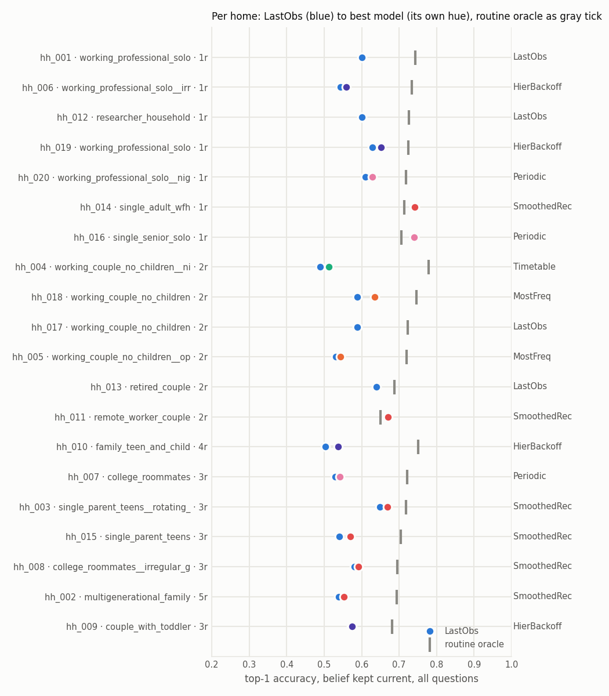
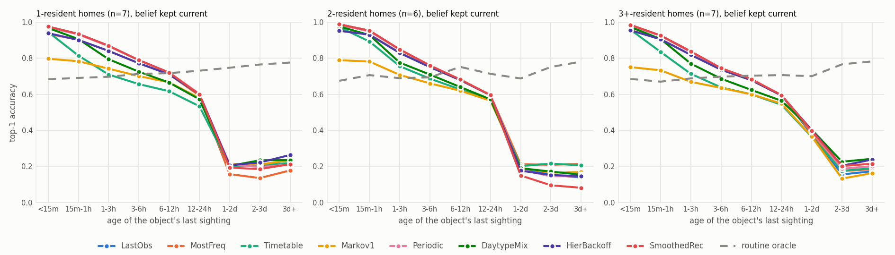
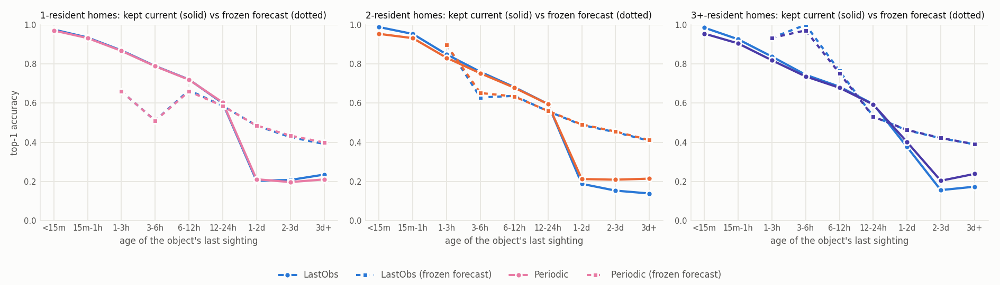
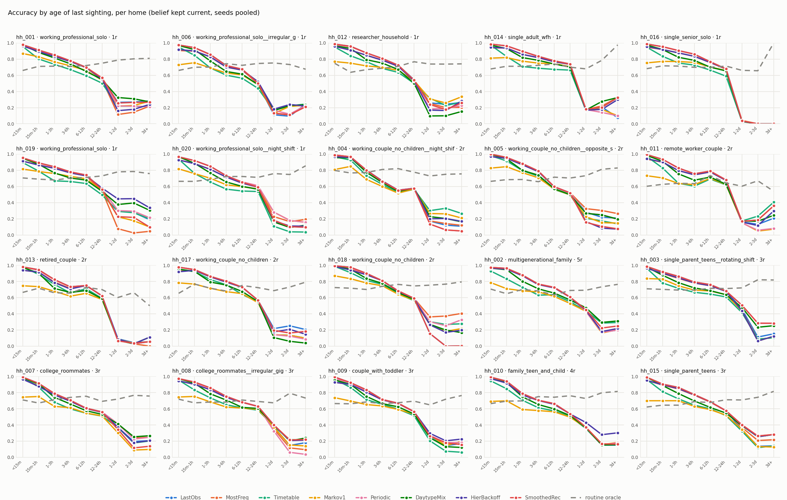
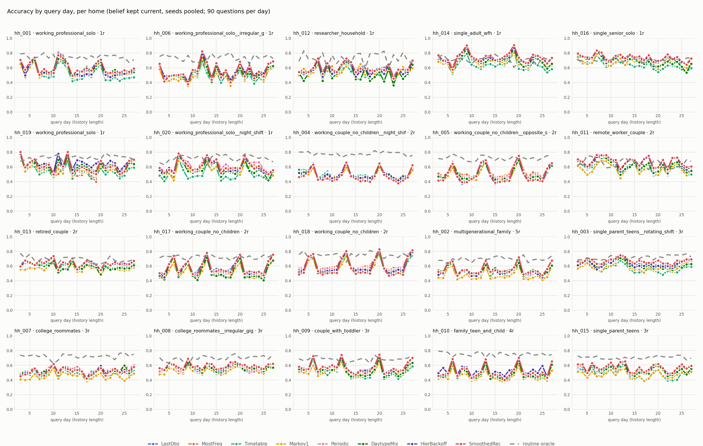

# Per-household passive analysis

20 households x 5 seeds (0, 1, 2, 3, 4), 8 belief models + the routine oracle. Seeds of one home are pooled (equal question counts, so this is the seed mean); the last column of the overview is the largest across-seed range any model showed on that home, the noise floor for reading its row. Commit `ea7e8db7139b`, run 2026-09-03T06:32:17.

Two evaluation modes over the same questions:

- **kept current** (continuous): the belief is updated with every sighting strictly before each query and answers about now. Query day is the history length; the age of the object's last sighting is recorded per question.
- **frozen forecast**: the bake-off protocol. The belief is frozen at day D and answers questions up to 7 days later, bucketed by horizon; the headline cell is D=7, h=1 (questions 6-24h after the freeze).

The routine oracle predicts from the household's authored rules re-realized under many seeds, with no observations: routine knowledge alone. Not a hard ceiling; a fresh sighting beats it.

## Which homes separate the models (belief kept current)

Sorted by the oracle within resident group, so the most routine-predictable home of each group comes first.

| home | type | res | LastObs | MostFreq | Timetable | Markov1 | Periodic | DaytypeMix | HierBackoff | SmoothedRec | oracle | best | best-median | best-LastObs | oracle-best | seed range | paired best-LastObs (seeds>0) |
|---|---|---|---|---|---|---|---|---|---|---|---|---|---|---|---|---|---|
| hh_001 | working_professional_solo | 1 | 0.601 | 0.564 | 0.520 | 0.557 | 0.587 | 0.585 | 0.574 | 0.600 | 0.742 | LastObs | 0.021 | 0.000 | 0.142 | 0.075 | +0.000 (0/5) |
| hh_006 | working_professional_solo__irregular_gig | 1 | 0.543 | 0.538 | 0.481 | 0.496 | 0.558 | 0.524 | 0.559 | 0.550 | 0.733 | HierBackoff | 0.018 | 0.016 | 0.174 | 0.084 | +0.016 (3/5) |
| hh_012 | researcher_household | 1 | 0.601 | 0.585 | 0.547 | 0.556 | 0.583 | 0.528 | 0.570 | 0.593 | 0.726 | LastObs | 0.024 | 0.000 | 0.126 | 0.118 | +0.000 (0/5) |
| hh_019 | working_professional_solo | 1 | 0.628 | 0.573 | 0.543 | 0.573 | 0.628 | 0.605 | 0.652 | 0.612 | 0.724 | HierBackoff | 0.043 | 0.024 | 0.072 | 0.114 | +0.024 (2/5) |
| hh_020 | working_professional_solo__night_shift | 1 | 0.609 | 0.605 | 0.503 | 0.562 | 0.629 | 0.564 | 0.595 | 0.608 | 0.718 | Periodic | 0.029 | 0.019 | 0.089 | 0.084 | +0.019 (4/5) |
| hh_014 | single_adult_wfh | 1 | 0.739 | 0.728 | 0.641 | 0.681 | 0.740 | 0.702 | 0.728 | 0.742 | 0.713 | SmoothedRec | 0.014 | 0.002 | -0.029 | 0.046 | +0.002 (3/5) |
| hh_016 | single_senior_solo | 1 | 0.739 | 0.727 | 0.636 | 0.674 | 0.739 | 0.690 | 0.727 | 0.739 | 0.705 | Periodic | 0.012 | 0.000 | -0.034 | 0.052 | +0.000 (3/5) |
| **1-resident mean** |  | 7 | 0.637 | 0.617 | 0.553 | 0.586 | 0.638 | 0.600 | 0.629 | 0.635 | 0.723 |  | 0.023 | 0.009 | 0.077 |  |  |
| hh_004 | working_couple_no_children__night_shift | 2 | 0.488 | 0.493 | 0.513 | 0.491 | 0.477 | 0.501 | 0.504 | 0.476 | 0.779 | Timetable | 0.021 | 0.024 | 0.266 | 0.097 | +0.024 (3/5) |
| hh_018 | working_couple_no_children | 2 | 0.588 | 0.635 | 0.590 | 0.576 | 0.625 | 0.594 | 0.609 | 0.589 | 0.746 | MostFreq | 0.043 | 0.047 | 0.111 | 0.088 | +0.047 (4/5) |
| hh_017 | working_couple_no_children | 2 | 0.588 | 0.566 | 0.536 | 0.510 | 0.567 | 0.531 | 0.576 | 0.581 | 0.723 | LastObs | 0.022 | 0.000 | 0.135 | 0.081 | +0.000 (0/5) |
| hh_005 | working_couple_no_children__opposite_schedules | 2 | 0.531 | 0.544 | 0.484 | 0.479 | 0.529 | 0.506 | 0.493 | 0.496 | 0.720 | MostFreq | 0.043 | 0.012 | 0.176 | 0.133 | +0.012 (2/5) |
| hh_013 | retired_couple | 2 | 0.639 | 0.632 | 0.600 | 0.564 | 0.637 | 0.591 | 0.631 | 0.638 | 0.687 | LastObs | 0.008 | 0.000 | 0.047 | 0.038 | +0.000 (0/5) |
| hh_011 | remote_worker_couple | 2 | 0.667 | 0.659 | 0.587 | 0.574 | 0.663 | 0.617 | 0.656 | 0.670 | 0.650 | SmoothedRec | 0.013 | 0.003 | -0.021 | 0.042 | +0.003 (2/5) |
| **2-resident mean** |  | 6 | 0.584 | 0.588 | 0.552 | 0.532 | 0.583 | 0.556 | 0.578 | 0.575 | 0.717 |  | 0.025 | 0.014 | 0.119 |  |  |
| hh_010 | family_teen_and_child | 4 | 0.504 | 0.506 | 0.465 | 0.448 | 0.507 | 0.482 | 0.537 | 0.508 | 0.750 | HierBackoff | 0.032 | 0.033 | 0.214 | 0.112 | +0.033 (3/5) |
| hh_007 | college_roommates | 3 | 0.529 | 0.538 | 0.484 | 0.450 | 0.542 | 0.524 | 0.523 | 0.515 | 0.721 | Periodic | 0.019 | 0.013 | 0.179 | 0.098 | +0.013 (2/5) |
| hh_003 | single_parent_teens__rotating_shift | 3 | 0.648 | 0.634 | 0.564 | 0.590 | 0.667 | 0.617 | 0.634 | 0.668 | 0.718 | SmoothedRec | 0.034 | 0.020 | 0.049 | 0.060 | +0.020 (4/5) |
| hh_015 | single_parent_teens | 3 | 0.540 | 0.551 | 0.479 | 0.475 | 0.568 | 0.534 | 0.565 | 0.569 | 0.704 | SmoothedRec | 0.023 | 0.029 | 0.135 | 0.105 | +0.029 (3/5) |
| hh_008 | college_roommates__irregular_gig | 3 | 0.581 | 0.567 | 0.540 | 0.523 | 0.561 | 0.563 | 0.586 | 0.591 | 0.695 | SmoothedRec | 0.026 | 0.010 | 0.104 | 0.088 | +0.010 (3/5) |
| hh_002 | multigenerational_family | 5 | 0.538 | 0.542 | 0.510 | 0.477 | 0.538 | 0.544 | 0.542 | 0.553 | 0.693 | SmoothedRec | 0.013 | 0.014 | 0.141 | 0.097 | +0.014 (2/5) |
| hh_009 | couple_with_toddler | 3 | 0.572 | 0.567 | 0.506 | 0.513 | 0.573 | 0.534 | 0.574 | 0.572 | 0.681 | HierBackoff | 0.005 | 0.002 | 0.106 | 0.079 | +0.002 (1/5) |
| **3+-resident mean** |  | 7 | 0.559 | 0.558 | 0.507 | 0.497 | 0.565 | 0.542 | 0.566 | 0.568 | 0.709 |  | 0.022 | 0.017 | 0.132 |  |  |

## Same homes under the frozen forecast (D=7, h=1)

| home | type | res | LastObs | MostFreq | Timetable | Markov1 | Periodic | DaytypeMix | HierBackoff | SmoothedRec | oracle | best | best-median | best-LastObs | oracle-best | seed range | paired best-LastObs (seeds>0) |
|---|---|---|---|---|---|---|---|---|---|---|---|---|---|---|---|---|---|
| hh_020 | working_professional_solo__night_shift | 1 | 0.637 | 0.623 | 0.578 | 0.535 | 0.632 | 0.628 | 0.630 | 0.634 | 0.761 | LastObs | 0.008 | 0.000 | 0.124 | 0.248 | +0.000 (0/5) |
| hh_001 | working_professional_solo | 1 | 0.440 | 0.445 | 0.406 | 0.433 | 0.440 | 0.428 | 0.433 | 0.445 | 0.752 | MostFreq | 0.008 | 0.005 | 0.308 | 0.174 | +0.005 (1/5) |
| hh_019 | working_professional_solo | 1 | 0.423 | 0.446 | 0.408 | 0.450 | 0.453 | 0.441 | 0.446 | 0.464 | 0.739 | SmoothedRec | 0.018 | 0.041 | 0.275 | 0.120 | +0.041 (5/5) |
| hh_014 | single_adult_wfh | 1 | 0.478 | 0.470 | 0.423 | 0.473 | 0.475 | 0.448 | 0.470 | 0.475 | 0.725 | LastObs | 0.006 | 0.000 | 0.248 | 0.187 | +0.000 (0/5) |
| hh_006 | working_professional_solo__irregular_gig | 1 | 0.396 | 0.410 | 0.370 | 0.389 | 0.421 | 0.435 | 0.421 | 0.407 | 0.722 | DaytypeMix | 0.027 | 0.039 | 0.287 | 0.331 | +0.039 (3/5) |
| hh_012 | researcher_household | 1 | 0.533 | 0.522 | 0.497 | 0.524 | 0.529 | 0.492 | 0.522 | 0.526 | 0.684 | LastObs | 0.010 | 0.000 | 0.151 | 0.148 | +0.000 (0/5) |
| hh_016 | single_senior_solo | 1 | 0.641 | 0.630 | 0.575 | 0.600 | 0.632 | 0.623 | 0.630 | 0.641 | 0.680 | LastObs | 0.011 | 0.000 | 0.039 | 0.149 | +0.000 (0/5) |
| **1-resident mean** |  | 7 | 0.507 | 0.506 | 0.465 | 0.486 | 0.512 | 0.499 | 0.507 | 0.513 | 0.723 |  | 0.013 | 0.012 | 0.204 |  |  |
| hh_004 | working_couple_no_children__night_shift | 2 | 0.509 | 0.497 | 0.488 | 0.485 | 0.497 | 0.503 | 0.509 | 0.515 | 0.792 | SmoothedRec | 0.015 | 0.006 | 0.277 | 0.171 | +0.006 (1/5) |
| hh_018 | working_couple_no_children | 2 | 0.476 | 0.473 | 0.464 | 0.461 | 0.476 | 0.452 | 0.481 | 0.483 | 0.758 | SmoothedRec | 0.008 | 0.007 | 0.275 | 0.206 | +0.008 (2/5) |
| hh_017 | working_couple_no_children | 2 | 0.456 | 0.479 | 0.433 | 0.450 | 0.463 | 0.452 | 0.479 | 0.482 | 0.750 | SmoothedRec | 0.022 | 0.025 | 0.268 | 0.152 | +0.025 (4/5) |
| hh_005 | working_couple_no_children__opposite_schedules | 2 | 0.441 | 0.386 | 0.450 | 0.415 | 0.412 | 0.409 | 0.450 | 0.452 | 0.744 | SmoothedRec | 0.024 | 0.012 | 0.291 | 0.174 | +0.012 (1/5) |
| hh_013 | retired_couple | 2 | 0.564 | 0.559 | 0.549 | 0.501 | 0.561 | 0.540 | 0.559 | 0.559 | 0.689 | LastObs | 0.005 | 0.000 | 0.125 | 0.115 | +0.000 (0/5) |
| hh_011 | remote_worker_couple | 2 | 0.563 | 0.551 | 0.507 | 0.541 | 0.561 | 0.539 | 0.541 | 0.553 | 0.663 | LastObs | 0.017 | 0.000 | 0.100 | 0.169 | +0.000 (0/5) |
| **2-resident mean** |  | 6 | 0.502 | 0.491 | 0.482 | 0.476 | 0.495 | 0.482 | 0.503 | 0.507 | 0.733 |  | 0.015 | 0.008 | 0.223 |  |  |
| hh_010 | family_teen_and_child | 4 | 0.377 | 0.387 | 0.359 | 0.377 | 0.374 | 0.382 | 0.374 | 0.384 | 0.768 | MostFreq | 0.010 | 0.010 | 0.382 | 0.087 | +0.010 (3/5) |
| hh_009 | couple_with_toddler | 3 | 0.451 | 0.446 | 0.430 | 0.444 | 0.446 | 0.446 | 0.444 | 0.458 | 0.735 | SmoothedRec | 0.012 | 0.007 | 0.277 | 0.180 | +0.007 (3/5) |
| hh_015 | single_parent_teens | 3 | 0.405 | 0.431 | 0.384 | 0.419 | 0.464 | 0.429 | 0.438 | 0.400 | 0.728 | Periodic | 0.040 | 0.059 | 0.265 | 0.218 | +0.057 (3/5) |
| hh_008 | college_roommates__irregular_gig | 3 | 0.406 | 0.426 | 0.395 | 0.421 | 0.413 | 0.385 | 0.408 | 0.426 | 0.717 | MostFreq | 0.015 | 0.020 | 0.291 | 0.170 | +0.021 (2/5) |
| hh_007 | college_roommates | 3 | 0.452 | 0.412 | 0.395 | 0.369 | 0.400 | 0.400 | 0.429 | 0.414 | 0.714 | LastObs | 0.046 | 0.000 | 0.262 | 0.188 | +0.000 (0/5) |
| hh_003 | single_parent_teens__rotating_shift | 3 | 0.492 | 0.478 | 0.466 | 0.517 | 0.483 | 0.483 | 0.513 | 0.480 | 0.687 | Markov1 | 0.035 | 0.026 | 0.169 | 0.131 | +0.025 (3/5) |
| hh_002 | multigenerational_family | 5 | 0.409 | 0.417 | 0.375 | 0.400 | 0.375 | 0.382 | 0.397 | 0.395 | 0.676 | MostFreq | 0.021 | 0.007 | 0.260 | 0.197 | +0.007 (2/5) |
| **3+-resident mean** |  | 7 | 0.427 | 0.428 | 0.401 | 0.421 | 0.422 | 0.415 | 0.429 | 0.423 | 0.718 |  | 0.026 | 0.018 | 0.272 |  |  |

## Age of the last sighting

All homes pooled:

| age of last sighting | n | LastObs | MostFreq | Timetable | Markov1 | Periodic | DaytypeMix | HierBackoff | SmoothedRec | oracle |
|---|---|---|---|---|---|---|---|---|---|---|
| <15m | 2833 | 0.982 | 0.946 | 0.957 | 0.782 | 0.977 | 0.972 | 0.947 | 0.982 | 0.682 |
| 15m-1h | 8450 | 0.938 | 0.911 | 0.842 | 0.769 | 0.935 | 0.913 | 0.911 | 0.938 | 0.689 |
| 1-3h | 19489 | 0.854 | 0.832 | 0.724 | 0.711 | 0.852 | 0.782 | 0.831 | 0.854 | 0.692 |
| 3-6h | 24504 | 0.767 | 0.756 | 0.660 | 0.670 | 0.766 | 0.709 | 0.755 | 0.767 | 0.703 |
| 6-12h | 39980 | 0.698 | 0.692 | 0.615 | 0.633 | 0.698 | 0.645 | 0.692 | 0.698 | 0.723 |
| 12-24h | 78956 | 0.597 | 0.594 | 0.547 | 0.564 | 0.598 | 0.570 | 0.596 | 0.597 | 0.717 |
| 1-2d | 32446 | 0.287 | 0.284 | 0.284 | 0.286 | 0.296 | 0.301 | 0.299 | 0.287 | 0.710 |
| 2-3d | 9740 | 0.168 | 0.172 | 0.192 | 0.160 | 0.179 | 0.215 | 0.196 | 0.172 | 0.763 |
| 3d+ | 8602 | 0.168 | 0.195 | 0.201 | 0.176 | 0.181 | 0.206 | 0.205 | 0.161 | 0.781 |

1-resident homes:

| age of last sighting | n | LastObs | MostFreq | Timetable | Markov1 | Periodic | DaytypeMix | HierBackoff | SmoothedRec | oracle |
|---|---|---|---|---|---|---|---|---|---|---|
| <15m | 1232 | 0.976 | 0.935 | 0.946 | 0.797 | 0.971 | 0.968 | 0.939 | 0.976 | 0.683 |
| 15m-1h | 3804 | 0.935 | 0.902 | 0.815 | 0.783 | 0.932 | 0.906 | 0.902 | 0.935 | 0.691 |
| 1-3h | 8388 | 0.869 | 0.840 | 0.709 | 0.742 | 0.867 | 0.794 | 0.840 | 0.869 | 0.697 |
| 3-6h | 9960 | 0.790 | 0.772 | 0.657 | 0.701 | 0.788 | 0.725 | 0.772 | 0.790 | 0.713 |
| 6-12h | 16249 | 0.721 | 0.711 | 0.617 | 0.667 | 0.720 | 0.665 | 0.711 | 0.721 | 0.717 |
| 12-24h | 26630 | 0.599 | 0.593 | 0.534 | 0.579 | 0.603 | 0.573 | 0.601 | 0.599 | 0.731 |
| 1-2d | 8726 | 0.203 | 0.157 | 0.204 | 0.215 | 0.211 | 0.202 | 0.207 | 0.193 | 0.747 |
| 2-3d | 2466 | 0.207 | 0.135 | 0.202 | 0.210 | 0.197 | 0.234 | 0.221 | 0.185 | 0.765 |
| 3d+ | 1295 | 0.235 | 0.178 | 0.219 | 0.235 | 0.210 | 0.236 | 0.263 | 0.212 | 0.776 |

2-resident homes:

| age of last sighting | n | LastObs | MostFreq | Timetable | Markov1 | Periodic | DaytypeMix | HierBackoff | SmoothedRec | oracle |
|---|---|---|---|---|---|---|---|---|---|---|
| <15m | 778 | 0.988 | 0.954 | 0.973 | 0.789 | 0.985 | 0.977 | 0.952 | 0.988 | 0.675 |
| 15m-1h | 2330 | 0.953 | 0.932 | 0.893 | 0.782 | 0.949 | 0.928 | 0.930 | 0.953 | 0.706 |
| 1-3h | 5566 | 0.849 | 0.831 | 0.756 | 0.708 | 0.847 | 0.776 | 0.829 | 0.849 | 0.689 |
| 3-6h | 7406 | 0.760 | 0.752 | 0.687 | 0.661 | 0.760 | 0.709 | 0.750 | 0.760 | 0.694 |
| 6-12h | 11709 | 0.682 | 0.679 | 0.627 | 0.620 | 0.682 | 0.640 | 0.679 | 0.682 | 0.752 |
| 12-24h | 26682 | 0.595 | 0.595 | 0.565 | 0.564 | 0.596 | 0.572 | 0.595 | 0.596 | 0.713 |
| 1-2d | 7247 | 0.188 | 0.212 | 0.202 | 0.192 | 0.181 | 0.190 | 0.176 | 0.149 | 0.688 |
| 2-3d | 2348 | 0.153 | 0.209 | 0.216 | 0.165 | 0.145 | 0.171 | 0.152 | 0.095 | 0.752 |
| 3d+ | 3434 | 0.138 | 0.214 | 0.206 | 0.169 | 0.147 | 0.154 | 0.146 | 0.082 | 0.781 |

3+-resident homes:

| age of last sighting | n | LastObs | MostFreq | Timetable | Markov1 | Periodic | DaytypeMix | HierBackoff | SmoothedRec | oracle |
|---|---|---|---|---|---|---|---|---|---|---|
| <15m | 823 | 0.985 | 0.956 | 0.959 | 0.751 | 0.981 | 0.973 | 0.955 | 0.985 | 0.685 |
| 15m-1h | 2316 | 0.926 | 0.906 | 0.835 | 0.733 | 0.924 | 0.907 | 0.905 | 0.926 | 0.670 |
| 1-3h | 5535 | 0.838 | 0.819 | 0.713 | 0.669 | 0.834 | 0.770 | 0.819 | 0.838 | 0.688 |
| 3-6h | 7138 | 0.745 | 0.737 | 0.638 | 0.635 | 0.743 | 0.686 | 0.736 | 0.745 | 0.698 |
| 6-12h | 12022 | 0.684 | 0.678 | 0.600 | 0.600 | 0.684 | 0.624 | 0.678 | 0.684 | 0.703 |
| 12-24h | 25644 | 0.595 | 0.593 | 0.542 | 0.548 | 0.595 | 0.564 | 0.593 | 0.595 | 0.707 |
| 1-2d | 16473 | 0.376 | 0.384 | 0.363 | 0.365 | 0.392 | 0.403 | 0.401 | 0.396 | 0.700 |
| 2-3d | 4926 | 0.156 | 0.174 | 0.176 | 0.132 | 0.187 | 0.226 | 0.203 | 0.202 | 0.766 |
| 3d+ | 3873 | 0.173 | 0.184 | 0.190 | 0.163 | 0.201 | 0.242 | 0.238 | 0.215 | 0.782 |

Kept current versus frozen forecast at matched ages, LastObs and the best routine model per group:

Every model here uses recent sightings, so at short ages they all sit on LastObs; the informative comparison is at a day or more, against the oracle:

| home | type | res | LastObs 12-24h | LastObs 1-2d | best model 1-2d | oracle 1-2d | LastObs 3d+ | best model 3d+ | oracle 3d+ | routine > LastObs by 0.02 from |
|---|---|---|---|---|---|---|---|---|---|---|
| hh_001 | working_professional_solo | 1 | 0.565 | 0.265 | 0.325 (DaytypeMix) | 0.788 | 0.283 | 0.283 (LastObs) | 0.810 | 1-2d |
| hh_006 | working_professional_solo__irregular_gig | 1 | 0.490 | 0.112 | 0.182 (HierBackoff) | 0.752 | 0.244 | 0.244 (Timetable) | 0.675 | 12-24h |
| hh_012 | researcher_household | 1 | 0.545 | 0.259 | 0.317 (Timetable) | 0.739 | 0.265 | 0.335 (Markov1) | 0.741 | 1-2d |
| hh_014 | single_adult_wfh | 1 | 0.739 | 0.160 | 0.182 (SmoothedRec) | 0.679 | 0.075 | 0.325 (Timetable) | 0.975 | 2-3d |
| hh_016 | single_senior_solo | 1 | 0.679 | 0.038 | 0.042 (Markov1) | 0.661 | 0.000 | 0.000 (Timetable) | 1.000 | never |
| hh_019 | working_professional_solo | 1 | 0.568 | 0.300 | 0.446 (HierBackoff) | 0.781 | 0.189 | 0.336 (HierBackoff) | 0.759 | 1-2d |
| hh_020 | working_professional_solo__night_shift | 1 | 0.596 | 0.182 | 0.282 (Periodic) | 0.759 | 0.096 | 0.193 (MostFreq) | 0.855 | 1-2d |
| hh_004 | working_couple_no_children__night_shift | 2 | 0.574 | 0.171 | 0.301 (Timetable) | 0.729 | 0.108 | 0.266 (Timetable) | 0.755 | 1-2d |
| hh_005 | working_couple_no_children__opposite_schedules | 2 | 0.522 | 0.282 | 0.326 (MostFreq) | 0.733 | 0.209 | 0.264 (MostFreq) | 0.829 | 1-2d |
| hh_011 | remote_worker_couple | 2 | 0.680 | 0.162 | 0.173 (Timetable) | 0.603 | 0.207 | 0.405 (Timetable) | 0.541 | 2-3d |
| hh_013 | retired_couple | 2 | 0.620 | 0.091 | 0.091 (LastObs) | 0.601 | 0.056 | 0.111 (HierBackoff) | 0.500 | 3d+ |
| hh_017 | working_couple_no_children | 2 | 0.566 | 0.217 | 0.217 (LastObs) | 0.686 | 0.205 | 0.205 (LastObs) | 0.791 | never |
| hh_018 | working_couple_no_children | 2 | 0.590 | 0.155 | 0.361 (MostFreq) | 0.754 | 0.003 | 0.405 (MostFreq) | 0.794 | 1-2d |
| hh_002 | multigenerational_family | 5 | 0.607 | 0.429 | 0.474 (DaytypeMix) | 0.691 | 0.199 | 0.312 (DaytypeMix) | 0.764 | 1-2d |
| hh_003 | single_parent_teens__rotating_shift | 3 | 0.681 | 0.456 | 0.506 (SmoothedRec) | 0.720 | 0.152 | 0.283 (SmoothedRec) | 0.818 | 1-2d |
| hh_007 | college_roommates | 3 | 0.562 | 0.368 | 0.414 (Periodic) | 0.720 | 0.206 | 0.267 (DaytypeMix) | 0.757 | 1-2d |
| hh_008 | college_roommates__irregular_gig | 3 | 0.628 | 0.376 | 0.399 (DaytypeMix) | 0.673 | 0.181 | 0.239 (DaytypeMix) | 0.732 | 1-2d |
| hh_009 | couple_with_toddler | 3 | 0.565 | 0.265 | 0.296 (HierBackoff) | 0.648 | 0.170 | 0.226 (HierBackoff) | 0.764 | 1-2d |
| hh_010 | family_teen_and_child | 4 | 0.536 | 0.361 | 0.430 (HierBackoff) | 0.727 | 0.151 | 0.303 (HierBackoff) | 0.814 | 1-2d |
| hh_015 | single_parent_teens | 3 | 0.575 | 0.340 | 0.402 (SmoothedRec) | 0.709 | 0.141 | 0.282 (SmoothedRec) | 0.815 | 1-2d |

Age is not exogenous. An object the patrol has not seen for days is one it could not see — the share of questions whose true location is out of the house or on a person rises with age (seed-0 banks, all homes pooled):

| age of last sighting | n | ordinary receptacle | out of house | on a person |
|---|---|---|---|---|
| <15m | 525 | 100% | 0% | 0% |
| 15m-1h | 1734 | 98% | 1% | 0% |
| 1-3h | 3993 | 95% | 5% | 0% |
| 3-6h | 4827 | 93% | 7% | 0% |
| 6-12h | 8022 | 88% | 12% | 0% |
| 12-24h | 15691 | 85% | 14% | 1% |
| 1-2d | 6470 | 76% | 21% | 3% |
| 2-3d | 1971 | 67% | 29% | 4% |
| 3d+ | 1767 | 64% | 31% | 5% |

## History: accuracy by query day

`sep` is best model minus the median model over that day window; `95%-of-peak day` is when the best model's 3-day rolling accuracy first reaches 95% of its own peak.

| home | type | res | best model | best d3-5 | best d20+ | sep d3-5 | sep d20+ | LastObs d20+ | oracle d20+ | 95%-of-peak day |
|---|---|---|---|---|---|---|---|---|---|---|
| hh_001 | working_professional_solo | 1 | LastObs | 0.647 | 0.571 | 0.022 | 0.026 | 0.571 | 0.741 | 3 |
| hh_006 | working_professional_solo__irregular_gig | 1 | Periodic | 0.527 | 0.587 | 0.012 | 0.017 | 0.573 | 0.734 | 13 |
| hh_012 | researcher_household | 1 | LastObs | 0.549 | 0.594 | 0.013 | 0.026 | 0.594 | 0.730 | 14 |
| hh_014 | single_adult_wfh | 1 | Periodic | 0.719 | 0.719 | 0.004 | 0.010 | 0.716 | 0.704 | 9 |
| hh_016 | single_senior_solo | 1 | Periodic | 0.759 | 0.714 | 0.007 | 0.012 | 0.714 | 0.702 | 3 |
| hh_019 | working_professional_solo | 1 | HierBackoff | 0.675 | 0.647 | -0.001 | 0.044 | 0.630 | 0.738 | 3 |
| hh_020 | working_professional_solo__night_shift | 1 | Periodic | 0.573 | 0.620 | 0.022 | 0.034 | 0.601 | 0.726 | 9 |
| hh_004 | working_couple_no_children__night_shift | 2 | HierBackoff | 0.522 | 0.512 | 0.009 | 0.011 | 0.498 | 0.783 | 6 |
| hh_005 | working_couple_no_children__opposite_schedules | 2 | MostFreq | 0.503 | 0.563 | 0.033 | 0.044 | 0.553 | 0.719 | 14 |
| hh_011 | remote_worker_couple | 2 | SmoothedRec | 0.661 | 0.645 | 0.011 | 0.015 | 0.641 | 0.633 | 8 |
| hh_013 | retired_couple | 2 | LastObs | 0.647 | 0.629 | 0.010 | 0.009 | 0.629 | 0.671 | 9 |
| hh_017 | working_couple_no_children | 2 | LastObs | 0.546 | 0.592 | 0.030 | 0.021 | 0.592 | 0.726 | 7 |
| hh_018 | working_couple_no_children | 2 | MostFreq | 0.625 | 0.654 | 0.032 | 0.042 | 0.611 | 0.738 | 6 |
| hh_002 | multigenerational_family | 5 | SmoothedRec | 0.556 | 0.561 | 0.011 | 0.016 | 0.545 | 0.696 | 6 |
| hh_003 | single_parent_teens__rotating_shift | 3 | Periodic | 0.667 | 0.661 | 0.018 | 0.034 | 0.641 | 0.742 | 12 |
| hh_007 | college_roommates | 3 | Periodic | 0.504 | 0.560 | 0.010 | 0.024 | 0.542 | 0.733 | 10 |
| hh_008 | college_roommates__irregular_gig | 3 | SmoothedRec | 0.576 | 0.592 | 0.010 | 0.027 | 0.583 | 0.711 | 7 |
| hh_009 | couple_with_toddler | 3 | HierBackoff | 0.557 | 0.585 | 0.006 | 0.006 | 0.582 | 0.687 | 6 |
| hh_010 | family_teen_and_child | 4 | HierBackoff | 0.515 | 0.550 | 0.053 | 0.032 | 0.519 | 0.744 | 6 |
| hh_015 | single_parent_teens | 3 | Periodic | 0.570 | 0.561 | 0.010 | 0.017 | 0.539 | 0.714 | 3 |

Figures are static; every plotted value appears in the tables above, which are the table view.
