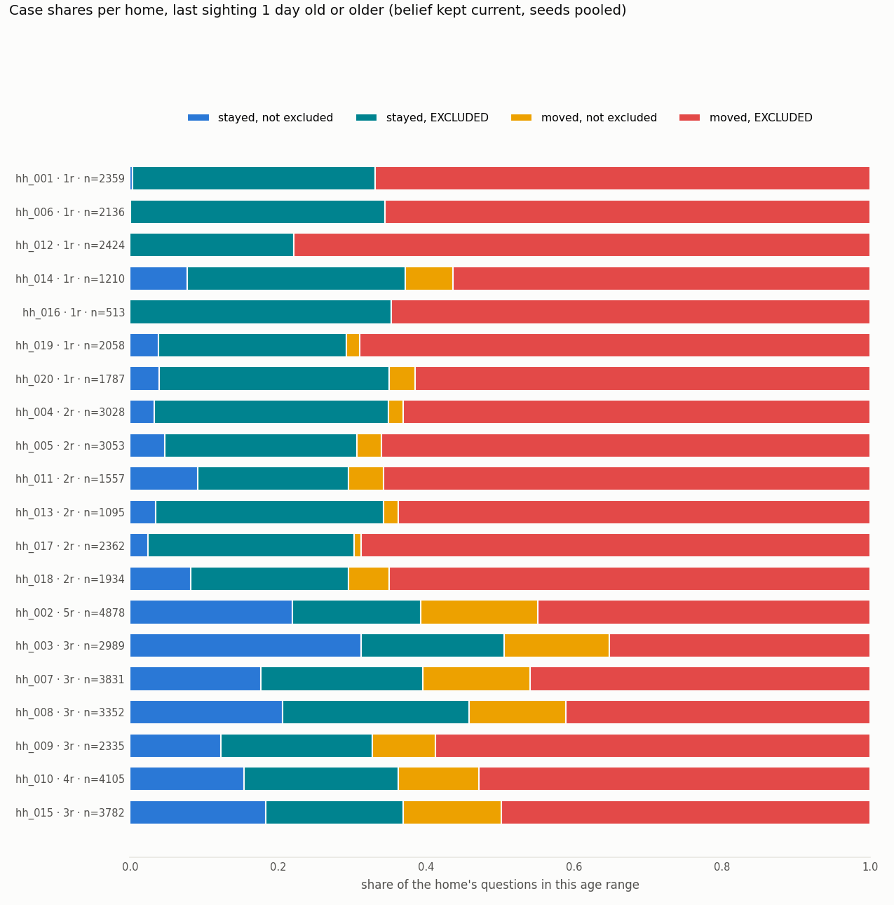
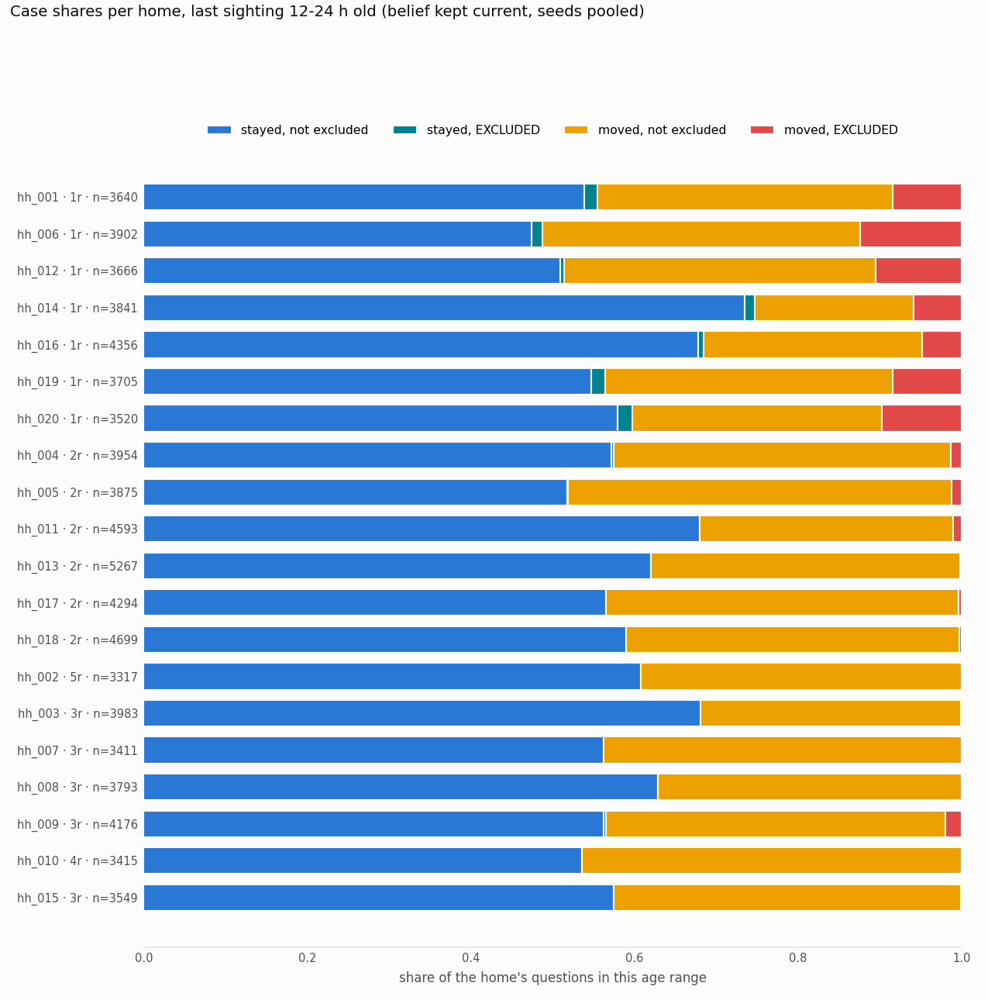

# Why the survival models win at long ages: the four-case split

Each question is classed by whether the object MOVED since its last sighting and whether a later room visit EXCLUDED the last-seen receptacle (found it without the object). The base class's exclusion is hard and permanent until the next sighting, so LastObs and MostFreq can never re-answer an excluded receptacle; the Perpetua models feed the same negative evidence into their filters and the emergence filter re-admits the receptacle after the expected absence. Seeds of a home are pooled; homes are not. Cells under 30 questions are not quoted.

## last sighting 1 day old or older

Accuracy per case, LastObs / MostFreq / Perpetua / PerpetuaStar / PerpetuaStarFlat:

| home | res | n | stayed, not excluded share | stayed, EXCLUDED share | moved, not excluded share | moved, EXCLUDED share | stayed, not excluded: LastObs / MostFreq / Perpetua / PerpStar / PerpFlat | stayed, EXCLUDED: LastObs / MostFreq / Perpetua / PerpStar / PerpFlat | moved, not excluded: LastObs / MostFreq / Perpetua / PerpStar / PerpFlat | moved, EXCLUDED: LastObs / MostFreq / Perpetua / PerpStar / PerpFlat |
|---|---|---|---|---|---|---|---|---|---|---|
| hh_001 | 1 | 2359 | 0.00 | 0.33 | 0.00 | 0.67 | n=9<30 | 0.00 / 0.00 / 0.69 / 0.70 / 0.68 | n=1<30 | 0.52 / 0.52 / 0.07 / 0.06 / 0.06 |
| hh_006 | 1 | 2136 | 0.00 | 0.34 | 0.00 | 0.66 | n=1<30 | 0.00 / 0.00 / 0.61 / 0.65 / 0.63 | n=0<30 | 0.34 / 0.34 / 0.15 / 0.14 / 0.13 |
| hh_012 | 1 | 2424 | 0.00 | 0.22 | 0.00 | 0.78 | n=0<30 | 0.00 / 0.00 / 0.51 / 0.51 / 0.50 | n=0<30 | 0.47 / 0.47 / 0.11 / 0.10 / 0.10 |
| hh_014 | 1 | 1210 | 0.08 | 0.30 | 0.06 | 0.56 | 1.00 / 0.98 / 0.73 / 0.77 / 0.77 | 0.00 / 0.00 / 0.68 / 0.73 / 0.73 | 0.00 / 0.00 / 0.22 / 0.22 / 0.26 | 0.14 / 0.14 / 0.21 / 0.18 / 0.19 |
| hh_016 | 1 | 513 | 0.00 | 0.35 | 0.00 | 0.65 | n=0<30 | 0.00 / 0.00 / 0.49 / 0.55 / 0.54 | n=0<30 | 0.04 / 0.04 / 0.24 / 0.26 / 0.24 |
| hh_019 | 1 | 2058 | 0.04 | 0.25 | 0.02 | 0.69 | 1.00 / 1.00 / 0.68 / 0.71 / 0.69 | 0.00 / 0.00 / 0.49 / 0.52 / 0.51 | 0.00 / 0.00 / 0.19 / 0.19 / 0.19 | 0.57 / 0.57 / 0.12 / 0.11 / 0.11 |
| hh_020 | 1 | 1787 | 0.04 | 0.31 | 0.04 | 0.61 | 1.00 / 1.00 / 0.62 / 0.59 / 0.58 | 0.00 / 0.00 / 0.65 / 0.68 / 0.67 | 0.00 / 0.00 / 0.11 / 0.14 / 0.14 | 0.44 / 0.44 / 0.21 / 0.18 / 0.19 |
| hh_004 | 2 | 3028 | 0.03 | 0.32 | 0.02 | 0.63 | 1.00 / 1.00 / 0.62 / 0.72 / 0.70 | 0.00 / 0.00 / 0.58 / 0.60 / 0.60 | 0.00 / 0.00 / 0.33 / 0.31 / 0.33 | 0.41 / 0.41 / 0.15 / 0.15 / 0.15 |
| hh_005 | 2 | 3053 | 0.05 | 0.26 | 0.03 | 0.66 | 1.00 / 1.00 / 0.62 / 0.64 / 0.62 | 0.00 / 0.00 / 0.72 / 0.72 / 0.71 | 0.00 / 0.01 / 0.29 / 0.27 / 0.30 | 0.48 / 0.48 / 0.11 / 0.10 / 0.10 |
| hh_011 | 2 | 1557 | 0.09 | 0.20 | 0.05 | 0.66 | 1.00 / 1.00 / 0.59 / 0.59 / 0.56 | 0.00 / 0.00 / 0.52 / 0.53 / 0.51 | 0.00 / 0.00 / 0.25 / 0.25 / 0.23 | 0.04 / 0.04 / 0.28 / 0.28 / 0.28 |
| hh_013 | 2 | 1095 | 0.03 | 0.31 | 0.02 | 0.64 | 1.00 / 1.00 / 0.68 / 0.74 / 0.74 | 0.00 / 0.00 / 0.56 / 0.60 / 0.59 | n=22<30 | 0.09 / 0.09 / 0.35 / 0.30 / 0.31 |
| hh_017 | 2 | 2362 | 0.02 | 0.28 | 0.01 | 0.69 | 1.00 / 1.00 / 0.62 / 0.64 / 0.62 | 0.00 / 0.00 / 0.67 / 0.65 / 0.64 | n=23<30 | 0.44 / 0.44 / 0.13 / 0.11 / 0.11 |
| hh_018 | 2 | 1934 | 0.08 | 0.21 | 0.05 | 0.65 | 1.00 / 1.00 / 0.60 / 0.69 / 0.68 | 0.00 / 0.00 / 0.69 / 0.69 / 0.69 | 0.00 / 0.00 / 0.36 / 0.29 / 0.30 | 0.56 / 0.56 / 0.15 / 0.14 / 0.14 |
| hh_002 | 5 | 4878 | 0.22 | 0.17 | 0.16 | 0.45 | 1.00 / 1.00 / 0.60 / 0.67 / 0.65 | 0.00 / 0.00 / 0.62 / 0.64 / 0.63 | 0.00 / 0.00 / 0.26 / 0.24 / 0.24 | 0.47 / 0.47 / 0.12 / 0.11 / 0.11 |
| hh_003 | 3 | 2989 | 0.31 | 0.19 | 0.14 | 0.35 | 1.00 / 1.00 / 0.70 / 0.74 / 0.73 | 0.00 / 0.00 / 0.65 / 0.69 / 0.66 | 0.00 / 0.00 / 0.31 / 0.27 / 0.29 | 0.40 / 0.40 / 0.18 / 0.17 / 0.17 |
| hh_007 | 3 | 3831 | 0.18 | 0.22 | 0.15 | 0.46 | 1.00 / 1.00 / 0.60 / 0.67 / 0.65 | 0.00 / 0.00 / 0.65 / 0.66 / 0.64 | 0.00 / 0.00 / 0.23 / 0.21 / 0.20 | 0.48 / 0.48 / 0.13 / 0.13 / 0.12 |
| hh_008 | 3 | 3352 | 0.21 | 0.25 | 0.13 | 0.41 | 1.00 / 1.00 / 0.65 / 0.68 / 0.67 | 0.00 / 0.00 / 0.65 / 0.67 / 0.67 | 0.00 / 0.00 / 0.21 / 0.18 / 0.19 | 0.41 / 0.41 / 0.16 / 0.15 / 0.14 |
| hh_009 | 3 | 2335 | 0.12 | 0.20 | 0.09 | 0.59 | 1.00 / 1.00 / 0.67 / 0.72 / 0.69 | 0.00 / 0.00 / 0.58 / 0.59 / 0.57 | 0.00 / 0.00 / 0.34 / 0.28 / 0.28 | 0.33 / 0.33 / 0.20 / 0.21 / 0.21 |
| hh_010 | 4 | 4105 | 0.15 | 0.21 | 0.11 | 0.53 | 1.00 / 1.00 / 0.67 / 0.69 / 0.68 | 0.00 / 0.00 / 0.65 / 0.68 / 0.67 | 0.00 / 0.00 / 0.22 / 0.20 / 0.20 | 0.49 / 0.49 / 0.11 / 0.11 / 0.11 |
| hh_015 | 3 | 3782 | 0.18 | 0.19 | 0.13 | 0.50 | 1.00 / 1.00 / 0.61 / 0.65 / 0.64 | 0.00 / 0.00 / 0.62 / 0.66 / 0.64 | 0.00 / 0.00 / 0.22 / 0.21 / 0.21 | 0.43 / 0.43 / 0.15 / 0.15 / 0.15 |

## last sighting 12-24 h old

Accuracy per case, LastObs / MostFreq / Perpetua / PerpetuaStar / PerpetuaStarFlat:

| home | res | n | stayed, not excluded share | stayed, EXCLUDED share | moved, not excluded share | moved, EXCLUDED share | stayed, not excluded: LastObs / MostFreq / Perpetua / PerpStar / PerpFlat | stayed, EXCLUDED: LastObs / MostFreq / Perpetua / PerpStar / PerpFlat | moved, not excluded: LastObs / MostFreq / Perpetua / PerpStar / PerpFlat | moved, EXCLUDED: LastObs / MostFreq / Perpetua / PerpStar / PerpFlat |
|---|---|---|---|---|---|---|---|---|---|---|
| hh_001 | 1 | 3640 | 0.54 | 0.02 | 0.36 | 0.08 | 1.00 / 1.00 / 0.78 / 0.80 / 0.79 | 0.00 / 0.00 / 0.51 / 0.51 / 0.53 | 0.00 / 0.00 / 0.15 / 0.14 / 0.14 | 0.44 / 0.44 / 0.17 / 0.14 / 0.13 |
| hh_006 | 1 | 3902 | 0.47 | 0.01 | 0.39 | 0.12 | 1.00 / 0.99 / 0.71 / 0.73 / 0.72 | 0.00 / 0.00 / 0.36 / 0.36 / 0.36 | 0.00 / 0.00 / 0.11 / 0.09 / 0.09 | 0.50 / 0.50 / 0.20 / 0.18 / 0.18 |
| hh_012 | 1 | 3666 | 0.51 | 0.00 | 0.38 | 0.11 | 1.00 / 0.99 / 0.76 / 0.78 / 0.77 | n=16<30 | 0.00 / 0.00 / 0.09 / 0.08 / 0.09 | 0.55 / 0.55 / 0.13 / 0.13 / 0.12 |
| hh_014 | 1 | 3841 | 0.73 | 0.01 | 0.19 | 0.06 | 1.00 / 0.99 / 0.76 / 0.78 / 0.77 | 0.00 / 0.00 / 0.46 / 0.38 / 0.31 | 0.00 / 0.02 / 0.19 / 0.18 / 0.18 | 0.16 / 0.16 / 0.31 / 0.34 / 0.30 |
| hh_016 | 1 | 4356 | 0.68 | 0.01 | 0.27 | 0.05 | 1.00 / 0.99 / 0.77 / 0.80 / 0.80 | n=28<30 | 0.00 / 0.00 / 0.23 / 0.23 / 0.22 | 0.08 / 0.08 / 0.38 / 0.40 / 0.39 |
| hh_019 | 1 | 3705 | 0.55 | 0.02 | 0.35 | 0.08 | 1.00 / 0.99 / 0.70 / 0.73 / 0.73 | 0.00 / 0.00 / 0.22 / 0.35 / 0.37 | 0.00 / 0.00 / 0.14 / 0.13 / 0.13 | 0.42 / 0.42 / 0.21 / 0.20 / 0.19 |
| hh_020 | 1 | 3520 | 0.58 | 0.02 | 0.31 | 0.10 | 1.00 / 0.99 / 0.69 / 0.70 / 0.69 | 0.00 / 0.00 / 0.43 / 0.51 / 0.51 | 0.00 / 0.00 / 0.21 / 0.18 / 0.18 | 0.37 / 0.37 / 0.29 / 0.27 / 0.26 |
| hh_004 | 2 | 3954 | 0.57 | 0.00 | 0.41 | 0.01 | 1.00 / 1.00 / 0.79 / 0.82 / 0.81 | n=11<30 | 0.00 / 0.00 / 0.21 / 0.19 / 0.19 | 0.77 / 0.77 / 0.17 / 0.17 / 0.17 |
| hh_005 | 2 | 3875 | 0.52 | 0.00 | 0.47 | 0.01 | 1.00 / 1.00 / 0.68 / 0.72 / 0.71 | n=4<30 | 0.00 / 0.00 / 0.15 / 0.12 / 0.13 | 0.47 / 0.47 / 0.14 / 0.12 / 0.12 |
| hh_011 | 2 | 4593 | 0.68 | 0.00 | 0.31 | 0.01 | 1.00 / 0.98 / 0.67 / 0.70 / 0.69 | n=1<30 | 0.00 / 0.01 / 0.23 / 0.20 / 0.20 | 0.04 / 0.04 / 0.48 / 0.41 / 0.39 |
| hh_013 | 2 | 5267 | 0.62 | 0.00 | 0.38 | 0.00 | 1.00 / 1.00 / 0.75 / 0.79 / 0.77 | n=0<30 | 0.00 / 0.01 / 0.22 / 0.21 / 0.21 | n=10<30 |
| hh_017 | 2 | 4294 | 0.57 | 0.00 | 0.43 | 0.00 | 1.00 / 1.00 / 0.71 / 0.75 / 0.73 | n=0<30 | 0.00 / 0.00 / 0.15 / 0.14 / 0.14 | n=18<30 |
| hh_018 | 2 | 4699 | 0.59 | 0.00 | 0.41 | 0.00 | 1.00 / 1.00 / 0.75 / 0.80 / 0.78 | n=0<30 | 0.00 / 0.00 / 0.17 / 0.16 / 0.16 | n=12<30 |
| hh_002 | 5 | 3317 | 0.61 | 0.00 | 0.39 | 0.00 | 1.00 / 0.99 / 0.69 / 0.72 / 0.71 | n=0<30 | 0.00 / 0.01 / 0.16 / 0.14 / 0.15 | n=0<30 |
| hh_003 | 3 | 3983 | 0.68 | 0.00 | 0.32 | 0.00 | 1.00 / 0.99 / 0.76 / 0.80 / 0.79 | n=0<30 | 0.00 / 0.01 / 0.14 / 0.13 / 0.13 | n=3<30 |
| hh_007 | 3 | 3411 | 0.56 | 0.00 | 0.44 | 0.00 | 1.00 / 0.98 / 0.70 / 0.75 / 0.74 | n=0<30 | 0.00 / 0.01 / 0.16 / 0.16 / 0.16 | n=0<30 |
| hh_008 | 3 | 3793 | 0.63 | 0.00 | 0.37 | 0.00 | 1.00 / 0.99 / 0.75 / 0.79 / 0.78 | n=0<30 | 0.00 / 0.01 / 0.18 / 0.15 / 0.16 | n=0<30 |
| hh_009 | 3 | 4176 | 0.56 | 0.00 | 0.41 | 0.02 | 1.00 / 0.99 / 0.70 / 0.73 / 0.73 | n=12<30 | 0.00 / 0.01 / 0.17 / 0.15 / 0.16 | 0.20 / 0.20 / 0.33 / 0.32 / 0.32 |
| hh_010 | 4 | 3415 | 0.54 | 0.00 | 0.46 | 0.00 | 1.00 / 0.99 / 0.73 / 0.75 / 0.74 | n=0<30 | 0.00 / 0.01 / 0.13 / 0.12 / 0.12 | n=0<30 |
| hh_015 | 3 | 3549 | 0.57 | 0.00 | 0.42 | 0.00 | 1.00 / 0.99 / 0.69 / 0.73 / 0.73 | n=0<30 | 0.00 / 0.01 / 0.13 / 0.13 / 0.13 | n=3<30 |

