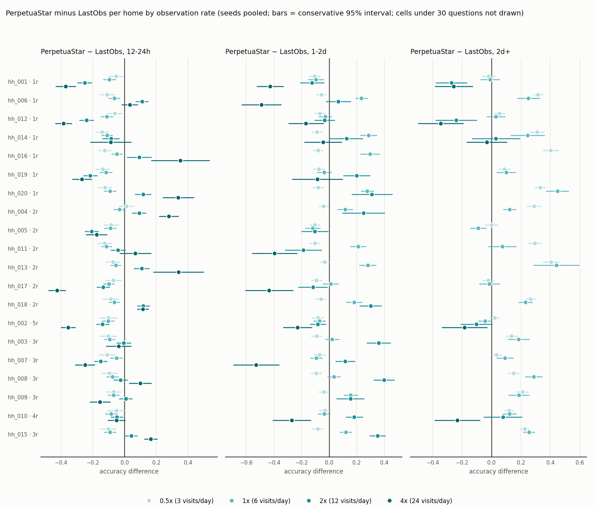
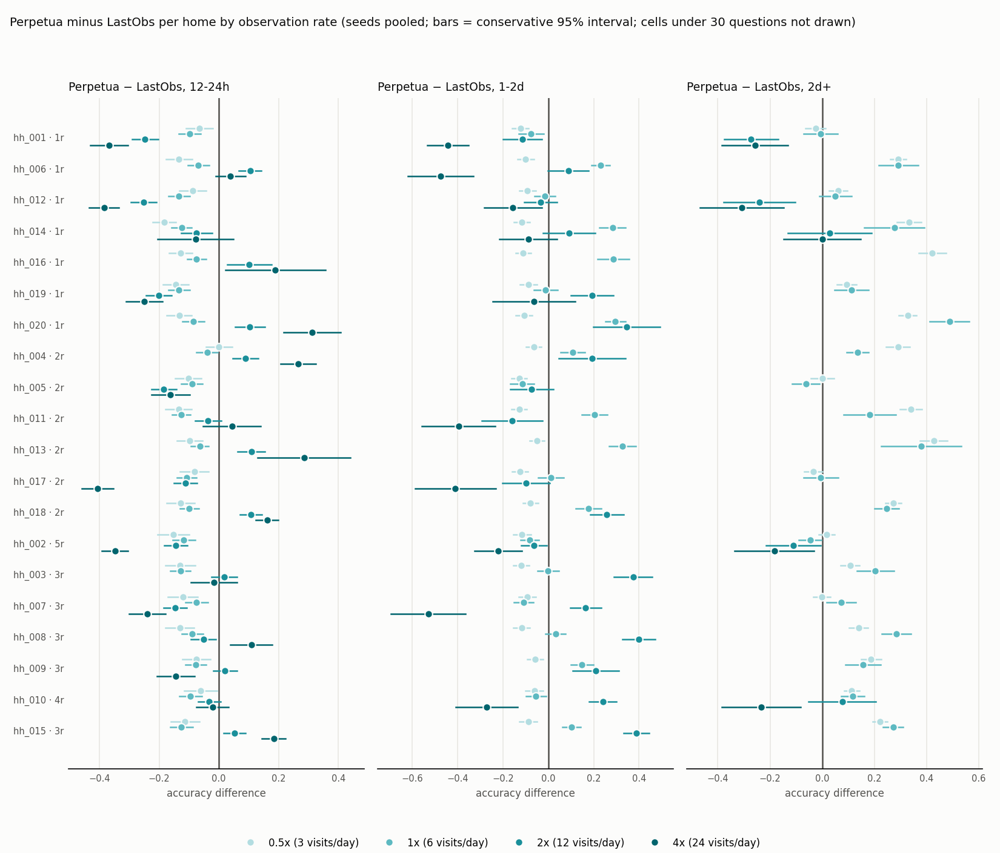
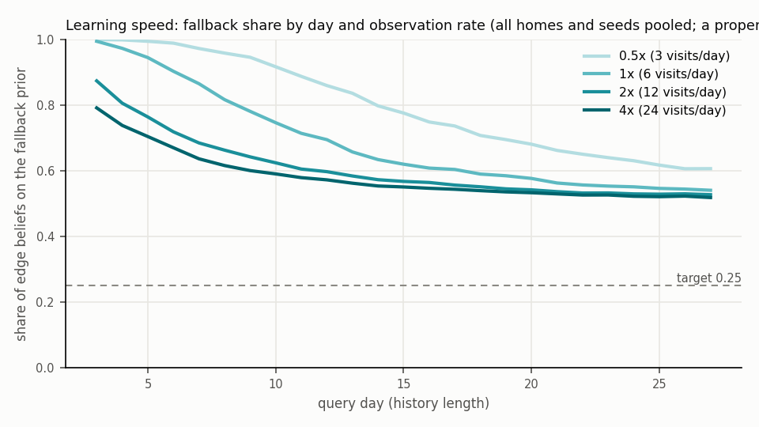

# Observation-rate sweep: model limit or data limit?

Rates 0.5x = 3 visits/day, 1x = 6 visits/day, 2x = 12 visits/day, 4x = 24 visits/day of the round-robin room patrol; 28-day episodes; 20 homes x seeds [0, 1]; models LastObs, Periodic, DaytypeMix, SmoothedRec, Perpetua, PerpetuaStar, PerpStarFlat + the routine oracle. Every table compares within a fixed age-of-last-sighting bin, homes are never pooled with each other, and cells under 30 questions are masked. Per-rate full reports live in the visits<v>/ directories beside this file.

## 1. Accuracy by age of last sighting, per resident group and rate

### 1-resident homes (7 homes, seeds 0 and 1 pooled)

| rate | age of last sighting | n | LastObs | Periodic | DaytypeMix | SmoothedRec | Perpetua | PerpetuaStar | PerpStarFlat | oracle |
|---|---|---|---|---|---|---|---|---|---|---|
| 0.5x | <15m | 266 | 0.985 | 0.985 | 0.985 | 0.985 | 0.944 | 0.974 | 0.962 | 0.680 |
| 0.5x | 15m-1h | 741 | 0.964 | 0.964 | 0.947 | 0.964 | 0.938 | 0.947 | 0.945 | 0.682 |
| 0.5x | 1-3h | 1774 | 0.902 | 0.901 | 0.874 | 0.902 | 0.861 | 0.886 | 0.883 | 0.698 |
| 0.5x | 3-6h | 1792 | 0.804 | 0.802 | 0.766 | 0.804 | 0.756 | 0.777 | 0.770 | 0.699 |
| 0.5x | 6-12h | 3154 | 0.734 | 0.733 | 0.683 | 0.734 | 0.688 | 0.701 | 0.701 | 0.694 |
| 0.5x | 12-24h | 7434 | 0.612 | 0.611 | 0.580 | 0.612 | 0.485 | 0.502 | 0.494 | 0.715 |
| 0.5x | 1-2d | 10161 | 0.533 | 0.538 | 0.531 | 0.536 | 0.427 | 0.453 | 0.450 | 0.714 |
| 0.5x | 2-3d | 2643 | 0.132 | 0.170 | 0.168 | 0.138 | 0.323 | 0.319 | 0.318 | 0.740 |
| 0.5x | 3d+ | 3535 | 0.164 | 0.192 | 0.182 | 0.174 | 0.328 | 0.330 | 0.327 | 0.767 |
| 1x | <15m | 450 | 0.982 | 0.976 | 0.976 | 0.982 | 0.929 | 0.936 | 0.929 | 0.682 |
| 1x | 15m-1h | 1533 | 0.928 | 0.925 | 0.894 | 0.928 | 0.856 | 0.876 | 0.874 | 0.674 |
| 1x | 1-3h | 3412 | 0.875 | 0.874 | 0.800 | 0.875 | 0.814 | 0.836 | 0.828 | 0.693 |
| 1x | 3-6h | 3966 | 0.778 | 0.778 | 0.724 | 0.778 | 0.709 | 0.731 | 0.731 | 0.701 |
| 1x | 6-12h | 6494 | 0.724 | 0.724 | 0.669 | 0.725 | 0.652 | 0.662 | 0.658 | 0.708 |
| 1x | 12-24h | 10606 | 0.594 | 0.599 | 0.575 | 0.595 | 0.492 | 0.504 | 0.500 | 0.729 |
| 1x | 1-2d | 3528 | 0.174 | 0.216 | 0.190 | 0.185 | 0.298 | 0.288 | 0.283 | 0.740 |
| 1x | 2-3d | 976 | 0.170 | 0.195 | 0.194 | 0.165 | 0.325 | 0.296 | 0.294 | 0.769 |
| 1x | 3d+ | 535 | 0.164 | 0.215 | 0.226 | 0.217 | 0.314 | 0.305 | 0.293 | 0.776 |
| 2x | <15m | 1069 | 0.984 | 0.982 | 0.965 | 0.984 | 0.923 | 0.949 | 0.950 | 0.661 |
| 2x | 15m-1h | 2801 | 0.948 | 0.943 | 0.888 | 0.948 | 0.876 | 0.893 | 0.890 | 0.671 |
| 2x | 1-3h | 6512 | 0.877 | 0.875 | 0.767 | 0.877 | 0.806 | 0.818 | 0.820 | 0.703 |
| 2x | 3-6h | 7513 | 0.812 | 0.814 | 0.745 | 0.813 | 0.744 | 0.751 | 0.747 | 0.710 |
| 2x | 6-12h | 6954 | 0.675 | 0.715 | 0.657 | 0.689 | 0.605 | 0.613 | 0.614 | 0.725 |
| 2x | 12-24h | 5402 | 0.439 | 0.440 | 0.418 | 0.434 | 0.355 | 0.355 | 0.353 | 0.767 |
| 2x | 1-2d | 1022 | 0.247 | 0.250 | 0.210 | 0.251 | 0.285 | 0.283 | 0.275 | 0.732 |
| 2x | 2-3d | 118 | 0.381 | 0.508 | 0.500 | 0.390 | 0.059 | 0.068 | 0.059 | 0.737 |
| 2x | 3d+ | 109 | 0.257 | 0.284 | 0.367 | 0.367 | 0.156 | 0.147 | 0.156 | 0.798 |
| 4x | <15m | 2113 | 0.992 | 0.987 | 0.960 | 0.992 | 0.930 | 0.951 | 0.948 | 0.690 |
| 4x | 15m-1h | 5669 | 0.953 | 0.950 | 0.879 | 0.953 | 0.877 | 0.898 | 0.900 | 0.692 |
| 4x | 1-3h | 12254 | 0.882 | 0.882 | 0.788 | 0.882 | 0.804 | 0.815 | 0.816 | 0.703 |
| 4x | 3-6h | 4469 | 0.716 | 0.766 | 0.719 | 0.728 | 0.626 | 0.630 | 0.629 | 0.731 |
| 4x | 6-12h | 4508 | 0.640 | 0.685 | 0.630 | 0.661 | 0.492 | 0.497 | 0.497 | 0.742 |
| 4x | 12-24h | 1915 | 0.384 | 0.408 | 0.340 | 0.389 | 0.194 | 0.193 | 0.190 | 0.820 |
| 4x | 1-2d | 405 | 0.402 | 0.390 | 0.407 | 0.427 | 0.114 | 0.121 | 0.121 | 0.723 |
| 4x | 2-3d | 104 | 0.356 | 0.462 | 0.538 | 0.423 | 0.067 | 0.058 | 0.058 | 0.779 |
| 4x | 3d+ | 63 | 0.222 | 0.270 | 0.413 | 0.460 | 0.127 | 0.095 | 0.127 | 0.841 |

### 2-resident homes (6 homes, seeds 0 and 1 pooled)

| rate | age of last sighting | n | LastObs | Periodic | DaytypeMix | SmoothedRec | Perpetua | PerpetuaStar | PerpStarFlat | oracle |
|---|---|---|---|---|---|---|---|---|---|---|
| 0.5x | <15m | 147 | 1.000 | 1.000 | 1.000 | 1.000 | 0.973 | 0.973 | 0.973 | 0.680 |
| 0.5x | 15m-1h | 498 | 0.944 | 0.944 | 0.934 | 0.944 | 0.900 | 0.928 | 0.932 | 0.687 |
| 0.5x | 1-3h | 1250 | 0.877 | 0.877 | 0.863 | 0.877 | 0.829 | 0.853 | 0.851 | 0.688 |
| 0.5x | 3-6h | 1389 | 0.704 | 0.703 | 0.689 | 0.704 | 0.665 | 0.690 | 0.686 | 0.697 |
| 0.5x | 6-12h | 3080 | 0.624 | 0.624 | 0.596 | 0.624 | 0.586 | 0.601 | 0.598 | 0.698 |
| 0.5x | 12-24h | 5580 | 0.616 | 0.615 | 0.605 | 0.616 | 0.527 | 0.546 | 0.540 | 0.726 |
| 0.5x | 1-2d | 10068 | 0.547 | 0.547 | 0.541 | 0.547 | 0.453 | 0.476 | 0.470 | 0.722 |
| 0.5x | 2-3d | 1827 | 0.202 | 0.093 | 0.153 | 0.117 | 0.347 | 0.327 | 0.323 | 0.681 |
| 0.5x | 3d+ | 3161 | 0.157 | 0.021 | 0.140 | 0.058 | 0.348 | 0.346 | 0.344 | 0.757 |
| 1x | <15m | 310 | 0.994 | 0.994 | 0.987 | 0.994 | 0.916 | 0.948 | 0.945 | 0.710 |
| 1x | 15m-1h | 945 | 0.958 | 0.954 | 0.940 | 0.958 | 0.916 | 0.927 | 0.921 | 0.703 |
| 1x | 1-3h | 2234 | 0.853 | 0.852 | 0.779 | 0.853 | 0.802 | 0.800 | 0.796 | 0.683 |
| 1x | 3-6h | 2920 | 0.765 | 0.765 | 0.718 | 0.765 | 0.708 | 0.715 | 0.712 | 0.698 |
| 1x | 6-12h | 4691 | 0.685 | 0.685 | 0.650 | 0.685 | 0.624 | 0.639 | 0.630 | 0.762 |
| 1x | 12-24h | 10739 | 0.593 | 0.592 | 0.569 | 0.592 | 0.505 | 0.518 | 0.509 | 0.710 |
| 1x | 1-2d | 2908 | 0.234 | 0.119 | 0.175 | 0.135 | 0.331 | 0.327 | 0.326 | 0.684 |
| 1x | 2-3d | 916 | 0.228 | 0.035 | 0.147 | 0.068 | 0.272 | 0.248 | 0.248 | 0.749 |
| 1x | 3d+ | 1337 | 0.209 | 0.013 | 0.133 | 0.040 | 0.318 | 0.298 | 0.298 | 0.791 |
| 2x | <15m | 608 | 0.988 | 0.984 | 0.972 | 0.988 | 0.921 | 0.949 | 0.934 | 0.678 |
| 2x | 15m-1h | 1841 | 0.951 | 0.946 | 0.902 | 0.951 | 0.875 | 0.902 | 0.895 | 0.681 |
| 2x | 1-3h | 4312 | 0.879 | 0.875 | 0.773 | 0.879 | 0.798 | 0.824 | 0.812 | 0.687 |
| 2x | 3-6h | 5499 | 0.815 | 0.813 | 0.726 | 0.815 | 0.728 | 0.736 | 0.726 | 0.716 |
| 2x | 6-12h | 7856 | 0.700 | 0.696 | 0.651 | 0.696 | 0.620 | 0.625 | 0.620 | 0.726 |
| 2x | 12-24h | 6209 | 0.413 | 0.301 | 0.355 | 0.316 | 0.405 | 0.398 | 0.385 | 0.742 |
| 2x | 1-2d | 608 | 0.250 | 0.089 | 0.186 | 0.097 | 0.266 | 0.265 | 0.220 | 0.738 |
| 2x | 2-3d | 57 | 0.368 | 0.193 | 0.368 | 0.316 | 0.175 | 0.158 | 0.123 | 0.772 |
| 2x | 3d+ | 10 | - | - | - | - | - | - | - | - |
| 4x | <15m | 1220 | 0.978 | 0.976 | 0.931 | 0.978 | 0.902 | 0.926 | 0.921 | 0.663 |
| 4x | 15m-1h | 3603 | 0.936 | 0.933 | 0.843 | 0.936 | 0.849 | 0.881 | 0.881 | 0.686 |
| 4x | 1-3h | 8639 | 0.872 | 0.870 | 0.728 | 0.872 | 0.787 | 0.804 | 0.804 | 0.697 |
| 4x | 3-6h | 7162 | 0.784 | 0.776 | 0.720 | 0.778 | 0.707 | 0.715 | 0.716 | 0.721 |
| 4x | 6-12h | 4084 | 0.657 | 0.461 | 0.506 | 0.482 | 0.407 | 0.407 | 0.405 | 0.764 |
| 4x | 12-24h | 2127 | 0.314 | 0.105 | 0.270 | 0.163 | 0.276 | 0.263 | 0.260 | 0.783 |
| 4x | 1-2d | 125 | 0.376 | 0.352 | 0.408 | 0.368 | 0.096 | 0.088 | 0.096 | 0.744 |
| 4x | 2-3d | 32 | 0.562 | 0.375 | 0.531 | 0.531 | 0.031 | 0.031 | 0.031 | 0.812 |
| 4x | 3d+ | 8 | - | - | - | - | - | - | - | - |

### 3+-resident homes (7 homes, seeds 0 and 1 pooled)

| rate | age of last sighting | n | LastObs | Periodic | DaytypeMix | SmoothedRec | Perpetua | PerpetuaStar | PerpStarFlat | oracle |
|---|---|---|---|---|---|---|---|---|---|---|
| 0.5x | <15m | 144 | 0.993 | 0.993 | 0.993 | 0.993 | 0.924 | 0.979 | 0.972 | 0.681 |
| 0.5x | 15m-1h | 453 | 0.945 | 0.945 | 0.932 | 0.945 | 0.892 | 0.932 | 0.925 | 0.642 |
| 0.5x | 1-3h | 1229 | 0.862 | 0.862 | 0.843 | 0.862 | 0.821 | 0.850 | 0.845 | 0.675 |
| 0.5x | 3-6h | 1333 | 0.737 | 0.736 | 0.701 | 0.737 | 0.712 | 0.715 | 0.710 | 0.701 |
| 0.5x | 6-12h | 2713 | 0.651 | 0.652 | 0.609 | 0.651 | 0.621 | 0.635 | 0.631 | 0.710 |
| 0.5x | 12-24h | 5346 | 0.557 | 0.557 | 0.517 | 0.557 | 0.446 | 0.467 | 0.458 | 0.698 |
| 0.5x | 1-2d | 9687 | 0.520 | 0.520 | 0.509 | 0.520 | 0.426 | 0.450 | 0.443 | 0.703 |
| 0.5x | 2-3d | 4771 | 0.373 | 0.378 | 0.377 | 0.370 | 0.372 | 0.393 | 0.388 | 0.695 |
| 0.5x | 3d+ | 5824 | 0.160 | 0.195 | 0.166 | 0.139 | 0.349 | 0.357 | 0.352 | 0.747 |
| 1x | <15m | 331 | 0.997 | 0.991 | 0.979 | 0.997 | 0.970 | 0.961 | 0.958 | 0.689 |
| 1x | 15m-1h | 945 | 0.917 | 0.914 | 0.904 | 0.917 | 0.872 | 0.899 | 0.892 | 0.656 |
| 1x | 1-3h | 2236 | 0.832 | 0.826 | 0.762 | 0.832 | 0.771 | 0.799 | 0.795 | 0.687 |
| 1x | 3-6h | 2827 | 0.728 | 0.727 | 0.669 | 0.728 | 0.695 | 0.706 | 0.704 | 0.702 |
| 1x | 6-12h | 4834 | 0.685 | 0.684 | 0.625 | 0.685 | 0.632 | 0.641 | 0.636 | 0.698 |
| 1x | 12-24h | 10211 | 0.589 | 0.590 | 0.561 | 0.590 | 0.488 | 0.508 | 0.503 | 0.706 |
| 1x | 1-2d | 6539 | 0.389 | 0.397 | 0.392 | 0.380 | 0.386 | 0.400 | 0.391 | 0.697 |
| 1x | 2-3d | 1992 | 0.192 | 0.210 | 0.199 | 0.164 | 0.304 | 0.309 | 0.306 | 0.773 |
| 1x | 3d+ | 1585 | 0.184 | 0.224 | 0.206 | 0.162 | 0.322 | 0.320 | 0.312 | 0.784 |
| 2x | <15m | 595 | 0.980 | 0.980 | 0.961 | 0.980 | 0.887 | 0.911 | 0.906 | 0.659 |
| 2x | 15m-1h | 1779 | 0.935 | 0.932 | 0.872 | 0.935 | 0.867 | 0.891 | 0.886 | 0.672 |
| 2x | 1-3h | 4475 | 0.849 | 0.847 | 0.743 | 0.849 | 0.781 | 0.796 | 0.789 | 0.677 |
| 2x | 3-6h | 5403 | 0.747 | 0.746 | 0.669 | 0.747 | 0.685 | 0.694 | 0.688 | 0.705 |
| 2x | 6-12h | 8580 | 0.682 | 0.678 | 0.616 | 0.679 | 0.616 | 0.616 | 0.606 | 0.697 |
| 2x | 12-24h | 8242 | 0.433 | 0.441 | 0.423 | 0.430 | 0.391 | 0.386 | 0.375 | 0.731 |
| 2x | 1-2d | 2121 | 0.184 | 0.181 | 0.162 | 0.140 | 0.393 | 0.359 | 0.345 | 0.772 |
| 2x | 2-3d | 230 | 0.243 | 0.265 | 0.235 | 0.178 | 0.304 | 0.304 | 0.296 | 0.722 |
| 2x | 3d+ | 75 | 0.240 | 0.360 | 0.267 | 0.307 | 0.187 | 0.200 | 0.200 | 0.760 |
| 4x | <15m | 1274 | 0.979 | 0.969 | 0.940 | 0.979 | 0.904 | 0.923 | 0.924 | 0.666 |
| 4x | 15m-1h | 3576 | 0.935 | 0.931 | 0.853 | 0.935 | 0.846 | 0.878 | 0.877 | 0.664 |
| 4x | 1-3h | 8470 | 0.863 | 0.862 | 0.736 | 0.863 | 0.786 | 0.800 | 0.798 | 0.688 |
| 4x | 3-6h | 8671 | 0.769 | 0.771 | 0.698 | 0.772 | 0.688 | 0.701 | 0.699 | 0.692 |
| 4x | 6-12h | 5754 | 0.627 | 0.617 | 0.585 | 0.593 | 0.468 | 0.472 | 0.469 | 0.731 |
| 4x | 12-24h | 3385 | 0.366 | 0.412 | 0.355 | 0.349 | 0.264 | 0.250 | 0.247 | 0.814 |
| 4x | 1-2d | 282 | 0.383 | 0.340 | 0.355 | 0.277 | 0.167 | 0.149 | 0.149 | 0.741 |
| 4x | 2-3d | 62 | 0.290 | 0.468 | 0.323 | 0.403 | 0.048 | 0.048 | 0.048 | 0.774 |
| 4x | 3d+ | 26 | - | - | - | - | - | - | - | - |

## 2. Paired per-home-seed comparisons

One pair per (home, seed): both models answer the same questions in the bin. `wins` counts pairs where the survival model is strictly better; pairs with fewer than 30 questions are excluded.

| rate | survival model | comparator | bin | pairs | wins | losses | median delta | mean delta |
|---|---|---|---|---|---|---|---|---|
| 0.5x | Perpetua | LastObs | 12-24h | 40 | 1 | 39 | -0.116 | -0.110 |
| 0.5x | Perpetua | LastObs | 1-2d | 40 | 0 | 40 | -0.101 | -0.099 |
| 0.5x | Perpetua | Periodic | 1-2d | 40 | 0 | 40 | -0.105 | -0.100 |
| 0.5x | Perpetua | DaytypeMix | 1-2d | 40 | 0 | 40 | -0.098 | -0.092 |
| 0.5x | Perpetua | SmoothedRec | 1-2d | 40 | 0 | 40 | -0.103 | -0.099 |
| 0.5x | PerpetuaStar | LastObs | 1-2d | 40 | 1 | 39 | -0.079 | -0.074 |
| 0.5x | PerpetuaStar | Periodic | 1-2d | 40 | 0 | 39 | -0.078 | -0.076 |
| 0.5x | PerpetuaStar | DaytypeMix | 1-2d | 40 | 2 | 38 | -0.068 | -0.067 |
| 0.5x | PerpetuaStar | SmoothedRec | 1-2d | 40 | 1 | 39 | -0.081 | -0.075 |
| 0.5x | PerpStarFlat | LastObs | 1-2d | 40 | 0 | 40 | -0.086 | -0.079 |
| 0.5x | PerpStarFlat | Periodic | 1-2d | 40 | 0 | 40 | -0.085 | -0.081 |
| 0.5x | PerpStarFlat | DaytypeMix | 1-2d | 40 | 1 | 39 | -0.070 | -0.073 |
| 0.5x | PerpStarFlat | SmoothedRec | 1-2d | 40 | 0 | 40 | -0.090 | -0.080 |
| 0.5x | Perpetua | LastObs | 2d+ | 40 | 32 | 8 | +0.217 | +0.179 |
| 0.5x | Perpetua | Periodic | 2d+ | 40 | 36 | 4 | +0.227 | +0.192 |
| 0.5x | Perpetua | DaytypeMix | 2d+ | 40 | 35 | 5 | +0.202 | +0.172 |
| 0.5x | Perpetua | SmoothedRec | 2d+ | 40 | 36 | 4 | +0.230 | +0.202 |
| 0.5x | PerpetuaStar | LastObs | 2d+ | 40 | 33 | 7 | +0.217 | +0.179 |
| 0.5x | PerpetuaStar | Periodic | 2d+ | 40 | 36 | 4 | +0.233 | +0.192 |
| 0.5x | PerpetuaStar | DaytypeMix | 2d+ | 40 | 35 | 5 | +0.194 | +0.172 |
| 0.5x | PerpetuaStar | SmoothedRec | 2d+ | 40 | 37 | 3 | +0.224 | +0.202 |
| 0.5x | PerpStarFlat | LastObs | 2d+ | 40 | 33 | 7 | +0.211 | +0.176 |
| 0.5x | PerpStarFlat | Periodic | 2d+ | 40 | 35 | 5 | +0.227 | +0.189 |
| 0.5x | PerpStarFlat | DaytypeMix | 2d+ | 40 | 35 | 5 | +0.199 | +0.169 |
| 0.5x | PerpStarFlat | SmoothedRec | 2d+ | 40 | 36 | 4 | +0.220 | +0.199 |
| 1x | Perpetua | LastObs | 12-24h | 40 | 0 | 40 | -0.098 | -0.098 |
| 1x | Perpetua | LastObs | 1-2d | 40 | 25 | 15 | +0.082 | +0.086 |
| 1x | Perpetua | Periodic | 1-2d | 40 | 28 | 12 | +0.134 | +0.101 |
| 1x | Perpetua | DaytypeMix | 1-2d | 40 | 25 | 15 | +0.126 | +0.092 |
| 1x | Perpetua | SmoothedRec | 1-2d | 40 | 29 | 11 | +0.112 | +0.110 |
| 1x | PerpetuaStar | LastObs | 1-2d | 40 | 25 | 14 | +0.091 | +0.086 |
| 1x | PerpetuaStar | Periodic | 1-2d | 40 | 29 | 11 | +0.113 | +0.101 |
| 1x | PerpetuaStar | DaytypeMix | 1-2d | 40 | 27 | 13 | +0.100 | +0.092 |
| 1x | PerpetuaStar | SmoothedRec | 1-2d | 40 | 30 | 9 | +0.102 | +0.111 |
| 1x | PerpStarFlat | LastObs | 1-2d | 40 | 25 | 14 | +0.080 | +0.081 |
| 1x | PerpStarFlat | Periodic | 1-2d | 40 | 28 | 12 | +0.111 | +0.096 |
| 1x | PerpStarFlat | DaytypeMix | 1-2d | 40 | 27 | 13 | +0.096 | +0.087 |
| 1x | PerpStarFlat | SmoothedRec | 1-2d | 40 | 29 | 10 | +0.098 | +0.106 |
| 1x | Perpetua | LastObs | 2d+ | 37 | 26 | 10 | +0.177 | +0.163 |
| 1x | Perpetua | Periodic | 2d+ | 37 | 27 | 10 | +0.216 | +0.177 |
| 1x | Perpetua | DaytypeMix | 2d+ | 37 | 27 | 10 | +0.165 | +0.143 |
| 1x | Perpetua | SmoothedRec | 2d+ | 37 | 29 | 8 | +0.216 | +0.182 |
| 1x | PerpetuaStar | LastObs | 2d+ | 37 | 26 | 11 | +0.162 | +0.145 |
| 1x | PerpetuaStar | Periodic | 2d+ | 37 | 28 | 8 | +0.190 | +0.159 |
| 1x | PerpetuaStar | DaytypeMix | 2d+ | 37 | 27 | 9 | +0.123 | +0.125 |
| 1x | PerpetuaStar | SmoothedRec | 2d+ | 37 | 30 | 6 | +0.188 | +0.164 |
| 1x | PerpStarFlat | LastObs | 2d+ | 37 | 26 | 11 | +0.162 | +0.141 |
| 1x | PerpStarFlat | Periodic | 2d+ | 37 | 27 | 9 | +0.188 | +0.154 |
| 1x | PerpStarFlat | DaytypeMix | 2d+ | 37 | 26 | 10 | +0.121 | +0.120 |
| 1x | PerpStarFlat | SmoothedRec | 2d+ | 37 | 29 | 7 | +0.175 | +0.160 |
| 2x | Perpetua | LastObs | 12-24h | 40 | 20 | 20 | -0.017 | -0.038 |
| 2x | Perpetua | LastObs | 1-2d | 33 | 23 | 10 | +0.128 | +0.130 |
| 2x | Perpetua | Periodic | 1-2d | 33 | 26 | 6 | +0.169 | +0.151 |
| 2x | Perpetua | DaytypeMix | 1-2d | 33 | 25 | 6 | +0.153 | +0.143 |
| 2x | Perpetua | SmoothedRec | 1-2d | 33 | 26 | 6 | +0.191 | +0.161 |
| 2x | PerpetuaStar | LastObs | 1-2d | 33 | 21 | 11 | +0.106 | +0.113 |
| 2x | PerpetuaStar | Periodic | 1-2d | 33 | 26 | 6 | +0.157 | +0.135 |
| 2x | PerpetuaStar | DaytypeMix | 1-2d | 33 | 26 | 5 | +0.129 | +0.126 |
| 2x | PerpetuaStar | SmoothedRec | 1-2d | 33 | 23 | 9 | +0.164 | +0.144 |
| 2x | PerpStarFlat | LastObs | 1-2d | 33 | 20 | 11 | +0.103 | +0.096 |
| 2x | PerpStarFlat | Periodic | 1-2d | 33 | 25 | 7 | +0.149 | +0.117 |
| 2x | PerpStarFlat | DaytypeMix | 1-2d | 33 | 24 | 7 | +0.124 | +0.109 |
| 2x | PerpStarFlat | SmoothedRec | 1-2d | 33 | 24 | 8 | +0.149 | +0.126 |
| 2x | Perpetua | LastObs | 2d+ | 8 | 1 | 7 | -0.145 | -0.137 |
| 2x | Perpetua | Periodic | 2d+ | 8 | 0 | 8 | -0.202 | -0.223 |
| 2x | Perpetua | DaytypeMix | 2d+ | 8 | 1 | 7 | -0.135 | -0.150 |
| 2x | Perpetua | SmoothedRec | 2d+ | 8 | 2 | 6 | -0.139 | -0.104 |
| 2x | PerpetuaStar | LastObs | 2d+ | 8 | 1 | 7 | -0.145 | -0.135 |
| 2x | PerpetuaStar | Periodic | 2d+ | 8 | 0 | 8 | -0.202 | -0.221 |
| 2x | PerpetuaStar | DaytypeMix | 2d+ | 8 | 1 | 7 | -0.135 | -0.148 |
| 2x | PerpetuaStar | SmoothedRec | 2d+ | 8 | 2 | 6 | -0.139 | -0.102 |
| 2x | PerpStarFlat | LastObs | 2d+ | 8 | 1 | 7 | -0.151 | -0.132 |
| 2x | PerpStarFlat | Periodic | 2d+ | 8 | 0 | 8 | -0.202 | -0.218 |
| 2x | PerpStarFlat | DaytypeMix | 2d+ | 8 | 1 | 7 | -0.142 | -0.145 |
| 2x | PerpStarFlat | SmoothedRec | 2d+ | 8 | 2 | 6 | -0.139 | -0.099 |
| 4x | Perpetua | LastObs | 12-24h | 37 | 17 | 20 | -0.030 | -0.062 |
| 4x | Perpetua | LastObs | 1-2d | 10 | 0 | 10 | -0.229 | -0.257 |
| 4x | Perpetua | Periodic | 1-2d | 10 | 0 | 10 | -0.315 | -0.327 |
| 4x | Perpetua | DaytypeMix | 1-2d | 10 | 0 | 10 | -0.328 | -0.345 |
| 4x | Perpetua | SmoothedRec | 1-2d | 10 | 0 | 10 | -0.440 | -0.372 |
| 4x | PerpetuaStar | LastObs | 1-2d | 10 | 1 | 9 | -0.248 | -0.254 |
| 4x | PerpetuaStar | Periodic | 1-2d | 10 | 0 | 10 | -0.338 | -0.324 |
| 4x | PerpetuaStar | DaytypeMix | 1-2d | 10 | 0 | 10 | -0.320 | -0.342 |
| 4x | PerpetuaStar | SmoothedRec | 1-2d | 10 | 0 | 10 | -0.423 | -0.369 |
| 4x | PerpStarFlat | LastObs | 1-2d | 10 | 1 | 9 | -0.248 | -0.254 |
| 4x | PerpStarFlat | Periodic | 1-2d | 10 | 0 | 10 | -0.338 | -0.324 |
| 4x | PerpStarFlat | DaytypeMix | 1-2d | 10 | 0 | 10 | -0.320 | -0.342 |
| 4x | PerpStarFlat | SmoothedRec | 1-2d | 10 | 0 | 10 | -0.423 | -0.369 |
| 4x | Perpetua | LastObs | 2d+ | 4 | 0 | 4 | -0.250 | -0.253 |
| 4x | Perpetua | Periodic | 2d+ | 4 | 0 | 4 | -0.276 | -0.309 |
| 4x | Perpetua | DaytypeMix | 2d+ | 4 | 0 | 4 | -0.360 | -0.359 |
| 4x | Perpetua | SmoothedRec | 2d+ | 4 | 0 | 4 | -0.260 | -0.261 |
| 4x | PerpetuaStar | LastObs | 2d+ | 4 | 0 | 4 | -0.260 | -0.270 |
| 4x | PerpetuaStar | Periodic | 2d+ | 4 | 0 | 4 | -0.310 | -0.326 |
| 4x | PerpetuaStar | DaytypeMix | 2d+ | 4 | 0 | 4 | -0.383 | -0.376 |
| 4x | PerpetuaStar | SmoothedRec | 2d+ | 4 | 0 | 4 | -0.260 | -0.278 |
| 4x | PerpStarFlat | LastObs | 2d+ | 4 | 0 | 4 | -0.250 | -0.253 |
| 4x | PerpStarFlat | Periodic | 2d+ | 4 | 0 | 4 | -0.276 | -0.309 |
| 4x | PerpStarFlat | DaytypeMix | 2d+ | 4 | 0 | 4 | -0.360 | -0.359 |
| 4x | PerpStarFlat | SmoothedRec | 2d+ | 4 | 0 | 4 | -0.260 | -0.261 |

## 3. Fallback share by query day (learning speed)

Share of PerpetuaStar edge beliefs computed from the fallback single-component prior rather than a fitted mixture; Perpetua and PerpetuaStarFlat share the fitting and agree to two decimals.

| rate | day 3 | day 6 | day 9 | day 12 | day 15 | day 18 | day 21 | day 24 | day 27 | first day < 0.25 |
|---|---|---|---|---|---|---|---|---|---|---|
| 0.5x | 1.00 | 0.99 | 0.95 | 0.86 | 0.78 | 0.71 | 0.66 | 0.63 | 0.61 | never |
| 1x | 0.99 | 0.90 | 0.78 | 0.69 | 0.62 | 0.59 | 0.56 | 0.55 | 0.54 | never |
| 2x | 0.87 | 0.72 | 0.64 | 0.60 | 0.57 | 0.55 | 0.54 | 0.53 | 0.53 | never |
| 4x | 0.79 | 0.67 | 0.60 | 0.57 | 0.55 | 0.54 | 0.53 | 0.52 | 0.52 | never |

## 4. Completed segments per edge at episode end

| rate | edges | median persistence segs | share < 2 persistence | median emergence segs | share < 2 emergence | mean K persistence |
|---|---|---|---|---|---|---|
| 0.5x | 4759 | 2 | 0.48 | 1 | 0.61 | 1.04 |
| 1x | 5575 | 2 | 0.42 | 1 | 0.55 | 1.10 |
| 2x | 6676 | 2.0 | 0.41 | 1.0 | 0.53 | 1.17 |
| 4x | 7315 | 2 | 0.39 | 1 | 0.53 | 1.32 |

## 5. Where the object really is, per age bin and rate

The share of questions whose true answer is out of the house or on a person is the part of each bin no in-house model can get; it shifts with the rate because the rate changes which questions land in which bin.

| rate | age of last sighting | n | share ordinary receptacle | share out of house | share on a person |
|---|---|---|---|---|---|
| 0.5x | <15m | 557 | 1.00 | 0.00 | 0.00 |
| 0.5x | 15m-1h | 1692 | 0.99 | 0.01 | 0.00 |
| 0.5x | 1-3h | 4253 | 0.96 | 0.04 | 0.00 |
| 0.5x | 3-6h | 4514 | 0.92 | 0.08 | 0.00 |
| 0.5x | 6-12h | 8947 | 0.90 | 0.09 | 0.00 |
| 0.5x | 12-24h | 18360 | 0.87 | 0.12 | 0.00 |
| 0.5x | 1-2d | 29916 | 0.87 | 0.12 | 0.01 |
| 0.5x | 2-3d | 9241 | 0.78 | 0.19 | 0.02 |
| 0.5x | 3d+ | 12520 | 0.69 | 0.28 | 0.03 |
| 1x | <15m | 1091 | 0.99 | 0.01 | 0.00 |
| 1x | 15m-1h | 3423 | 0.98 | 0.02 | 0.00 |
| 1x | 1-3h | 7882 | 0.95 | 0.05 | 0.00 |
| 1x | 3-6h | 9713 | 0.92 | 0.07 | 0.00 |
| 1x | 6-12h | 16019 | 0.88 | 0.11 | 0.00 |
| 1x | 12-24h | 31556 | 0.85 | 0.14 | 0.01 |
| 1x | 1-2d | 12975 | 0.76 | 0.21 | 0.03 |
| 1x | 2-3d | 3884 | 0.65 | 0.30 | 0.05 |
| 1x | 3d+ | 3457 | 0.63 | 0.31 | 0.06 |
| 2x | <15m | 2272 | 1.00 | 0.00 | 0.00 |
| 2x | 15m-1h | 6421 | 0.98 | 0.02 | 0.00 |
| 2x | 1-3h | 15299 | 0.95 | 0.05 | 0.00 |
| 2x | 3-6h | 18415 | 0.93 | 0.07 | 0.00 |
| 2x | 6-12h | 23390 | 0.86 | 0.14 | 0.00 |
| 2x | 12-24h | 19853 | 0.69 | 0.30 | 0.02 |
| 2x | 1-2d | 3751 | 0.64 | 0.26 | 0.10 |
| 2x | 2-3d | 405 | 0.40 | 0.28 | 0.32 |
| 2x | 3d+ | 194 | 0.34 | 0.31 | 0.35 |
| 4x | <15m | 4607 | 1.00 | 0.00 | 0.00 |
| 4x | 15m-1h | 12848 | 0.98 | 0.02 | 0.00 |
| 4x | 1-3h | 29363 | 0.95 | 0.05 | 0.00 |
| 4x | 3-6h | 20302 | 0.88 | 0.11 | 0.00 |
| 4x | 6-12h | 14346 | 0.68 | 0.31 | 0.01 |
| 4x | 12-24h | 7427 | 0.47 | 0.49 | 0.04 |
| 4x | 1-2d | 812 | 0.29 | 0.33 | 0.39 |
| 4x | 2-3d | 198 | 0.12 | 0.33 | 0.55 |
| 4x | 3d+ | 97 | 0.22 | 0.32 | 0.46 |

## 6. Survival-model accuracy on in-house questions only

Same models, same bins, restricted to questions whose true answer is an ordinary receptacle. Their accuracy across rates can be compared here without the ceiling shift of section 5; comparators are not shown because their answers are not in the side file.

| rate | age of last sighting | n in-house | Perpetua | PerpetuaStar | PerpStarFlat |
|---|---|---|---|---|---|
| 0.5x | 12-24h | 16050 | 0.556 | 0.578 | 0.569 |
| 0.5x | 1-2d | 26143 | 0.498 | 0.526 | 0.520 |
| 0.5x | 2-3d | 7247 | 0.450 | 0.457 | 0.453 |
| 0.5x | 3d+ | 8601 | 0.499 | 0.505 | 0.499 |
| 1x | 12-24h | 26966 | 0.579 | 0.597 | 0.590 |
| 1x | 1-2d | 9825 | 0.462 | 0.466 | 0.459 |
| 1x | 2-3d | 2532 | 0.463 | 0.447 | 0.444 |
| 1x | 3d+ | 2192 | 0.503 | 0.487 | 0.479 |
| 2x | 12-24h | 13635 | 0.562 | 0.556 | 0.542 |
| 2x | 1-2d | 2412 | 0.533 | 0.502 | 0.476 |
| 2x | 2-3d | 163 | 0.534 | 0.534 | 0.503 |
| 2x | 3d+ | 65 | 0.508 | 0.492 | 0.508 |
| 4x | 12-24h | 3490 | 0.531 | 0.508 | 0.502 |
| 4x | 1-2d | 232 | 0.453 | 0.440 | 0.444 |
| 4x | 2-3d | 24 | - | - | - |
| 4x | 3d+ | 21 | - | - | - |

## 7. Why: the four-case split per rate

Each question by whether the object MOVED since its last sighting and whether a later visit EXCLUDED the last-seen receptacle (see `perpetua_cases.md` in each rate directory for the per-home tables; these totals are orientation only). The rate changes which case a question lands in, and that is what flips the sign of the comparison.

### last sighting 1 day old or older

| rate | case | share | n | LastObs | MostFreq | Perpetua | PerpetuaStar |
|---|---|---|---|---|---|---|---|
| 0.5x | stayed, not excluded | 0.34 | 17435 | 1.00 | 1.00 | 0.58 | 0.65 |
| 0.5x | stayed, EXCLUDED | 0.13 | 6647 | 0.00 | 0.00 | 0.74 | 0.77 |
| 0.5x | moved, not excluded | 0.28 | 14489 | 0.00 | 0.00 | 0.27 | 0.24 |
| 0.5x | moved, EXCLUDED | 0.25 | 13106 | 0.40 | 0.40 | 0.13 | 0.11 |
| 1x | stayed, not excluded | 0.11 | 2336 | 1.00 | 1.00 | 0.64 | 0.69 |
| 1x | stayed, EXCLUDED | 0.25 | 5046 | 0.00 | 0.00 | 0.63 | 0.64 |
| 1x | moved, not excluded | 0.08 | 1527 | 0.00 | 0.00 | 0.25 | 0.22 |
| 1x | moved, EXCLUDED | 0.56 | 11407 | 0.41 | 0.41 | 0.15 | 0.14 |
| 2x | stayed, not excluded | 0.01 | 23 | - | - | - | - |
| 2x | stayed, EXCLUDED | 0.33 | 1456 | 0.00 | 0.00 | 0.70 | 0.66 |
| 2x | moved, not excluded | 0.00 | 15 | - | - | - | - |
| 2x | moved, EXCLUDED | 0.66 | 2856 | 0.40 | 0.40 | 0.13 | 0.12 |
| 4x | stayed, not excluded | 0.01 | 11 | - | - | - | - |
| 4x | stayed, EXCLUDED | 0.12 | 137 | 0.00 | 0.00 | 0.59 | 0.55 |
| 4x | moved, not excluded | 0.01 | 7 | - | - | - | - |
| 4x | moved, EXCLUDED | 0.86 | 952 | 0.38 | 0.38 | 0.04 | 0.04 |

### last sighting 12-24 h old

| rate | case | share | n | LastObs | MostFreq | Perpetua | PerpetuaStar |
|---|---|---|---|---|---|---|---|
| 0.5x | stayed, not excluded | 0.60 | 10963 | 1.00 | 1.00 | 0.69 | 0.73 |
| 0.5x | moved, not excluded | 0.40 | 7397 | 0.00 | 0.00 | 0.19 | 0.16 |
| 1x | stayed, not excluded | 0.59 | 18499 | 1.00 | 0.99 | 0.73 | 0.76 |
| 1x | stayed, EXCLUDED | 0.00 | 141 | 0.00 | 0.00 | 0.29 | 0.35 |
| 1x | moved, not excluded | 0.38 | 11944 | 0.00 | 0.01 | 0.16 | 0.15 |
| 1x | moved, EXCLUDED | 0.03 | 972 | 0.41 | 0.41 | 0.21 | 0.21 |
| 2x | stayed, not excluded | 0.31 | 6197 | 1.00 | 0.99 | 0.73 | 0.73 |
| 2x | stayed, EXCLUDED | 0.14 | 2719 | 0.00 | 0.00 | 0.62 | 0.61 |
| 2x | moved, not excluded | 0.18 | 3578 | 0.00 | 0.00 | 0.11 | 0.11 |
| 2x | moved, EXCLUDED | 0.37 | 7359 | 0.56 | 0.56 | 0.14 | 0.14 |
| 4x | stayed, not excluded | 0.08 | 570 | 1.00 | 0.99 | 0.70 | 0.68 |
| 4x | stayed, EXCLUDED | 0.21 | 1568 | 0.00 | 0.00 | 0.66 | 0.59 |
| 4x | moved, not excluded | 0.02 | 184 | 0.00 | 0.00 | 0.09 | 0.07 |
| 4x | moved, EXCLUDED | 0.69 | 5105 | 0.69 | 0.69 | 0.08 | 0.09 |

