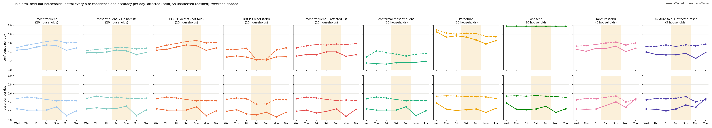

# Follow-on: two baselines, told arm, affected vs unaffected split

**Patrol density.** The study was re-frozen at 23:00 at a patrol every 8 h (`configs/frozen_2026-09-20_p8.yaml`,
banks in `../heldout_p8/`): at 2 h every event parked its objects where the next pass re-saw them, so affected
questions were not harder for recency agents. Question ids, objects, times and truths are identical between
the p2 and p8 banks, so the labels and the affected lists carry over unchanged. Results are kept per density:
`p8/` (the frozen configuration, leads the page) and `p2/` (the earlier freeze, kept for the record).

Started 2026-09-20 20:30 PDT. Same households, banks and questions as `../heldout/` (frozen config,
seeds 10-29). Page: https://claude.ai/artifact/PMxnzQYbCmFtAFm22hPb4G . Mixture arms: the other
agent's Longleaf Ledger, https://claude.ai/artifact/KJPMaPPbgv4UmeVakrDSTA .

## What was built

- `patrol/affected.py`: every question labelled affected / unaffected from the generator's own record.
  Affected = the object's placement at question time carries a guest_visit/sick_day cause, OR was made on a
  weekend by an activity that resident only does on the weekend template, OR the owner's routine weekday
  activity that uses the object is off the schedule that day (weekend, sick day, guest evening) and did not
  happen. The cause log alone would give 7%; with the two template-derived components 22% of shift-day
  questions and 2% of non-shift-day questions are affected.
- `patrol/bocpd.py`: the frozen most-frequent counter with a discount schedule on its counts (and on its
  empty looks, when those are on); Adams-MacKay detector over the counter's surprise per patrol; variants
  none / detect / told / listed. `--negative on` reproduces the old (buggy) classical logs to the digit,
  `--negative off` the corrected ones.
- `patrol/aci.py`: adaptive conformal inference (and DtACI) on any logged distribution; nonconformity
  1 - p(truth), set = spots with p >= 1 - q_t, alpha_t += gamma (0.1 - err). gamma 0.05 chosen on seeds 0-9.
- `patrol/affected_llm.py`: one local-model call per resident message -> objects and rooms to doubt (cap 20),
  scored against the labels. `patrol/mixture_reset.py`: the targeted reset applied post hoc to a logged
  belief (blend listed objects toward flat; recovers by half per new sighting).
- `patrol/followon_figs.py`, `followon_checks.py`, `followon_page.py`: figure, checks, page.

## Figure 1 (told arm), what it shows so far

- most frequent (no reset): confidence does not move on shift days for either group; accuracy on affected
  objects is 29-41% against 42-52% on unaffected ones, so the label picks out the questions the shift
  actually makes hard.
- BOCPD reset, told: confidence falls on the weekend to 0.46 on affected AND 0.46 on unaffected objects
  (from 0.64 / 0.72). On weekday event days it also falls on affected objects (those are the households with a
  message that day) - the "trust nothing" control lowers everything the message touches, which is every object.
- conformal most frequent: coverage holds at 0.90 throughout (0.902 on non-shift days, 0.903 on shift days),
  but the probability bar a spot needs to enter the set is ~0.01, so the "confidence" line is flat near 0 and
  the set is ~10 of ~38 spots. The counter's tail probabilities are too poorly calibrated for a tight 90% set.
- Perpetua* and last seen: no split between groups; last seen sits at 0.98 all week.
- most frequent + affected list (20 households): the reset applied only to the objects the local model named
  at message time. Affected confidence falls to 0.43-0.49 on weekday event days and 0.57-0.60 on the weekend
  (from 0.61-0.64), unaffected stays at 0.66-0.70. This is the pattern the brief predicts for the mixture, from
  the plain counter plus the list; it also learns the weekend faster (affected accuracy 52% / 49% on Mon / Tue
  against 34% / 38% without the reset).
- mixture (told), 3 households so far (hh_s10, s11, s13; the arms restarted 21:14 under the tempered weighting):
  less sure about affected objects on every day (0.41-0.59 vs 0.67-0.70 unaffected) rather than only on shift
  days, and a clear learning curve on them (12% Wed -> 48% Sat -> 62% Tue) that no classical line has.
- mixture told + affected reset (post hoc, same 3 households): a further 0.06-0.09 drop on affected objects
  on the weekend and 0.03-0.04 on unaffected ones (the list's precision is 0.6).
- conformal wrap on the mixture (3 households): coverage 0.90-0.91, set 6-15 spots, bar 0.02-0.04: as for the
  counter, calibration on top of the method changes the set size, not which objects are doubted.

## Not-told panel

The detector almost never fires (4% of shift days, 4% of non-shift days). Household-level surprise rises by
about 0.03 nats on weekends against a day-to-day spread of 0.06, and not at all on sick or guest days: only
about a fifth of the questioned objects are moved by a shift, and most patrol sightings are of objects that sit
where they always sit. A 45-point grid over hazard, window and threshold on seeds 0-9 found no setting that
fires on more than 5% of shift days at under 20% false alarms; the a-priori defaults are reported.

## Conformal

The set is wider on affected objects (16-18 spots Fri-Sun) than on unaffected ones (9-10). The wrapper's
threshold is one number for every object, so this is not the wrapper telling them apart: the counter's
distribution is flatter for objects that move around, and those are the ones the shift affects. Coverage
dips to 0.80-0.85 on affected objects on some days while staying at 0.90 overall.

## Checks

See `checks.md` (regenerated by `followon_checks`).

## Affected list (LLM) vs generator truth

See `affected_llm/scores.md`: with the protocol sentence about when questions are asked and a cap of 20,
recall and precision over all 72 message days are in `checks.md` / `affected_llm/scores.md`. The first prompt (no protocol sentence, no cap)
listed commute objects on Saturday (keys, wallets, backpack: rarely questioned on a weekend) and 77 of ~90
objects on a guest evening; kept in `affected_llm_v1_uncapped/`.

## Files

`affected/labels.jsonl`, `affected/shares.md`, `bocpd/*.jsonl` (+ `.fires.json` sidecars with the surprise
series and fires), `aci/*.jsonl`, `affected_llm/lists.jsonl`, `affected_llm/scores.md`, `figs/`,
`checks.md`, `problems_found.md`, `open_questions.md`, `spend_log.md`, `tuning/` (frozen-config banks and
most-frequent logs for seeds 0-9).

## Patrol every 8 h (the frozen configuration)

- The shift now shows for every line: most frequent 28-40% on affected objects vs 42-52% on unaffected; last
  seen 31-35% vs 53% on Thu-Sat.
- BOCPD reset (told): confidence falls to 0.23 on the weekend for affected AND unaffected objects, and accuracy
  on affected objects drops with it (0.20 vs 0.29 without the reset): forgetting everything costs.
- most frequent + affected list: affected confidence sits 0.12-0.18 below unaffected all week (the list resets
  touch the affected objects on every message day), unaffected is untouched; accuracy on affected objects is
  equal or slightly better than the plain counter (Mon/Tue 0.39-0.41 vs 0.31-0.37).
- Detector: fires on 0% of days at the a-priori setting; the grid on the p8 tuning seeds finds no setting
  above 5% shift-day firing at under 20% false alarms except fire-on-everything (85% / 71%). The counter is
  still learning all week at 3 patrols a day (surprise falls from 0.8 to 0.4 nats), which a stationary
  detector cannot separate from a shift.
- Conformal: coverage 0.899 on non-shift days, 0.897 on shift days; bar ~0.01; set size 7-15 spots.
- Mixture lines at 8 h: pending the other agent's p8 arms (`../heldout_p8/hyp/`).

## Labels, second cut (21 Sep): fresh moves only

`affected` now = event_moved or weekend_moved while the move is fresh (made after the last patrol pass before
the question) or stayed_put; seen-since moves are `after_shift`. Per density: `affected/labels_p8.jsonl`,
`labels_p2.jsonl`. Affected-list scores against the p8 labels: precision 0.47, recall 0.63 (72 message days).
