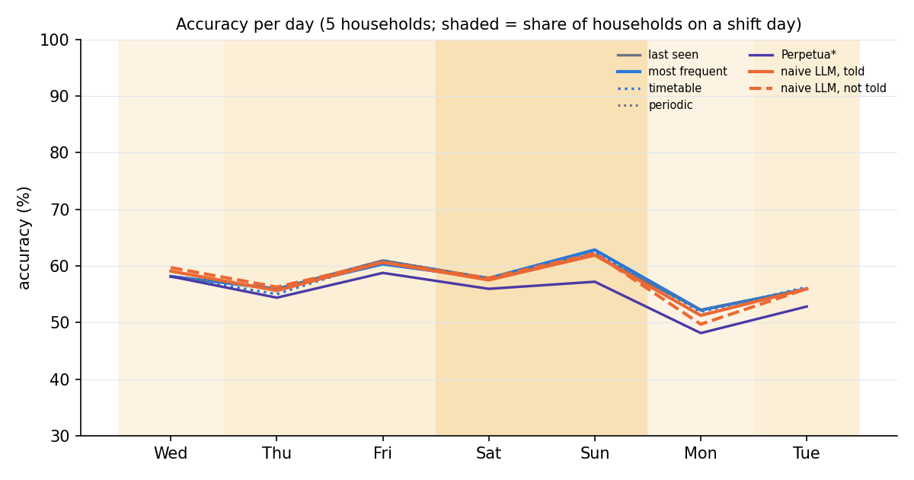
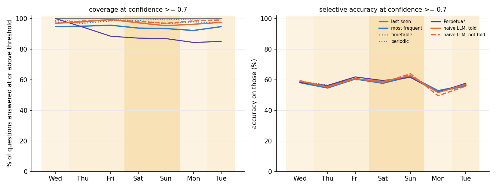
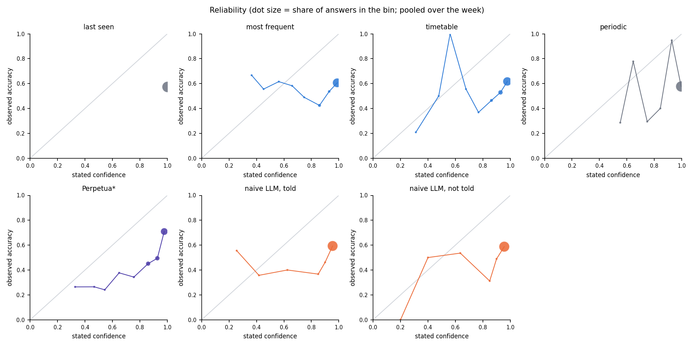
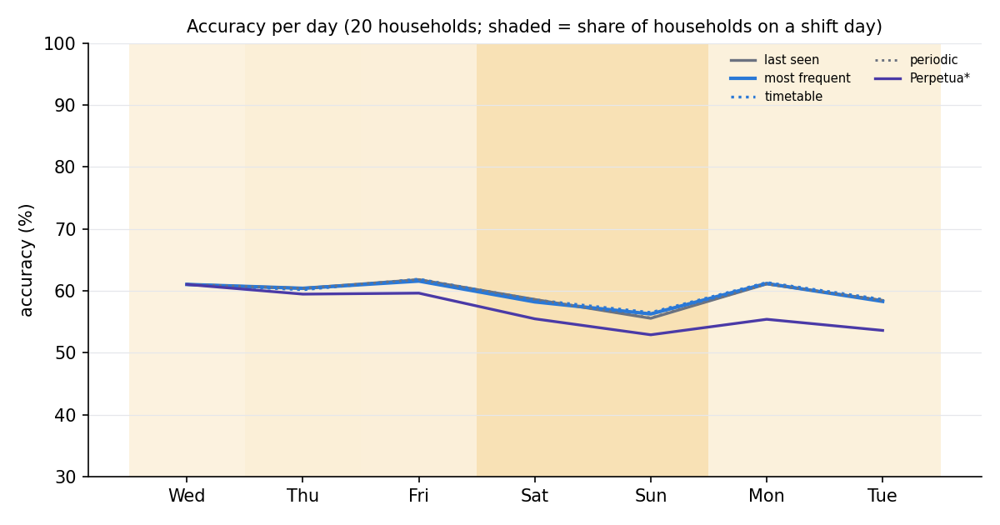
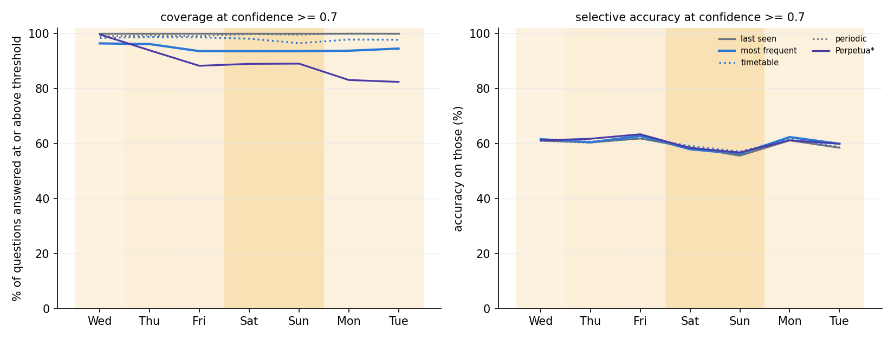
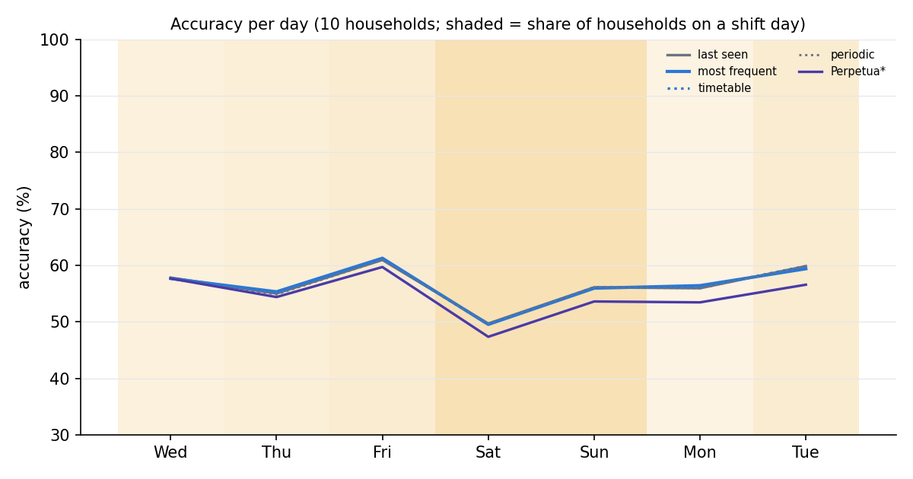

# Confidence-based shift evaluation, 2026-09-20

Frozen config: `configs/frozen_2026-09-20.yaml` (patrol every 2 h, activity-driven questions, 64 per day, sick_day 0.10 and guest_visit 0.10 per weekday, timetable bins 2 h, empty-look suppression off for the pure classical baselines). Tuned on seeds 0-9 with the classical agents only; seeds 10-29 are held out. Every agent sees the identical patrol stream, never senses, and answers one in-house spot plus a confidence. Score is plain accuracy. See `tuning_log.md`, `problems_found.md`, `open_questions.md`.

## Held-out households with every agent (paper figures)

Households hh_s10, hh_s11, hh_s12, hh_s13, hh_s14 (the LLM agents were run on these; the other held-out households have the classical agents only, below).

## Figure 1: accuracy per day (all questions)

| agent | Wed (1/5 shift) | Thu (2/5 shift) | Fri (2/5 shift) | Sat (5/5 shift) | Sun (5/5 shift) | Mon (1/5 shift) | Tue (2/5 shift) | all |
|---|---|---|---|---|---|---|---|---|
| Perpetua* | 58% | 54% | 59% | 56% | 57% | 48% | 53% | 55% |
| last seen | 58% | 56% | 61% | 58% | 62% | 52% | 56% | 58% |
| llm_naive/not_told/look_off | 60% | 56% | 61% | 58% | 62% | 50% | 56% | 57% |
| llm_naive/told/look_off | 59% | 56% | 61% | 57% | 62% | 51% | 56% | 57% |
| most frequent | 58% | 56% | 60% | 58% | 63% | 52% | 56% | 58% |
| periodic | 58% | 56% | 61% | 58% | 62% | 52% | 56% | 58% |
| timetable | 58% | 55% | 61% | 58% | 62% | 52% | 56% | 57% |

## Figure 2 (threshold 0.5): coverage / selective accuracy per day

Coverage = share of questions answered with confidence >= 0.5; selective accuracy = accuracy on those.

| agent | Wed (1/5 shift) | Thu (2/5 shift) | Fri (2/5 shift) | Sat (5/5 shift) | Sun (5/5 shift) | Mon (1/5 shift) | Tue (2/5 shift) | all |
|---|---|---|---|---|---|---|---|---|
| Perpetua* | 100% / 58% | 96% / 55% | 92% / 61% | 93% / 57% | 95% / 60% | 91% / 51% | 95% / 55% | 95% / 57% |
| last seen | 100% / 58% | 100% / 56% | 100% / 61% | 100% / 58% | 100% / 62% | 100% / 52% | 100% / 56% | 100% / 58% |
| llm_naive/not_told/look_off | 97% / 59% | 100% / 56% | 100% / 61% | 100% / 58% | 99% / 63% | 99% / 50% | 100% / 56% | 99% / 58% |
| llm_naive/told/look_off | 98% / 59% | 100% / 56% | 100% / 61% | 99% / 58% | 98% / 62% | 99% / 51% | 99% / 56% | 99% / 58% |
| most frequent | 100% / 58% | 99% / 56% | 98% / 60% | 97% / 57% | 99% / 62% | 99% / 53% | 97% / 57% | 98% / 58% |
| periodic | 100% / 58% | 100% / 56% | 100% / 61% | 100% / 58% | 100% / 62% | 100% / 52% | 100% / 56% | 100% / 58% |
| timetable | 99% / 59% | 97% / 56% | 99% / 61% | 99% / 58% | 97% / 63% | 98% / 52% | 99% / 56% | 98% / 58% |

## Figure 2 (threshold 0.7): coverage / selective accuracy per day

Coverage = share of questions answered with confidence >= 0.7; selective accuracy = accuracy on those.

| agent | Wed (1/5 shift) | Thu (2/5 shift) | Fri (2/5 shift) | Sat (5/5 shift) | Sun (5/5 shift) | Mon (1/5 shift) | Tue (2/5 shift) | all |
|---|---|---|---|---|---|---|---|---|
| Perpetua* | 100% / 58% | 94% / 56% | 88% / 62% | 87% / 59% | 87% / 62% | 84% / 52% | 85% / 58% | 89% / 58% |
| last seen | 100% / 58% | 100% / 56% | 100% / 61% | 100% / 58% | 100% / 62% | 100% / 52% | 100% / 56% | 100% / 58% |
| llm_naive/not_told/look_off | 97% / 59% | 98% / 56% | 99% / 61% | 98% / 58% | 97% / 64% | 98% / 50% | 99% / 56% | 98% / 58% |
| llm_naive/told/look_off | 97% / 59% | 98% / 55% | 99% / 61% | 97% / 59% | 95% / 63% | 96% / 52% | 98% / 57% | 97% / 58% |
| most frequent | 95% / 58% | 95% / 55% | 96% / 60% | 94% / 58% | 93% / 62% | 92% / 53% | 95% / 56% | 94% / 57% |
| periodic | 99% / 58% | 98% / 55% | 99% / 61% | 100% / 58% | 99% / 62% | 100% / 52% | 100% / 56% | 99% / 58% |
| timetable | 98% / 59% | 97% / 56% | 98% / 61% | 99% / 58% | 97% / 63% | 98% / 52% | 97% / 56% | 98% / 58% |

## Figure 2 (threshold 0.9): coverage / selective accuracy per day

Coverage = share of questions answered with confidence >= 0.9; selective accuracy = accuracy on those.

| agent | Wed (1/5 shift) | Thu (2/5 shift) | Fri (2/5 shift) | Sat (5/5 shift) | Sun (5/5 shift) | Mon (1/5 shift) | Tue (2/5 shift) | all |
|---|---|---|---|---|---|---|---|---|
| Perpetua* | 84% / 58% | 68% / 64% | 59% / 68% | 58% / 67% | 62% / 66% | 56% / 65% | 62% / 64% | 64% / 64% |
| last seen | 100% / 58% | 100% / 56% | 100% / 61% | 100% / 58% | 100% / 62% | 100% / 52% | 100% / 56% | 100% / 58% |
| llm_naive/not_told/look_off | 93% / 61% | 93% / 58% | 98% / 60% | 96% / 59% | 93% / 65% | 93% / 50% | 96% / 57% | 95% / 59% |
| llm_naive/told/look_off | 92% / 61% | 92% / 58% | 95% / 60% | 93% / 60% | 90% / 65% | 92% / 52% | 93% / 57% | 92% / 59% |
| most frequent | 83% / 60% | 80% / 59% | 78% / 62% | 82% / 61% | 80% / 61% | 73% / 55% | 81% / 59% | 80% / 60% |
| periodic | 95% / 61% | 95% / 56% | 98% / 61% | 99% / 58% | 98% / 62% | 99% / 52% | 100% / 56% | 98% / 58% |
| timetable | 87% / 62% | 86% / 59% | 84% / 60% | 86% / 60% | 86% / 63% | 88% / 56% | 86% / 58% | 86% / 60% |

## Reliability (stated confidence vs observed accuracy, pooled over the week)

| agent | [0,0.2) | [0.2,0.4) | [0.4,0.5) | [0.5,0.6) | [0.6,0.7) | [0.7,0.8) | [0.8,0.9) | [0.9,0.95) | [0.95,1) | ECE |
|---|---|---|---|---|---|---|---|---|---|---|
| Perpetua* | - | 26% (n=53) | 26% (n=68) | 24% (n=54) | 38% (n=61) | 34% (n=137) | 45% (n=428) | 49% (n=445) | 71% (n=994) | 0.331 |
| last seen | - | - | - | - | - | - | - | - | 58% (n=2240) | 0.424 |
| llm_naive/not_told/look_off | - | 0% (n=1) | 50% (n=14) | - | 54% (n=28) | - | 31% (n=77) | 49% (n=47) | 59% (n=2073) | 0.370 |
| llm_naive/told/look_off | - | 56% (n=9) | 36% (n=14) | - | 40% (n=40) | - | 37% (n=109) | 46% (n=52) | 59% (n=2016) | 0.365 |
| most frequent | - | 67% (n=9) | 56% (n=27) | 62% (n=39) | 58% (n=55) | 49% (n=94) | 42% (n=231) | 54% (n=179) | 61% (n=1606) | 0.367 |
| periodic | - | - | - | 29% (n=7) | 78% (n=9) | 29% (n=17) | 40% (n=20) | 95% (n=19) | 58% (n=2168) | 0.415 |
| timetable | - | 21% (n=24) | 50% (n=16) | 100% (n=4) | 56% (n=9) | 37% (n=38) | 46% (n=224) | 53% (n=450) | 62% (n=1475) | 0.368 |

## Split by household kind (from the intro cards: any retired resident, or none)

Retired residents are home on weekdays too, so the weekend is not a routine shift for their household.

| household kind (n) | agent | Wed | Thu | Fri | Sat | Sun | Mon | Tue | weekday | weekend | drop |
|---|---|---|---|---|---|---|---|---|---|---|---|
| working (13) | Perpetua* | 72% | 56% | 52% | 55% | 53% | 45% | 45% | 54% | 54% | +0 |
| working (13) | last seen | 72% | 61% | 55% | 55% | 55% | 72% | 53% | 62% | 55% | +8 |
| working (13) | llm_naive/not_told/look_off | 72% | 61% | 55% | 55% | 55% | 59% | 53% | 60% | 55% | +5 |
| working (13) | llm_naive/told/look_off | 72% | 61% | 55% | 55% | 58% | 66% | 53% | 61% | 56% | +5 |
| working (13) | most frequent | 72% | 61% | 55% | 55% | 61% | 70% | 53% | 62% | 58% | +4 |
| working (13) | periodic | 72% | 61% | 55% | 55% | 55% | 72% | 53% | 62% | 55% | +8 |
| working (13) | timetable | 72% | 56% | 55% | 55% | 61% | 72% | 53% | 62% | 58% | +4 |
| retired (7) | Perpetua* | 55% | 54% | 61% | 56% | 58% | 49% | 55% | 55% | 57% | -3 |
| retired (7) | last seen | 55% | 55% | 62% | 59% | 64% | 47% | 57% | 55% | 61% | -6 |
| retired (7) | llm_naive/not_told/look_off | 57% | 55% | 62% | 59% | 64% | 47% | 57% | 56% | 61% | -6 |
| retired (7) | llm_naive/told/look_off | 56% | 54% | 62% | 58% | 63% | 48% | 57% | 55% | 61% | -5 |
| retired (7) | most frequent | 55% | 55% | 62% | 59% | 63% | 48% | 57% | 55% | 61% | -6 |
| retired (7) | periodic | 55% | 55% | 62% | 59% | 64% | 47% | 57% | 55% | 61% | -6 |
| retired (7) | timetable | 55% | 55% | 62% | 59% | 63% | 47% | 57% | 55% | 61% | -6 |

## Split by household kind (from the intro cards: any retired resident, or none)

Retired residents are home on weekdays too, so the weekend is not a routine shift for their household.

| household kind (n) | agent | Wed | Thu | Fri | Sat | Sun | Mon | Tue | weekday | weekend | drop |
|---|---|---|---|---|---|---|---|---|---|---|---|
| working (13) | Perpetua* | 72% | 56% | 52% | 55% | 53% | 45% | 45% | 54% | 54% | +0 |
| working (13) | last seen | 72% | 61% | 55% | 55% | 55% | 72% | 53% | 62% | 55% | +8 |
| working (13) | llm_naive/not_told/look_off | 72% | 61% | 55% | 55% | 55% | 59% | 53% | 60% | 55% | +5 |
| working (13) | llm_naive/told/look_off | 72% | 61% | 55% | 55% | 58% | 66% | 53% | 61% | 56% | +5 |
| working (13) | most frequent | 72% | 61% | 55% | 55% | 61% | 70% | 53% | 62% | 58% | +4 |
| working (13) | periodic | 72% | 61% | 55% | 55% | 55% | 72% | 53% | 62% | 55% | +8 |
| working (13) | timetable | 72% | 56% | 55% | 55% | 61% | 72% | 53% | 62% | 58% | +4 |
| retired (7) | Perpetua* | 55% | 54% | 61% | 56% | 58% | 49% | 55% | 55% | 57% | -3 |
| retired (7) | last seen | 55% | 55% | 62% | 59% | 64% | 47% | 57% | 55% | 61% | -6 |
| retired (7) | llm_naive/not_told/look_off | 57% | 55% | 62% | 59% | 64% | 47% | 57% | 56% | 61% | -6 |
| retired (7) | llm_naive/told/look_off | 56% | 54% | 62% | 58% | 63% | 48% | 57% | 55% | 61% | -5 |
| retired (7) | most frequent | 55% | 55% | 62% | 59% | 63% | 48% | 57% | 55% | 61% | -6 |
| retired (7) | periodic | 55% | 55% | 62% | 59% | 64% | 47% | 57% | 55% | 61% | -6 |
| retired (7) | timetable | 55% | 55% | 62% | 59% | 63% | 47% | 57% | 55% | 61% | -6 |

## Tuning criteria numbers

| agent | rise Wed->Fri | drop Fri->Sat | drop day-before->event (n event days) | min day | max day |
|---|---|---|---|---|---|
| Perpetua* | +1 | +3 | -4 (21) | 48 | 59 |
| last seen | +3 | +3 | -4 (21) | 52 | 62 |
| llm_naive/not_told/look_off | +1 | +3 | -2 (21) | 50 | 62 |
| llm_naive/told/look_off | +2 | +3 | -3 (21) | 51 | 62 |
| most frequent | +2 | +2 | -3 (21) | 52 | 63 |
| periodic | +3 | +3 | -4 (21) | 52 | 62 |
| timetable | +3 | +3 | -4 (21) | 52 | 62 |

Households with a major event on a scored day: 18/20; event days: {'hh_s10': [5], 'hh_s11': [3, 7], 'hh_s12': [4, 5, 7], 'hh_s13': [1, 2], 'hh_s14': [2, 3, 6], 'hh_s15': [1, 2, 3, 5], 'hh_s16': [4, 5, 6], 'hh_s17': [2, 6, 7], 'hh_s18': [], 'hh_s19': [2, 3, 4], 'hh_s20': [1, 3, 5], 'hh_s21': [5], 'hh_s22': [3], 'hh_s23': [6, 7], 'hh_s24': [1, 2, 4, 6], 'hh_s25': [1], 'hh_s26': [2, 3, 4, 6], 'hh_s27': [], 'hh_s28': [2, 7], 'hh_s29': [4, 5, 7]}

## Per household: Perpetua* (bold = shift day)

| household | Wed | Thu | Fri | Sat | Sun | Mon | Tue | shift days | event days |
|---|---|---|---|---|---|---|---|---|---|
| hh_s10 | 72% | 56% | 52% | **55%** | **53%** | 45% | 45% | [4, 5] | [5] |
| hh_s11 | 56% | 59% | **52%** | **56%** | **56%** | 48% | **62%** | [3, 4, 5, 7] | [3, 7] |
| hh_s12 | 52% | 56% | 69% | **59%** | **61%** | 38% | **59%** | [4, 5, 7] | [4, 5, 7] |
| hh_s13 | **64%** | **47%** | 64% | **58%** | **62%** | 53% | 42% | [1, 2, 4, 5] | [1, 2] |
| hh_s14 | 47% | **53%** | **58%** | **52%** | **53%** | **56%** | 55% | [2, 3, 4, 5, 6] | [2, 3, 6] |

## Per household: last seen (bold = shift day)

| household | Wed | Thu | Fri | Sat | Sun | Mon | Tue | shift days | event days |
|---|---|---|---|---|---|---|---|---|---|
| hh_s10 | 72% | 61% | 55% | **55%** | **55%** | 72% | 53% | [4, 5] | [5] |
| hh_s11 | 56% | 61% | **56%** | **56%** | **55%** | 47% | **66%** | [3, 4, 5, 7] | [3, 7] |
| hh_s12 | 52% | 61% | 69% | **61%** | **67%** | 38% | **58%** | [4, 5, 7] | [4, 5, 7] |
| hh_s13 | **64%** | **42%** | 67% | **62%** | **64%** | 44% | 48% | [1, 2, 4, 5] | [1, 2] |
| hh_s14 | 47% | **55%** | **58%** | **55%** | **69%** | **61%** | 55% | [2, 3, 4, 5, 6] | [2, 3, 6] |

## Per household: llm_naive/not_told/look_off (bold = shift day)

| household | Wed | Thu | Fri | Sat | Sun | Mon | Tue | shift days | event days |
|---|---|---|---|---|---|---|---|---|---|
| hh_s10 | 72% | 61% | 55% | **55%** | **55%** | 59% | 53% | [4, 5] | [5] |
| hh_s11 | 55% | 61% | **56%** | **56%** | **55%** | 47% | **66%** | [3, 4, 5, 7] | [3, 7] |
| hh_s12 | 52% | 61% | 67% | **61%** | **67%** | 39% | **58%** | [4, 5, 7] | [4, 5, 7] |
| hh_s13 | **73%** | **44%** | 67% | **62%** | **64%** | 42% | 48% | [1, 2, 4, 5] | [1, 2] |
| hh_s14 | 47% | **55%** | **58%** | **55%** | **70%** | **61%** | 55% | [2, 3, 4, 5, 6] | [2, 3, 6] |

## Per household: llm_naive/told/look_off (bold = shift day)

| household | Wed | Thu | Fri | Sat | Sun | Mon | Tue | shift days | event days |
|---|---|---|---|---|---|---|---|---|---|
| hh_s10 | 72% | 61% | 55% | **55%** | **58%** | 66% | 53% | [4, 5] | [5] |
| hh_s11 | 55% | 61% | **56%** | **56%** | **55%** | 48% | **66%** | [3, 4, 5, 7] | [3, 7] |
| hh_s12 | 52% | 61% | 67% | **59%** | **67%** | 38% | **58%** | [4, 5, 7] | [4, 5, 7] |
| hh_s13 | **70%** | **42%** | 67% | **62%** | **64%** | 44% | 48% | [1, 2, 4, 5] | [1, 2] |
| hh_s14 | 47% | **53%** | **58%** | **55%** | **66%** | **61%** | 55% | [2, 3, 4, 5, 6] | [2, 3, 6] |

## Per household: most frequent (bold = shift day)

| household | Wed | Thu | Fri | Sat | Sun | Mon | Tue | shift days | event days |
|---|---|---|---|---|---|---|---|---|---|
| hh_s10 | 72% | 61% | 55% | **55%** | **61%** | 70% | 53% | [4, 5] | [5] |
| hh_s11 | 56% | 61% | **55%** | **56%** | **55%** | 48% | **66%** | [3, 4, 5, 7] | [3, 7] |
| hh_s12 | 52% | 61% | 69% | **61%** | **66%** | 38% | **58%** | [4, 5, 7] | [4, 5, 7] |
| hh_s13 | **64%** | **42%** | 67% | **62%** | **64%** | 44% | 48% | [1, 2, 4, 5] | [1, 2] |
| hh_s14 | 47% | **55%** | **56%** | **55%** | **69%** | **61%** | 55% | [2, 3, 4, 5, 6] | [2, 3, 6] |

## Per household: periodic (bold = shift day)

| household | Wed | Thu | Fri | Sat | Sun | Mon | Tue | shift days | event days |
|---|---|---|---|---|---|---|---|---|---|
| hh_s10 | 72% | 61% | 55% | **55%** | **55%** | 72% | 53% | [4, 5] | [5] |
| hh_s11 | 56% | 61% | **56%** | **56%** | **55%** | 47% | **66%** | [3, 4, 5, 7] | [3, 7] |
| hh_s12 | 52% | 61% | 69% | **61%** | **69%** | 38% | **58%** | [4, 5, 7] | [4, 5, 7] |
| hh_s13 | **64%** | **42%** | 67% | **62%** | **64%** | 44% | 48% | [1, 2, 4, 5] | [1, 2] |
| hh_s14 | 47% | **55%** | **58%** | **55%** | **69%** | **61%** | 55% | [2, 3, 4, 5, 6] | [2, 3, 6] |

## Per household: timetable (bold = shift day)

| household | Wed | Thu | Fri | Sat | Sun | Mon | Tue | shift days | event days |
|---|---|---|---|---|---|---|---|---|---|
| hh_s10 | 72% | 56% | 55% | **55%** | **61%** | 72% | 53% | [4, 5] | [5] |
| hh_s11 | 56% | 61% | **56%** | **56%** | **55%** | 48% | **66%** | [3, 4, 5, 7] | [3, 7] |
| hh_s12 | 52% | 61% | 69% | **61%** | **64%** | 34% | **58%** | [4, 5, 7] | [4, 5, 7] |
| hh_s13 | **64%** | **42%** | 67% | **62%** | **64%** | 44% | 50% | [1, 2, 4, 5] | [1, 2] |
| hh_s14 | 47% | **55%** | **58%** | **55%** | **69%** | **61%** | 55% | [2, 3, 4, 5, 6] | [2, 3, 6] |

## Held-out set, all 20 households, classical agents

## Figure 1: accuracy per day (all questions)

| agent | Wed (5/20 shift) | Thu (8/20 shift) | Fri (7/20 shift) | Sat (20/20 shift) | Sun (20/20 shift) | Mon (6/20 shift) | Tue (6/20 shift) | all |
|---|---|---|---|---|---|---|---|---|
| Perpetua* | 61% | 59% | 60% | 55% | 53% | 55% | 54% | 57% |
| last seen | 61% | 60% | 62% | 59% | 56% | 61% | 58% | 60% |
| most frequent | 61% | 60% | 62% | 58% | 56% | 61% | 58% | 60% |
| periodic | 61% | 60% | 62% | 59% | 56% | 61% | 58% | 60% |
| timetable | 61% | 60% | 62% | 59% | 56% | 61% | 59% | 60% |

## Figure 2 (threshold 0.5): coverage / selective accuracy per day

Coverage = share of questions answered with confidence >= 0.5; selective accuracy = accuracy on those.

| agent | Wed (5/20 shift) | Thu (8/20 shift) | Fri (7/20 shift) | Sat (20/20 shift) | Sun (20/20 shift) | Mon (6/20 shift) | Tue (6/20 shift) | all |
|---|---|---|---|---|---|---|---|---|
| Perpetua* | 100% / 61% | 97% / 61% | 94% / 62% | 95% / 57% | 95% / 55% | 92% / 58% | 91% / 57% | 95% / 59% |
| last seen | 100% / 61% | 100% / 60% | 100% / 62% | 100% / 59% | 100% / 56% | 100% / 61% | 100% / 58% | 100% / 60% |
| most frequent | 100% / 61% | 100% / 60% | 98% / 62% | 98% / 58% | 98% / 56% | 98% / 62% | 98% / 59% | 99% / 60% |
| periodic | 100% / 61% | 100% / 60% | 100% / 62% | 100% / 59% | 100% / 56% | 100% / 61% | 100% / 58% | 100% / 60% |
| timetable | 99% / 61% | 99% / 61% | 99% / 62% | 99% / 59% | 98% / 56% | 99% / 61% | 99% / 59% | 99% / 60% |

## Figure 2 (threshold 0.7): coverage / selective accuracy per day

Coverage = share of questions answered with confidence >= 0.7; selective accuracy = accuracy on those.

| agent | Wed (5/20 shift) | Thu (8/20 shift) | Fri (7/20 shift) | Sat (20/20 shift) | Sun (20/20 shift) | Mon (6/20 shift) | Tue (6/20 shift) | all |
|---|---|---|---|---|---|---|---|---|
| Perpetua* | 100% / 61% | 94% / 62% | 88% / 63% | 89% / 58% | 89% / 57% | 83% / 61% | 82% / 60% | 89% / 60% |
| last seen | 100% / 61% | 100% / 60% | 100% / 62% | 100% / 59% | 100% / 56% | 100% / 61% | 100% / 58% | 100% / 60% |
| most frequent | 96% / 62% | 96% / 60% | 94% / 63% | 94% / 58% | 94% / 56% | 94% / 62% | 94% / 60% | 94% / 60% |
| periodic | 99% / 61% | 99% / 60% | 99% / 62% | 100% / 58% | 99% / 56% | 100% / 61% | 100% / 59% | 99% / 60% |
| timetable | 98% / 61% | 99% / 61% | 99% / 62% | 98% / 59% | 96% / 57% | 98% / 62% | 98% / 59% | 98% / 60% |

## Figure 2 (threshold 0.9): coverage / selective accuracy per day

Coverage = share of questions answered with confidence >= 0.9; selective accuracy = accuracy on those.

| agent | Wed (5/20 shift) | Thu (8/20 shift) | Fri (7/20 shift) | Sat (20/20 shift) | Sun (20/20 shift) | Mon (6/20 shift) | Tue (6/20 shift) | all |
|---|---|---|---|---|---|---|---|---|
| Perpetua* | 81% / 64% | 65% / 72% | 60% / 69% | 61% / 65% | 61% / 62% | 54% / 70% | 55% / 66% | 63% / 67% |
| last seen | 100% / 61% | 100% / 60% | 100% / 62% | 100% / 59% | 100% / 56% | 100% / 61% | 100% / 58% | 100% / 60% |
| most frequent | 85% / 63% | 83% / 64% | 80% / 65% | 81% / 60% | 79% / 57% | 75% / 66% | 78% / 62% | 80% / 62% |
| periodic | 95% / 62% | 98% / 60% | 98% / 62% | 98% / 59% | 97% / 56% | 99% / 61% | 99% / 59% | 98% / 60% |
| timetable | 86% / 63% | 84% / 63% | 83% / 65% | 84% / 59% | 79% / 59% | 83% / 65% | 84% / 62% | 83% / 62% |

## Reliability (stated confidence vs observed accuracy, pooled over the week)

| agent | [0,0.2) | [0.2,0.4) | [0.4,0.5) | [0.5,0.6) | [0.6,0.7) | [0.7,0.8) | [0.8,0.9) | [0.9,0.95) | [0.95,1) | ECE |
|---|---|---|---|---|---|---|---|---|---|---|
| Perpetua* | 0% (n=2) | 15% (n=203) | 24% (n=262) | 28% (n=240) | 39% (n=254) | 42% (n=616) | 47% (n=1780) | 51% (n=1822) | 74% (n=3781) | 0.310 |
| last seen | - | - | - | - | - | - | - | - | 60% (n=8960) | 0.404 |
| most frequent | - | 30% (n=40) | 51% (n=79) | 55% (n=182) | 47% (n=197) | 45% (n=387) | 50% (n=910) | 51% (n=920) | 64% (n=6245) | 0.340 |
| periodic | - | 0% (n=3) | 100% (n=1) | 58% (n=24) | 70% (n=23) | 48% (n=65) | 42% (n=92) | 64% (n=107) | 60% (n=8645) | 0.394 |
| timetable | - | 44% (n=61) | 51% (n=39) | 58% (n=24) | 34% (n=64) | 40% (n=236) | 48% (n=1065) | 55% (n=1813) | 65% (n=5658) | 0.344 |

## Split by household kind (from the intro cards: any retired resident, or none)

Retired residents are home on weekdays too, so the weekend is not a routine shift for their household.

| household kind (n) | agent | Wed | Thu | Fri | Sat | Sun | Mon | Tue | weekday | weekend | drop |
|---|---|---|---|---|---|---|---|---|---|---|---|
| working (13) | Perpetua* | 63% | 62% | 61% | 56% | 51% | 55% | 54% | 59% | 54% | +5 |
| working (13) | last seen | 63% | 63% | 63% | 59% | 53% | 64% | 59% | 63% | 56% | +7 |
| working (13) | most frequent | 63% | 63% | 63% | 58% | 54% | 64% | 59% | 62% | 56% | +6 |
| working (13) | periodic | 63% | 63% | 63% | 59% | 53% | 64% | 59% | 63% | 56% | +7 |
| working (13) | timetable | 63% | 62% | 63% | 59% | 54% | 64% | 59% | 62% | 56% | +6 |
| retired (7) | Perpetua* | 57% | 56% | 57% | 54% | 56% | 55% | 53% | 56% | 55% | +0 |
| retired (7) | last seen | 57% | 56% | 59% | 58% | 59% | 55% | 57% | 57% | 59% | -2 |
| retired (7) | most frequent | 57% | 56% | 59% | 58% | 61% | 56% | 57% | 57% | 60% | -2 |
| retired (7) | periodic | 57% | 56% | 59% | 58% | 60% | 55% | 57% | 57% | 59% | -2 |
| retired (7) | timetable | 57% | 56% | 60% | 58% | 60% | 56% | 58% | 57% | 59% | -2 |

## Tuning criteria numbers

| agent | rise Wed->Fri | drop Fri->Sat | drop day-before->event (n event days) | min day | max day |
|---|---|---|---|---|---|
| Perpetua* | -1 | +4 | +0 (21) | 53 | 61 |
| last seen | +1 | +3 | +1 (21) | 56 | 62 |
| most frequent | +1 | +3 | +1 (21) | 56 | 62 |
| periodic | +1 | +3 | +1 (21) | 56 | 62 |
| timetable | +1 | +3 | +1 (21) | 56 | 62 |

Households with a major event on a scored day: 18/20; event days: {'hh_s10': [5], 'hh_s11': [3, 7], 'hh_s12': [4, 5, 7], 'hh_s13': [1, 2], 'hh_s14': [2, 3, 6], 'hh_s15': [1, 2, 3, 5], 'hh_s16': [4, 5, 6], 'hh_s17': [2, 6, 7], 'hh_s18': [], 'hh_s19': [2, 3, 4], 'hh_s20': [1, 3, 5], 'hh_s21': [5], 'hh_s22': [3], 'hh_s23': [6, 7], 'hh_s24': [1, 2, 4, 6], 'hh_s25': [1], 'hh_s26': [2, 3, 4, 6], 'hh_s27': [], 'hh_s28': [2, 7], 'hh_s29': [4, 5, 7]}

## Tuning set (seeds 0-9), classical agents only

## Figure 1: accuracy per day (all questions)

| agent | Wed (3/10 shift) | Thu (4/10 shift) | Fri (5/10 shift) | Sat (10/10 shift) | Sun (10/10 shift) | Mon (2/10 shift) | Tue (5/10 shift) | all |
|---|---|---|---|---|---|---|---|---|
| Perpetua* | 58% | 54% | 60% | 47% | 54% | 53% | 57% | 55% |
| last seen | 58% | 55% | 61% | 50% | 56% | 56% | 60% | 56% |
| most frequent | 58% | 55% | 61% | 50% | 56% | 56% | 59% | 56% |
| periodic | 58% | 55% | 61% | 50% | 56% | 56% | 60% | 56% |
| timetable | 58% | 55% | 61% | 50% | 56% | 56% | 60% | 56% |

## Figure 2 (threshold 0.5): coverage / selective accuracy per day

Coverage = share of questions answered with confidence >= 0.5; selective accuracy = accuracy on those.

| agent | Wed (3/10 shift) | Thu (4/10 shift) | Fri (5/10 shift) | Sat (10/10 shift) | Sun (10/10 shift) | Mon (2/10 shift) | Tue (5/10 shift) | all |
|---|---|---|---|---|---|---|---|---|
| Perpetua* | 100% / 58% | 97% / 55% | 94% / 62% | 95% / 48% | 94% / 56% | 92% / 56% | 89% / 61% | 94% / 57% |
| last seen | 100% / 58% | 100% / 55% | 100% / 61% | 100% / 50% | 100% / 56% | 100% / 56% | 100% / 60% | 100% / 56% |
| most frequent | 100% / 58% | 99% / 55% | 99% / 62% | 97% / 50% | 98% / 56% | 98% / 57% | 99% / 60% | 99% / 57% |
| periodic | 100% / 58% | 100% / 55% | 100% / 61% | 100% / 50% | 100% / 56% | 100% / 56% | 100% / 60% | 100% / 56% |
| timetable | 99% / 58% | 99% / 55% | 99% / 61% | 99% / 49% | 100% / 56% | 99% / 56% | 98% / 60% | 99% / 57% |

## Figure 2 (threshold 0.7): coverage / selective accuracy per day

Coverage = share of questions answered with confidence >= 0.7; selective accuracy = accuracy on those.

| agent | Wed (3/10 shift) | Thu (4/10 shift) | Fri (5/10 shift) | Sat (10/10 shift) | Sun (10/10 shift) | Mon (2/10 shift) | Tue (5/10 shift) | all |
|---|---|---|---|---|---|---|---|---|
| Perpetua* | 99% / 58% | 95% / 56% | 90% / 64% | 91% / 49% | 87% / 58% | 83% / 57% | 83% / 62% | 90% / 58% |
| last seen | 100% / 58% | 100% / 55% | 100% / 61% | 100% / 50% | 100% / 56% | 100% / 56% | 100% / 60% | 100% / 56% |
| most frequent | 96% / 57% | 96% / 55% | 95% / 62% | 93% / 50% | 96% / 56% | 95% / 57% | 94% / 60% | 95% / 57% |
| periodic | 98% / 58% | 99% / 55% | 100% / 61% | 100% / 50% | 100% / 56% | 100% / 56% | 99% / 60% | 99% / 57% |
| timetable | 98% / 58% | 99% / 55% | 98% / 61% | 97% / 50% | 98% / 57% | 97% / 56% | 97% / 61% | 98% / 57% |

## Figure 2 (threshold 0.9): coverage / selective accuracy per day

Coverage = share of questions answered with confidence >= 0.9; selective accuracy = accuracy on those.

| agent | Wed (3/10 shift) | Thu (4/10 shift) | Fri (5/10 shift) | Sat (10/10 shift) | Sun (10/10 shift) | Mon (2/10 shift) | Tue (5/10 shift) | all |
|---|---|---|---|---|---|---|---|---|
| Perpetua* | 80% / 62% | 70% / 63% | 65% / 72% | 59% / 53% | 61% / 65% | 56% / 65% | 56% / 71% | 64% / 64% |
| last seen | 100% / 58% | 100% / 55% | 100% / 61% | 100% / 50% | 100% / 56% | 100% / 56% | 100% / 60% | 100% / 56% |
| most frequent | 84% / 60% | 84% / 57% | 82% / 64% | 78% / 51% | 83% / 58% | 77% / 61% | 77% / 64% | 81% / 59% |
| periodic | 95% / 58% | 98% / 55% | 98% / 61% | 97% / 49% | 99% / 56% | 97% / 57% | 99% / 60% | 98% / 57% |
| timetable | 91% / 59% | 90% / 56% | 85% / 63% | 80% / 53% | 83% / 59% | 82% / 61% | 85% / 64% | 85% / 59% |

## Reliability (stated confidence vs observed accuracy, pooled over the week)

| agent | [0,0.2) | [0.2,0.4) | [0.4,0.5) | [0.5,0.6) | [0.6,0.7) | [0.7,0.8) | [0.8,0.9) | [0.9,0.95) | [0.95,1) | ECE |
|---|---|---|---|---|---|---|---|---|---|---|
| Perpetua* | - | 17% (n=92) | 26% (n=155) | 34% (n=93) | 38% (n=116) | 33% (n=261) | 43% (n=896) | 52% (n=938) | 71% (n=1929) | 0.335 |
| last seen | - | - | - | - | - | - | - | - | 56% (n=4480) | 0.434 |
| most frequent | - | 55% (n=11) | 29% (n=49) | 56% (n=71) | 54% (n=93) | 45% (n=193) | 43% (n=448) | 46% (n=418) | 61% (n=3197) | 0.375 |
| periodic | - | 0% (n=4) | 100% (n=1) | 36% (n=11) | 55% (n=11) | 59% (n=34) | 40% (n=45) | 58% (n=66) | 57% (n=4308) | 0.425 |
| timetable | - | 50% (n=30) | 27% (n=15) | 26% (n=23) | 29% (n=28) | 39% (n=138) | 43% (n=439) | 49% (n=819) | 62% (n=2988) | 0.378 |

## Split by household kind (from the intro cards: any retired resident, or none)

Retired residents are home on weekdays too, so the weekend is not a routine shift for their household.

| household kind (n) | agent | Wed | Thu | Fri | Sat | Sun | Mon | Tue | weekday | weekend | drop |
|---|---|---|---|---|---|---|---|---|---|---|---|
| working (7) | Perpetua* | 57% | 54% | 61% | 46% | 52% | 53% | 58% | 57% | 49% | +8 |
| working (7) | last seen | 57% | 55% | 62% | 48% | 55% | 56% | 63% | 58% | 52% | +7 |
| working (7) | most frequent | 57% | 55% | 61% | 48% | 55% | 56% | 62% | 58% | 52% | +7 |
| working (7) | periodic | 57% | 54% | 62% | 48% | 55% | 56% | 63% | 58% | 52% | +7 |
| working (7) | timetable | 57% | 55% | 62% | 48% | 55% | 56% | 63% | 58% | 52% | +7 |
| retired (3) | Perpetua* | 59% | 55% | 57% | 51% | 57% | 54% | 52% | 56% | 54% | +2 |
| retired (3) | last seen | 60% | 56% | 59% | 53% | 58% | 56% | 53% | 57% | 55% | +1 |
| retired (3) | most frequent | 60% | 56% | 61% | 53% | 58% | 57% | 53% | 57% | 55% | +2 |
| retired (3) | periodic | 60% | 56% | 59% | 53% | 58% | 56% | 53% | 57% | 55% | +1 |
| retired (3) | timetable | 60% | 56% | 60% | 53% | 58% | 56% | 53% | 57% | 55% | +1 |

## Tuning criteria numbers

| agent | rise Wed->Fri | drop Fri->Sat | drop day-before->event (n event days) | min day | max day |
|---|---|---|---|---|---|
| Perpetua* | +2 | +12 | +2 (14) | 47 | 60 |
| last seen | +3 | +11 | +2 (14) | 50 | 61 |
| most frequent | +4 | +12 | +2 (14) | 50 | 61 |
| periodic | +3 | +11 | +2 (14) | 50 | 61 |
| timetable | +3 | +12 | +2 (14) | 50 | 61 |

Households with a major event on a scored day: 9/10; event days: {'hh_s0': [1, 2], 'hh_s1': [3, 4, 7], 'hh_s2': [7], 'hh_s3': [2, 5, 7], 'hh_s4': [3, 4, 5, 6, 7], 'hh_s5': [1, 2, 3], 'hh_s6': [], 'hh_s7': [2, 5], 'hh_s8': [1, 3, 7], 'hh_s9': [3, 4, 6]}

## LLM tokens and time (local vLLM Qwen/Qwen3.8-27B; no hosted model was called)

- naive LLM (10 arms on 5 households): 4152 calls (328 cache replays), 5.47 M prompt tokens, 0.37 M completion tokens, 7.5 h summed call time (10 threads in flight), hosted spend $0.
