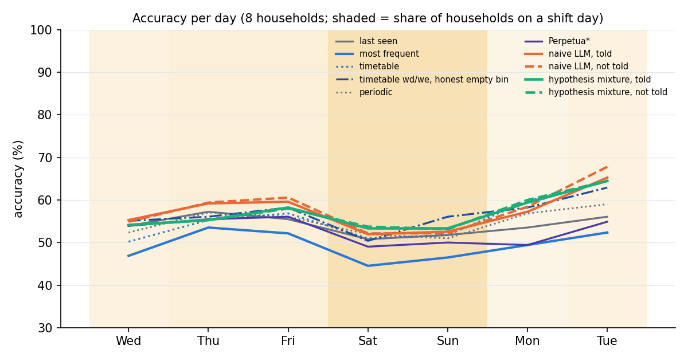
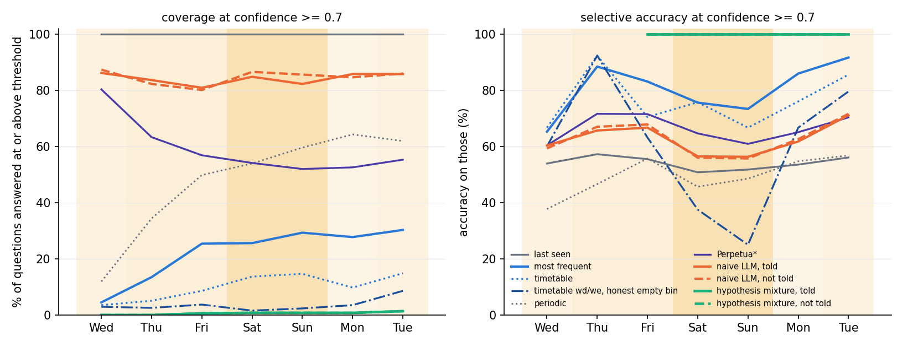
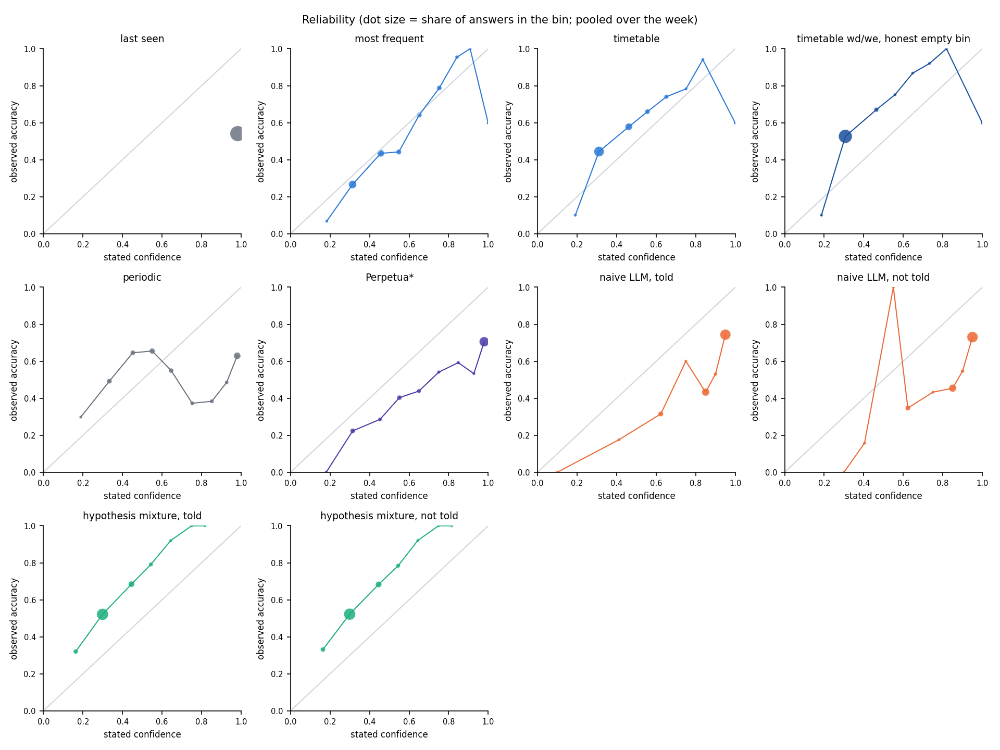
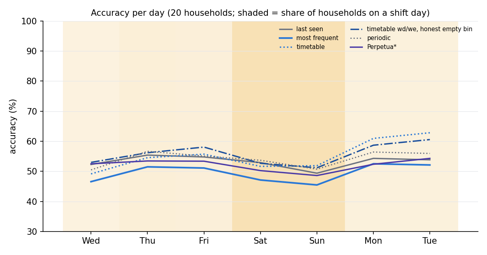
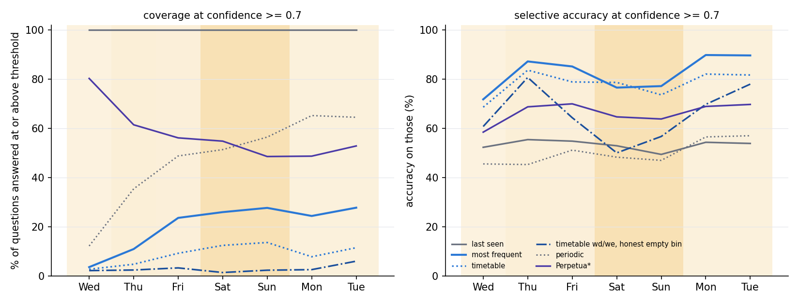
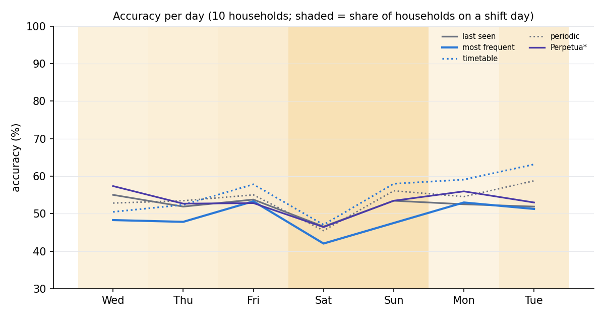
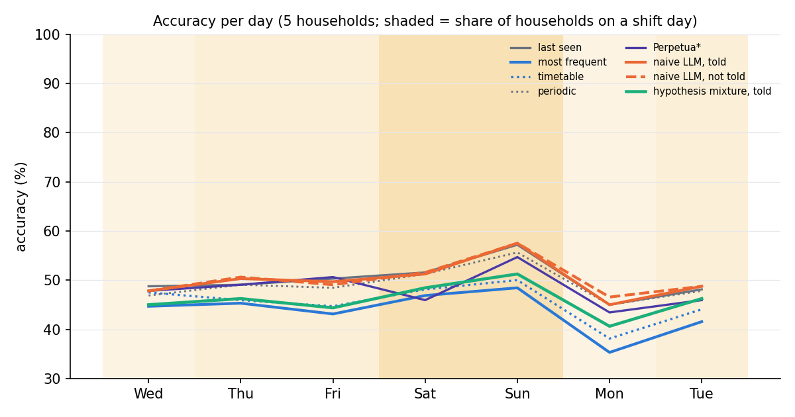

# Confidence-based shift evaluation, 2026-09-20/21

Protocol (frozen 2026-09-21, `configs/frozen_2026-09-21.yaml`): the robot walks through the home on Tuesday evening, does one full round every night at 03:00, and 10 minutes after every question is told where the object turned out to be (found-it feedback; an ordinary sighting every agent receives). Questions arise around what the residents do (64 a day, activity-driven, in-house truths only). Shift days = the weekend plus days with a guest visit or a sick day; the told arms get one dated message per shift day. Every agent sees the identical stream, never senses, and answers one in-house spot plus a confidence; score is plain accuracy. Tuned on seeds 0-9 with the classical agents only; seeds 10-29 are held out. The earlier sealed 8 h-patrol protocol (`heldout_p8/`) is kept as a secondary section. See `tuning_log.md`, `problems_found.md`, `open_questions.md`.

Read the tables in two halves: questions whose object MOVED since the robot's nightly round (about half) are where learning and the shift live; the STILL half is answered by recency almost by definition.

## Findings (read this first)

**Setup in one line.** 64 activity-driven questions a day for 7 days (Wed-Tue) in 20 held-out households; the robot
sees a nightly round (03:00) plus the resident's found-it answer 10 minutes after each question; no active sensing.
About half the questions (52%) ask about an object that moved since the nightly round ("moved"); the other half
("still") is answered by the last sighting almost by definition, so every number below is read on the moved half
unless stated. LLM agents ran on 8 of the 20 households: the naive Qwen3.8-27B with a stated confidence on s10-14, s18, s19, s25,
the hypothesis mixture on six of those (s10, s11, s14, s18, s19, s25; s12/s13 are queued behind them and were
not reached by 10:00); the paper tables are over the six households that have every agent, the classical
agents ran on all 20.

**1. The only counter that learns is the only counter that breaks.** On the moved half the timetable (2 h clock
bins over the sightings it has received) climbs 13 -> 26 -> 37% Wed-Fri, drops to 31% on Saturday, and is at 52%
by Monday/Tuesday (20 households). Its confidence stays at 0.38-0.44 throughout: it does not know it is on a shift
day. Per household (Thu-Tue, moved half) it is at 45% on plain days and 35% on the household's own shift days at the
same confidence (0.41), worse on the shift days in 17/20 households; the neighbouring-day view says the same
(Fri 37 -> Sat 31, Sun 37 -> Mon 52). Note the plain days are on average later in the week than the shift days,
which flatters the plain number by a few points. Most frequent, periodic and Perpetua* never learn a time-of-day routine
(20-28% on that half all week); last seen is flat at 17% with confidence 0.98 (the "stays confident, is wrong on
every moved question" corner of the story, by construction).

**2. The naive LLM learns from the same feedback and breaks the same way, at a flat 0.8 confidence.** Told or
not told makes no difference (27 vs 28% moved-half accuracy over the week on the 8 households, and the told
message days are not better). Six paper households, moved half: Wed-Fri 21 -> 21 -> 35%, Saturday 15%, Sunday 23,
back to 29-37% Mon/Tue; stated confidence 0.81-0.84 on every day, 0.88-0.91 on the still half (the mixture on
the same questions: 17 -> 30 -> 36, Sat 27, Sun 35, Mon/Tue 42-43 at 0.27-0.32; the timetable 12 -> 29 -> 37,
Sat 29, Sun 38, Mon/Tue 53-51 at 0.4). Its reliability is two clusters, both overconfident; ECE 0.28-0.29 (the
mixture 0.21-0.23 from the opposite side: 0.3 stated for 33-83% observed; the timetable 0.13). The prompt-leak
check on all 8 households (7,169 prompts) found no household-file content in any prompt.

**3. The hypothesis mixture learns less than the timetable, breaks half as much, and its confident half is
the best of any agent on shift days - but its confidence does not move.** Coverage-matched table (driver
session, `driver/weekend_table.py`, final at 06:50 with all six told arms complete; moved-since-round
questions Thu-Tue, each household's own shift days vs its plain days, pooled over hh_s10/s11/s14/s18/s19/s25;
cells = accuracy / mean confidence / selective accuracy at 25|50|75% coverage by the agent's own confidence;
n = 541 plain / 682 shift questions):

| agent | plain days | own shift days | change (acc, sel@50) |
|---|---|---|---|
| hypothesis mixture, told | 39% / 0.29 / 48-46-44 | 32% / 0.30 / 44-41-36 | -7, -5 |
| timetable | 47% / 0.42 / 61-59-51 | 32% / 0.42 / 33-37-36 | -15, -23 |
| naive LLM | 31% / 0.81 / 39-33-35 | 23% / 0.83 / 32-28-24 | -8, -5 |
| most frequent | 22% / 0.44 / 20-23-27 | 20% / 0.47 / 18-19-20 | -1, -4 |
| last seen | 18% / 0.98 / 27-21-20 | 19% / 0.98 / 21-21-19 | +1, 0 |

Per household (mixture d acc / d sel@50 vs timetable): s10 -7/-5 vs -13/-30; s11 -3/+8 vs -10/-11; s14 -10/-14
vs -11/-10; s18 -16/-17 vs -20/-44; s19 +3/+5 vs -30/-54; s25 -12/-24 vs -16/-24. Caveat: part of the
mixture's smaller break is a smaller rise (39 vs 47 on plain days; on hh_s19 33 vs 62, the household where
its library stays widest, ESS ~16). The naive LLM's Saturdays are the "confident and wrong" corner (hh_s11
12%, hh_s14 5%, hh_s25 11% on the moved half at c0.82-0.83, from 32-48 on Friday; hh_s11 Monday 14% while the
routine learners are back at 43-54). Mean confidence falls on shift days for no agent (mixture 0.29 -> 0.30;
the one household where it dips is hh_s25, 0.30 -> 0.26).

Told = not told for the mixture (hh_s10 99% and hh_s11 100% identical answers after the message day; hh_s14
guest Thursday and Friday identical to the digit), and this is structural: every document predicts 0.7 x the
shared hour-bin statistics + 0.3 x its own claims, so the library cannot disagree with its own statistics;
giving the message documents a full share of the mixture (v5, `problems_found.md` #23) moved their weights
from 0.02 to 0.10 and changed not one answer. The blend is what makes the documents learn from feedback
(without it the mixture never beat the counters) and the same blend is what makes them agree. The way out is
per-document conditional statistics (a guest document counting only guest evenings, a weekend document only
weekend days) - not built tonight.

**4. The shift is small at the day level, by the numbers.** Pooled over all questions the best agents move 4-8
points between a plain weekday and a shift day (criteria table: rise Wed->Fri +7, drop Fri->Sat +4 for the
timetable; the brief asked for >10 on both). On the moved half the rise is +24 and the drop -6 to -10 for the
timetable, and the weekend is *not* uniformly harder: several households' weekends look like their weekdays
(hh_s11, hh_s12, hh_s28), and the event days matter only when the event touches the objects asked about. A
self-monitoring confidence (top_prob scaled by the agent's own running hit rate on the feedback it has already
received today, table "confidence = self-monitored") moves every agent's confidence by only 3-5 points on shift
days, which is exactly the size of the day-level accuracy change.

**5. The one agent whose confidence tracks the shift is the one that knows what it has not seen yet.** A
calendar-aware timetable with an honest empty bin (separate weekend bins; a bin with no sighting answers
last-seen at confidence 0.3; tuning_log #46, post-freeze, tuning set then once on held-out; the line
"timetable wd/we, honest empty bin") has coverage at 0.5 of 3/7/12% Wed-Fri, 2/5% on the weekend and 17/25%
Mon/Tue on the moved half, confidence 0.33/0.34/0.37 -> 0.32/0.34 -> 0.37/0.40: it stops answering on
Saturday because it has no weekend timetable, and pays for that honesty with Saturday's moved-half accuracy
(14% vs the frozen timetable's 31%, whose weekday bins are half right on a Saturday). Day-level accuracy is
the same (53/56/58 -> 53/51 -> 59/61). This is the shape the brief asked for, at the coverage level and at a
small size; the frozen agents do not have it.

**6. What this means for the paper story.** The accuracy side of the story is present in the learning agents
(timetable, naive LLM, mixture: learn Wed-Fri, break on Saturday and on the household's own event days) and the
confidence side is present only where an agent's design encodes what it cannot know yet (finding 5). No stated
or derived confidence (top_prob, library agreement, self-monitoring) drops by more than a few points on shift
days, because the day-level effect of a shift in this simulator is a few points. The coverage-matched view
(each agent answering its most confident 25/50/75% of a day's questions) is the fair comparison and is in the
tables: at 25% coverage the mixture's confident quarter is right 74/73/85% Wed-Fri, 66/67% on the weekend and
84/90% Mon/Tue (all questions, six households), the timetable's 58/81/73 -> 64/65 -> 80/85, the naive LLM's
70/76/74 -> 60/65 -> 79/82; on the moved half, own shift days vs plain days, the mixture's top quarter goes
48 -> 44 where the timetable's goes 61 -> 33. The brief's numeric criteria (>10 points rise Wed->Fri and drop
Fri->Sat, all questions) are not met by any agent (best: timetable +8/-8, naive +3/-10); on the moved half
they are (timetable +25/-8, naive +14/-20, mixture +19/-9).

**Status of the runs at hand-over (2026-09-21, 09:00).** Told and not-told arms complete for all six mixture
households (s10/s11/s14/s18/s19/s25; the two arms' pooled rows are identical to the point on every day); s12/s13
told on their Sunday (not in the tables; their partial days read like the others - hh_s12 Saturday: mixture
42 -> 21% on the moved half, timetable 42 -> 21, so the 8 h protocol's "reverse case" does not repeat under
feedback). Everything ran on the local vLLM server; hosted spend $0.

**Protocol changes made tonight, in order** (all in `tuning_log.md`): uniform -> activity-driven questions
(#20-24); 2 h -> 8 h patrol (#25-29); simulator-regularity variants and truth-only oracles showing that
patrol-only observation makes recency unbeatable at any regularity (#33); found-it feedback + nightly round,
accepted on the tuning set (#34-36); negative-evidence suppression switched off for the classical agents (#31);
mixture defects fixed one at a time on single questions (#37-41). The 8 h protocol results are kept as a
secondary section at the end.

## Held-out households with every agent (paper figures)

Households hh_s10, hh_s11, hh_s12, hh_s13, hh_s14, hh_s18, hh_s19, hh_s25 (the LLM agents were run on these; the other held-out households have the classical agents only, below).

## Figure 1: accuracy per day (all questions)

| agent | Wed (2/8 shift) | Thu (3/8 shift) | Fri (3/8 shift) | Sat (8/8 shift) | Sun (8/8 shift) | Mon (1/8 shift) | Tue (2/8 shift) | all |
|---|---|---|---|---|---|---|---|---|
| Perpetua* | 54% | 55% | 56% | 49% | 50% | 49% | 55% | 53% |
| last seen | 54% | 57% | 55% | 51% | 52% | 54% | 56% | 54% |
| llm_longleaf/not_told/look_off | 54% | 55% | 58% | 54% | 53% | 60% | 64% | 57% |
| llm_longleaf/told/look_off | 54% | 55% | 58% | 53% | 53% | 59% | 64% | 57% |
| llm_naive/not_told/look_off | 55% | 59% | 61% | 52% | 52% | 58% | 68% | 58% |
| llm_naive/told/look_off | 55% | 59% | 60% | 52% | 53% | 57% | 65% | 57% |
| most frequent | 47% | 54% | 52% | 45% | 46% | 49% | 52% | 49% |
| periodic | 52% | 57% | 56% | 52% | 51% | 57% | 59% | 55% |
| timetable | 50% | 55% | 57% | 51% | 52% | 60% | 64% | 56% |
| timetable wd/we, honest empty bin | 55% | 56% | 58% | 50% | 56% | 58% | 63% | 57% |

## Figure 2 (threshold 0.5): coverage / selective accuracy per day

Coverage = share of questions answered with confidence >= 0.5; selective accuracy = accuracy on those.

| agent | Wed (2/8 shift) | Thu (3/8 shift) | Fri (3/8 shift) | Sat (8/8 shift) | Sun (8/8 shift) | Mon (1/8 shift) | Tue (2/8 shift) | all |
|---|---|---|---|---|---|---|---|---|
| Perpetua* | 97% / 55% | 85% / 62% | 79% / 63% | 76% / 58% | 75% / 56% | 73% / 59% | 73% / 67% | 80% / 60% |
| last seen | 100% / 54% | 100% / 57% | 100% / 55% | 100% / 51% | 100% / 52% | 100% / 54% | 100% / 56% | 100% / 54% |
| llm_longleaf/not_told/look_off | 6% / 83% | 11% / 80% | 15% / 85% | 12% / 75% | 15% / 74% | 15% / 87% | 21% / 91% | 13% / 83% |
| llm_longleaf/told/look_off | 6% / 83% | 11% / 80% | 15% / 86% | 12% / 76% | 15% / 74% | 15% / 87% | 20% / 91% | 13% / 83% |
| llm_naive/not_told/look_off | 99% / 55% | 97% / 61% | 96% / 63% | 97% / 54% | 97% / 53% | 96% / 60% | 98% / 68% | 97% / 59% |
| llm_naive/told/look_off | 97% / 56% | 97% / 61% | 96% / 61% | 96% / 53% | 98% / 53% | 98% / 58% | 98% / 66% | 97% / 58% |
| most frequent | 24% / 76% | 50% / 79% | 49% / 72% | 55% / 59% | 54% / 58% | 54% / 62% | 52% / 70% | 48% / 67% |
| periodic | 26% / 57% | 66% / 56% | 80% / 57% | 79% / 50% | 85% / 51% | 92% / 56% | 92% / 58% | 74% / 55% |
| timetable | 14% / 71% | 26% / 82% | 30% / 72% | 39% / 64% | 36% / 60% | 32% / 73% | 45% / 81% | 32% / 72% |
| timetable wd/we, honest empty bin | 4% / 58% | 7% / 78% | 14% / 77% | 2% / 45% | 5% / 42% | 19% / 79% | 32% / 81% | 12% / 75% |

## Figure 2 (threshold 0.7): coverage / selective accuracy per day

Coverage = share of questions answered with confidence >= 0.7; selective accuracy = accuracy on those.

| agent | Wed (2/8 shift) | Thu (3/8 shift) | Fri (3/8 shift) | Sat (8/8 shift) | Sun (8/8 shift) | Mon (1/8 shift) | Tue (2/8 shift) | all |
|---|---|---|---|---|---|---|---|---|
| Perpetua* | 80% / 60% | 63% / 72% | 57% / 71% | 54% / 65% | 52% / 61% | 53% / 65% | 55% / 70% | 59% / 66% |
| last seen | 100% / 54% | 100% / 57% | 100% / 55% | 100% / 51% | 100% / 52% | 100% / 54% | 100% / 56% | 100% / 54% |
| llm_longleaf/not_told/look_off | 0% / - | 0% / - | 1% / 100% | 1% / 100% | 1% / 100% | 1% / 100% | 1% / 100% | 1% / 100% |
| llm_longleaf/told/look_off | 0% / - | 0% / - | 1% / 100% | 1% / 100% | 1% / 100% | 1% / 100% | 1% / 100% | 1% / 100% |
| llm_naive/not_told/look_off | 87% / 59% | 82% / 67% | 80% / 68% | 87% / 56% | 86% / 56% | 85% / 63% | 86% / 72% | 85% / 63% |
| llm_naive/told/look_off | 86% / 60% | 84% / 66% | 81% / 67% | 85% / 56% | 82% / 56% | 86% / 62% | 86% / 71% | 84% / 63% |
| most frequent | 4% / 65% | 13% / 88% | 25% / 83% | 26% / 76% | 29% / 73% | 28% / 86% | 30% / 92% | 22% / 82% |
| periodic | 12% / 38% | 34% / 47% | 50% / 56% | 54% / 46% | 60% / 49% | 64% / 55% | 62% / 57% | 48% / 51% |
| timetable | 4% / 67% | 5% / 92% | 9% / 70% | 14% / 76% | 15% / 67% | 10% / 76% | 15% / 86% | 10% / 76% |
| timetable wd/we, honest empty bin | 3% / 60% | 3% / 92% | 4% / 63% | 2% / 38% | 2% / 25% | 4% / 67% | 9% / 80% | 4% / 67% |

## Figure 2 (threshold 0.9): coverage / selective accuracy per day

Coverage = share of questions answered with confidence >= 0.9; selective accuracy = accuracy on those.

| agent | Wed (2/8 shift) | Thu (3/8 shift) | Fri (3/8 shift) | Sat (8/8 shift) | Sun (8/8 shift) | Mon (1/8 shift) | Tue (2/8 shift) | all |
|---|---|---|---|---|---|---|---|---|
| Perpetua* | 72% / 61% | 51% / 76% | 44% / 75% | 41% / 66% | 38% / 68% | 37% / 69% | 40% / 70% | 46% / 69% |
| last seen | 100% / 54% | 100% / 57% | 100% / 55% | 100% / 51% | 100% / 52% | 100% / 54% | 100% / 56% | 100% / 54% |
| llm_longleaf/not_told/look_off | 0% / - | 0% / - | 0% / - | 0% / - | 0% / - | 0% / - | 0% / - | 0% / - |
| llm_longleaf/told/look_off | 0% / - | 0% / - | 0% / - | 0% / - | 0% / - | 0% / - | 0% / - | 0% / - |
| llm_naive/not_told/look_off | 62% / 67% | 58% / 76% | 56% / 78% | 61% / 62% | 57% / 63% | 57% / 73% | 57% / 78% | 58% / 71% |
| llm_naive/told/look_off | 60% / 68% | 56% / 77% | 57% / 74% | 56% / 63% | 51% / 67% | 57% / 73% | 58% / 79% | 56% / 72% |
| most frequent | 3% / 60% | 3% / 92% | 3% / 59% | 2% / 38% | 2% / 25% | 4% / 68% | 6% / 76% | 3% / 64% |
| periodic | 8% / 50% | 15% / 61% | 33% / 65% | 33% / 50% | 37% / 54% | 42% / 61% | 42% / 66% | 30% / 59% |
| timetable | 3% / 60% | 3% / 92% | 3% / 59% | 2% / 38% | 2% / 25% | 3% / 62% | 4% / 67% | 3% / 60% |
| timetable wd/we, honest empty bin | 3% / 60% | 3% / 92% | 3% / 59% | 2% / 38% | 2% / 25% | 3% / 62% | 4% / 67% | 3% / 60% |

## Coverage-matched selective accuracy (each agent answers its most confident 25 / 50 / 75% of the day's questions)

The fixed thresholds above compare different confidence scales; this compares agents at equal coverage.

| agent (coverage 25%) | Wed | Thu | Fri | Sat | Sun | Mon | Tue | all |
|---|---|---|---|---|---|---|---|---|
| Perpetua* | 66% | 83% | 80% | 73% | 75% | 77% | 79% | 75% |
| last seen | 59% | 60% | 67% | 49% | 48% | 61% | 62% | 56% |
| llm_longleaf/not_told/look_off | 73% | 75% | 83% | 66% | 70% | 81% | 89% | 77% |
| llm_longleaf/told/look_off | 73% | 75% | 83% | 67% | 70% | 80% | 88% | 77% |
| llm_naive/not_told/look_off | 76% | 81% | 77% | 67% | 70% | 75% | 70% | 73% |
| llm_naive/told/look_off | 76% | 80% | 74% | 70% | 71% | 72% | 77% | 74% |
| most frequent | 74% | 89% | 84% | 77% | 77% | 88% | 93% | 81% |
| periodic | 55% | 52% | 68% | 54% | 55% | 64% | 76% | 61% |
| timetable | 59% | 84% | 73% | 65% | 65% | 77% | 83% | 75% |
| timetable wd/we, honest empty bin | 63% | 61% | 76% | 50% | 59% | 80% | 82% | 70% |

| agent (coverage 50%) | Wed | Thu | Fri | Sat | Sun | Mon | Tue | all |
|---|---|---|---|---|---|---|---|---|
| Perpetua* | 64% | 77% | 74% | 66% | 62% | 66% | 71% | 68% |
| last seen | 54% | 59% | 59% | 50% | 50% | 54% | 55% | 55% |
| llm_longleaf/not_told/look_off | 66% | 72% | 78% | 66% | 66% | 74% | 83% | 72% |
| llm_longleaf/told/look_off | 66% | 71% | 77% | 65% | 65% | 73% | 82% | 71% |
| llm_naive/not_told/look_off | 73% | 77% | 78% | 65% | 64% | 76% | 79% | 73% |
| llm_naive/told/look_off | 73% | 79% | 76% | 65% | 68% | 76% | 83% | 74% |
| most frequent | 61% | 79% | 71% | 62% | 61% | 65% | 72% | 66% |
| periodic | 58% | 52% | 55% | 46% | 49% | 59% | 62% | 51% |
| timetable | 57% | 66% | 70% | 62% | 58% | 73% | 79% | 66% |
| timetable wd/we, honest empty bin | 60% | 59% | 65% | 50% | 59% | 68% | 76% | 61% |

| agent (coverage 75%) | Wed | Thu | Fri | Sat | Sun | Mon | Tue | all |
|---|---|---|---|---|---|---|---|---|
| Perpetua* | 61% | 66% | 66% | 59% | 56% | 58% | 65% | 61% |
| last seen | 54% | 59% | 57% | 51% | 53% | 55% | 56% | 55% |
| llm_longleaf/not_told/look_off | 60% | 63% | 67% | 59% | 60% | 67% | 72% | 64% |
| llm_longleaf/told/look_off | 60% | 64% | 67% | 58% | 60% | 67% | 73% | 64% |
| llm_naive/not_told/look_off | 61% | 69% | 69% | 58% | 58% | 65% | 72% | 65% |
| llm_naive/told/look_off | 63% | 69% | 68% | 58% | 58% | 64% | 73% | 65% |
| most frequent | 57% | 64% | 62% | 51% | 52% | 58% | 61% | 58% |
| periodic | 57% | 58% | 55% | 49% | 49% | 55% | 57% | 55% |
| timetable | 59% | 60% | 62% | 57% | 57% | 63% | 70% | 61% |
| timetable wd/we, honest empty bin | 57% | 59% | 60% | 51% | 59% | 62% | 66% | 59% |

## Questions whose object moved since the robot's last round (52% of questions)

The robot's last full look is the patrol round before the question. 'still' questions are answered by recency almost by definition; the shift and the learning live in the 'moved' half. Cells: accuracy c=mean confidence.

| agent | Wed moved / still | Thu moved / still | Fri moved / still | Sat moved / still | Sun moved / still | Mon moved / still | Tue moved / still | moved all | still all |
|---|---|---|---|---|---|---|---|---|---|
| Perpetua* | 19% c84 / 92% c93 | 26% c69 / 83% c87 | 33% c66 / 84% c83 | 22% c67 / 81% c78 | 29% c65 / 74% c78 | 22% c63 / 80% c79 | 27% c64 / 82% c80 | 26% (n=1875, cov@0.7 48%, sel 29%) | 82% |
| last seen | 17% c98 / 95% c98 | 17% c98 / 95% c98 | 25% c98 / 92% c98 | 14% c98 / 94% c98 | 20% c98 / 89% c98 | 17% c98 / 93% c98 | 18% c98 / 95% c98 | 18% (n=1875, cov@0.7 100%, sel 18%) | 93% |
| llm_longleaf/not_told/look_off | 18% c28 / 94% c32 | 29% c30 / 80% c36 | 35% c30 / 85% c41 | 29% c32 / 83% c38 | 33% c33 / 76% c40 | 40% c32 / 82% c40 | 49% c32 / 80% c44 | 33% (n=1875, cov@0.7 0%, sel -) | 83% |
| llm_longleaf/told/look_off | 18% c28 / 94% c32 | 29% c30 / 80% c36 | 36% c30 / 85% c41 | 29% c32 / 82% c38 | 33% c33 / 77% c40 | 40% c32 / 81% c40 | 49% c32 / 80% c44 | 33% (n=1875, cov@0.7 0%, sel -) | 83% |
| llm_naive/not_told/look_off | 19% c84 / 95% c91 | 23% c80 / 94% c91 | 37% c81 / 89% c90 | 18% c84 / 92% c90 | 25% c84 / 84% c89 | 32% c81 / 88% c91 | 45% c82 / 91% c91 | 28% (n=1875, cov@0.7 77%, sel 29%) | 90% |
| llm_naive/told/look_off | 20% c83 / 94% c91 | 22% c80 / 94% c91 | 35% c81 / 89% c90 | 17% c83 / 92% c89 | 26% c83 / 85% c89 | 29% c83 / 89% c90 | 40% c82 / 90% c91 | 27% (n=1875, cov@0.7 76%, sel 28%) | 91% |
| most frequent | 7% c42 / 91% c48 | 19% c43 / 86% c58 | 25% c45 / 85% c61 | 14% c47 / 80% c63 | 21% c49 / 76% c62 | 24% c45 / 78% c65 | 25% c46 / 79% c68 | 19% (n=1875, cov@0.7 10%, sel 27%) | 82% |
| periodic | 11% c46 / 98% c43 | 20% c68 / 92% c57 | 29% c74 / 88% c68 | 18% c76 / 92% c67 | 23% c79 / 84% c71 | 26% c79 / 91% c77 | 26% c78 / 92% c78 | 22% (n=1875, cov@0.7 56%, sel 28%) | 91% |
| timetable | 14% c40 / 90% c43 | 29% c39 / 80% c46 | 35% c42 / 82% c49 | 31% c44 / 75% c53 | 38% c43 / 68% c51 | 51% c43 / 70% c49 | 57% c46 / 71% c55 | 36% (n=1875, cov@0.7 7%, sel 38%) | 77% |
| timetable wd/we, honest empty bin | 19% c35 / 95% c32 | 28% c36 / 83% c36 | 36% c38 / 85% c39 | 13% c33 / 94% c31 | 31% c35 / 86% c33 | 42% c39 / 77% c41 | 48% c41 / 78% c47 | 31% (n=1875, cov@0.7 4%, sel 54%) | 85% |

## Reliability (stated confidence vs observed accuracy, pooled over the week)

| agent | [0,0.2) | [0.2,0.4) | [0.4,0.5) | [0.5,0.6) | [0.6,0.7) | [0.7,0.8) | [0.8,0.9) | [0.9,0.95) | [0.95,1) | ECE |
|---|---|---|---|---|---|---|---|---|---|---|
| Perpetua* | 0% (n=13) | 22% (n=430) | 29% (n=287) | 40% (n=407) | 44% (n=326) | 54% (n=231) | 59% (n=233) | 53% (n=167) | 71% (n=1490) | 0.224 |
| last seen | - | - | - | - | - | - | - | - | 54% (n=3584) | 0.441 |
| llm_longleaf/not_told/look_off | 33% (n=411) | 52% (n=2067) | 68% (n=625) | 78% (n=333) | 92% (n=126) | 100% (n=20) | 100% (n=2) | - | - | 0.223 |
| llm_longleaf/told/look_off | 32% (n=406) | 52% (n=2078) | 68% (n=618) | 79% (n=335) | 92% (n=125) | 100% (n=20) | 100% (n=2) | - | - | 0.222 |
| llm_naive/not_told/look_off | - | 0% (n=2) | 16% (n=102) | 100% (n=1) | 35% (n=447) | 43% (n=37) | 45% (n=916) | 55% (n=258) | 73% (n=1821) | 0.283 |
| llm_naive/told/look_off | 0% (n=1) | - | 18% (n=97) | - | 31% (n=470) | 60% (n=45) | 43% (n=952) | 53% (n=247) | 74% (n=1772) | 0.287 |
| most frequent | 7% (n=74) | 27% (n=1005) | 43% (n=776) | 44% (n=471) | 64% (n=458) | 79% (n=424) | 95% (n=263) | 100% (n=11) | 60% (n=102) | 0.060 |
| periodic | 30% (n=47) | 49% (n=441) | 65% (n=432) | 65% (n=539) | 55% (n=406) | 37% (n=314) | 38% (n=326) | 49% (n=278) | 63% (n=801) | 0.260 |
| timetable | 10% (n=50) | 44% (n=1575) | 58% (n=822) | 66% (n=432) | 74% (n=346) | 78% (n=189) | 94% (n=68) | - | 60% (n=102) | 0.123 |
| timetable wd/we, honest empty bin | 10% (n=10) | 53% (n=2774) | 67% (n=376) | 75% (n=189) | 87% (n=106) | 92% (n=25) | 100% (n=2) | - | 60% (n=102) | 0.221 |

## Split by household kind (from the intro cards: any retired resident, or none)

Retired residents are home on weekdays too, so the weekend is not a routine shift for their household.

| household kind (n) | agent | Wed | Thu | Fri | Sat | Sun | Mon | Tue | weekday | weekend | drop |
|---|---|---|---|---|---|---|---|---|---|---|---|
| working (13) | Perpetua* | 57% | 57% | 57% | 48% | 47% | 54% | 60% | 57% | 47% | +10 |
| working (13) | last seen | 59% | 58% | 55% | 50% | 48% | 57% | 60% | 58% | 49% | +9 |
| working (13) | llm_longleaf/not_told/look_off | 59% | 58% | 59% | 54% | 54% | 62% | 66% | 61% | 54% | +7 |
| working (13) | llm_longleaf/told/look_off | 59% | 58% | 60% | 53% | 54% | 62% | 66% | 61% | 54% | +7 |
| working (13) | llm_naive/not_told/look_off | 59% | 60% | 62% | 51% | 49% | 64% | 72% | 64% | 50% | +14 |
| working (13) | llm_naive/told/look_off | 59% | 59% | 61% | 52% | 47% | 62% | 69% | 62% | 49% | +13 |
| working (13) | most frequent | 51% | 53% | 55% | 44% | 46% | 52% | 58% | 54% | 45% | +9 |
| working (13) | periodic | 56% | 58% | 56% | 50% | 48% | 61% | 62% | 59% | 49% | +10 |
| working (13) | timetable | 53% | 57% | 62% | 50% | 50% | 64% | 66% | 60% | 50% | +10 |
| working (13) | timetable wd/we, honest empty bin | 58% | 56% | 61% | 50% | 54% | 63% | 69% | 61% | 52% | +10 |
| retired (7) | Perpetua* | 50% | 54% | 55% | 50% | 53% | 45% | 50% | 51% | 52% | -1 |
| retired (7) | last seen | 49% | 56% | 56% | 51% | 55% | 50% | 52% | 53% | 53% | -1 |
| retired (7) | llm_longleaf/not_told/look_off | 50% | 53% | 57% | 54% | 52% | 57% | 62% | 56% | 53% | +3 |
| retired (7) | llm_longleaf/told/look_off | 50% | 53% | 57% | 54% | 52% | 57% | 62% | 56% | 53% | +3 |
| retired (7) | llm_naive/not_told/look_off | 50% | 59% | 59% | 54% | 55% | 53% | 63% | 57% | 54% | +2 |
| retired (7) | llm_naive/told/look_off | 51% | 59% | 58% | 52% | 58% | 52% | 61% | 56% | 55% | +1 |
| retired (7) | most frequent | 43% | 54% | 49% | 45% | 47% | 47% | 47% | 48% | 46% | +2 |
| retired (7) | periodic | 49% | 56% | 56% | 54% | 54% | 53% | 56% | 54% | 54% | -0 |
| retired (7) | timetable | 48% | 54% | 52% | 52% | 53% | 55% | 62% | 54% | 53% | +1 |
| retired (7) | timetable wd/we, honest empty bin | 52% | 56% | 55% | 51% | 58% | 53% | 57% | 55% | 54% | +0 |

### Same households, confidence = library agreement for the mixture

## Figure 2 (threshold 0.7): coverage / selective accuracy per day

Coverage = share of questions answered with confidence >= 0.7; selective accuracy = accuracy on those.

| agent | Wed (2/8 shift) | Thu (3/8 shift) | Fri (3/8 shift) | Sat (8/8 shift) | Sun (8/8 shift) | Mon (1/8 shift) | Tue (2/8 shift) | all |
|---|---|---|---|---|---|---|---|---|
| Perpetua* | 80% / 60% | 63% / 72% | 57% / 71% | 54% / 65% | 52% / 61% | 53% / 65% | 55% / 70% | 59% / 66% |
| last seen | 100% / 54% | 100% / 57% | 100% / 55% | 100% / 51% | 100% / 52% | 100% / 54% | 100% / 56% | 100% / 54% |
| llm_longleaf/not_told/look_off | 96% / 55% | 96% / 56% | 96% / 59% | 93% / 56% | 93% / 54% | 89% / 62% | 90% / 68% | 93% / 59% |
| llm_longleaf/told/look_off | 96% / 55% | 96% / 56% | 96% / 59% | 93% / 56% | 93% / 54% | 90% / 62% | 91% / 67% | 94% / 58% |
| llm_naive/not_told/look_off | 87% / 59% | 82% / 67% | 80% / 68% | 87% / 56% | 86% / 56% | 85% / 63% | 86% / 72% | 85% / 63% |
| llm_naive/told/look_off | 86% / 60% | 84% / 66% | 81% / 67% | 85% / 56% | 82% / 56% | 86% / 62% | 86% / 71% | 84% / 63% |
| most frequent | 4% / 65% | 13% / 88% | 25% / 83% | 26% / 76% | 29% / 73% | 28% / 86% | 30% / 92% | 22% / 82% |
| periodic | 12% / 38% | 34% / 47% | 50% / 56% | 54% / 46% | 60% / 49% | 64% / 55% | 62% / 57% | 48% / 51% |
| timetable | 4% / 67% | 5% / 92% | 9% / 70% | 14% / 76% | 15% / 67% | 10% / 76% | 15% / 86% | 10% / 76% |
| timetable wd/we, honest empty bin | 3% / 60% | 3% / 92% | 4% / 63% | 2% / 38% | 2% / 25% | 4% / 67% | 9% / 80% | 4% / 67% |

### Same households, confidence = self-monitored (top_prob x the agent's running hit rate on the feedback it has already received today, every agent)

## Questions whose object moved since the robot's last round (52% of questions)

The robot's last full look is the patrol round before the question. 'still' questions are answered by recency almost by definition; the shift and the learning live in the 'moved' half. Cells: accuracy c=mean confidence.

| agent | Wed moved / still | Thu moved / still | Fri moved / still | Sat moved / still | Sun moved / still | Mon moved / still | Tue moved / still | moved all | still all |
|---|---|---|---|---|---|---|---|---|---|
| Perpetua* | 19% c48 / 92% c52 | 26% c43 / 83% c54 | 33% c40 / 84% c51 | 22% c37 / 81% c43 | 29% c36 / 74% c44 | 22% c36 / 80% c46 | 27% c38 / 82% c48 | 26% (n=1875, cov@0.7 3%, sel 13%) | 82% |
| last seen | 17% c56 / 95% c55 | 17% c61 / 95% c60 | 25% c60 / 92% c62 | 14% c55 / 94% c54 | 20% c55 / 89% c54 | 17% c58 / 93% c58 | 18% c60 / 95% c59 | 18% (n=1875, cov@0.7 7%, sel 9%) | 93% |
| llm_longleaf/not_told/look_off | 18% c16 / 94% c18 | 29% c18 / 80% c22 | 35% c20 / 85% c27 | 29% c18 / 83% c22 | 33% c18 / 76% c23 | 40% c20 / 82% c25 | 49% c21 / 80% c30 | 33% (n=1875, cov@0.7 0%, sel -) | 83% |
| llm_longleaf/told/look_off | 18% c16 / 94% c18 | 29% c18 / 80% c22 | 36% c20 / 85% c27 | 29% c18 / 82% c22 | 33% c19 / 77% c23 | 40% c20 / 81% c25 | 49% c21 / 80% c30 | 33% (n=1875, cov@0.7 0%, sel -) | 83% |
| llm_naive/not_told/look_off | 19% c48 / 95% c52 | 23% c51 / 94% c57 | 37% c53 / 89% c60 | 18% c48 / 92% c51 | 25% c47 / 84% c50 | 32% c51 / 88% c56 | 45% c56 / 91% c60 | 28% (n=1875, cov@0.7 4%, sel 32%) | 90% |
| llm_naive/told/look_off | 20% c48 / 94% c52 | 22% c51 / 94% c57 | 35% c52 / 89% c59 | 17% c48 / 92% c51 | 26% c47 / 85% c51 | 29% c51 / 89% c55 | 40% c55 / 90% c60 | 27% (n=1875, cov@0.7 3%, sel 30%) | 91% |
| most frequent | 7% c22 / 91% c25 | 19% c25 / 86% c33 | 25% c27 / 85% c37 | 14% c24 / 80% c32 | 21% c24 / 76% c32 | 24% c25 / 78% c36 | 25% c26 / 79% c39 | 19% (n=1875, cov@0.7 0%, sel 0%) | 82% |
| periodic | 11% c26 / 98% c24 | 20% c42 / 92% c35 | 29% c45 / 88% c43 | 18% c43 / 92% c38 | 23% c43 / 84% c39 | 26% c49 / 91% c46 | 26% c48 / 92% c47 | 22% (n=1875, cov@0.7 2%, sel 18%) | 91% |
| timetable | 14% c22 / 90% c23 | 29% c24 / 80% c28 | 35% c26 / 82% c32 | 31% c24 / 75% c29 | 38% c24 / 68% c28 | 51% c27 / 70% c30 | 57% c31 / 71% c37 | 36% (n=1875, cov@0.7 1%, sel 62%) | 77% |
| timetable wd/we, honest empty bin | 19% c20 / 95% c18 | 28% c22 / 83% c22 | 36% c25 / 85% c26 | 13% c19 / 94% c17 | 31% c21 / 86% c20 | 42% c25 / 77% c26 | 48% c27 / 78% c31 | 31% (n=1875, cov@0.7 1%, sel 55%) | 85% |

## Split by household kind (from the intro cards: any retired resident, or none)

Retired residents are home on weekdays too, so the weekend is not a routine shift for their household.

| household kind (n) | agent | Wed | Thu | Fri | Sat | Sun | Mon | Tue | weekday | weekend | drop |
|---|---|---|---|---|---|---|---|---|---|---|---|
| working (13) | Perpetua* | 57% | 57% | 57% | 48% | 47% | 54% | 60% | 57% | 47% | +10 |
| working (13) | last seen | 59% | 58% | 55% | 50% | 48% | 57% | 60% | 58% | 49% | +9 |
| working (13) | llm_longleaf/not_told/look_off | 59% | 58% | 59% | 54% | 54% | 62% | 66% | 61% | 54% | +7 |
| working (13) | llm_longleaf/told/look_off | 59% | 58% | 60% | 53% | 54% | 62% | 66% | 61% | 54% | +7 |
| working (13) | llm_naive/not_told/look_off | 59% | 60% | 62% | 51% | 49% | 64% | 72% | 64% | 50% | +14 |
| working (13) | llm_naive/told/look_off | 59% | 59% | 61% | 52% | 47% | 62% | 69% | 62% | 49% | +13 |
| working (13) | most frequent | 51% | 53% | 55% | 44% | 46% | 52% | 58% | 54% | 45% | +9 |
| working (13) | periodic | 56% | 58% | 56% | 50% | 48% | 61% | 62% | 59% | 49% | +10 |
| working (13) | timetable | 53% | 57% | 62% | 50% | 50% | 64% | 66% | 60% | 50% | +10 |
| working (13) | timetable wd/we, honest empty bin | 58% | 56% | 61% | 50% | 54% | 63% | 69% | 61% | 52% | +10 |
| retired (7) | Perpetua* | 50% | 54% | 55% | 50% | 53% | 45% | 50% | 51% | 52% | -1 |
| retired (7) | last seen | 49% | 56% | 56% | 51% | 55% | 50% | 52% | 53% | 53% | -1 |
| retired (7) | llm_longleaf/not_told/look_off | 50% | 53% | 57% | 54% | 52% | 57% | 62% | 56% | 53% | +3 |
| retired (7) | llm_longleaf/told/look_off | 50% | 53% | 57% | 54% | 52% | 57% | 62% | 56% | 53% | +3 |
| retired (7) | llm_naive/not_told/look_off | 50% | 59% | 59% | 54% | 55% | 53% | 63% | 57% | 54% | +2 |
| retired (7) | llm_naive/told/look_off | 51% | 59% | 58% | 52% | 58% | 52% | 61% | 56% | 55% | +1 |
| retired (7) | most frequent | 43% | 54% | 49% | 45% | 47% | 47% | 47% | 48% | 46% | +2 |
| retired (7) | periodic | 49% | 56% | 56% | 54% | 54% | 53% | 56% | 54% | 54% | -0 |
| retired (7) | timetable | 48% | 54% | 52% | 52% | 53% | 55% | 62% | 54% | 53% | +1 |
| retired (7) | timetable wd/we, honest empty bin | 52% | 56% | 55% | 51% | 58% | 53% | 57% | 55% | 54% | +0 |

## Tuning criteria numbers

| agent | rise Wed->Fri | drop Fri->Sat | drop day-before->event (n event days) | min day | max day |
|---|---|---|---|---|---|
| Perpetua* | +2 | +7 | -5 (21) | 49 | 56 |
| last seen | +2 | +5 | -3 (21) | 51 | 57 |
| llm_longleaf/not_told/look_off | +4 | +4 | -4 (21) | 53 | 64 |
| llm_longleaf/told/look_off | +4 | +5 | -4 (21) | 53 | 64 |
| llm_naive/not_told/look_off | +6 | +8 | -4 (21) | 52 | 68 |
| llm_naive/told/look_off | +4 | +8 | -6 (21) | 52 | 65 |
| most frequent | +5 | +8 | -4 (21) | 45 | 54 |
| periodic | +4 | +4 | -6 (21) | 51 | 59 |
| timetable | +7 | +6 | -3 (21) | 50 | 64 |
| timetable wd/we, honest empty bin | +3 | +8 | -4 (21) | 50 | 63 |

Households with a major event on a scored day: 18/20; event days: {'hh_s10': [5], 'hh_s11': [3, 7], 'hh_s12': [4, 5, 7], 'hh_s13': [1, 2], 'hh_s14': [2, 3, 6], 'hh_s15': [1, 2, 3, 5], 'hh_s16': [4, 5, 6], 'hh_s17': [2, 6, 7], 'hh_s18': [], 'hh_s19': [2, 3, 4], 'hh_s20': [1, 3, 5], 'hh_s21': [5], 'hh_s22': [3], 'hh_s23': [6, 7], 'hh_s24': [1, 2, 4, 6], 'hh_s25': [1], 'hh_s26': [2, 3, 4, 6], 'hh_s27': [], 'hh_s28': [2, 7], 'hh_s29': [4, 5, 7]}

## Per household: Perpetua* (bold = shift day)

| household | Wed | Thu | Fri | Sat | Sun | Mon | Tue | shift days | event days |
|---|---|---|---|---|---|---|---|---|---|
| hh_s10 | 61% | 45% | 48% | **41%** | **47%** | 55% | 52% | [4, 5] | [5] |
| hh_s11 | 53% | 55% | **56%** | **48%** | **55%** | 47% | **47%** | [3, 4, 5, 7] | [3, 7] |
| hh_s12 | 45% | 50% | 59% | **59%** | **58%** | 41% | **69%** | [4, 5, 7] | [4, 5, 7] |
| hh_s13 | **58%** | **56%** | 52% | **52%** | **50%** | 38% | 39% | [1, 2, 4, 5] | [1, 2] |
| hh_s14 | 45% | **53%** | **55%** | **41%** | **50%** | **55%** | 45% | [2, 3, 4, 5, 6] | [2, 3, 6] |
| hh_s18 | 56% | 69% | 69% | **58%** | **44%** | 52% | 61% | [4, 5] | [] |
| hh_s19 | 58% | **53%** | **59%** | **52%** | **42%** | 44% | 69% | [2, 3, 4, 5] | [2, 3, 4] |
| hh_s25 | **55%** | 62% | 50% | **42%** | **55%** | 66% | 58% | [1, 4, 5] | [1] |

## Per household: last seen (bold = shift day)

| household | Wed | Thu | Fri | Sat | Sun | Mon | Tue | shift days | event days |
|---|---|---|---|---|---|---|---|---|---|
| hh_s10 | 61% | 55% | 52% | **48%** | **47%** | 56% | 50% | [4, 5] | [5] |
| hh_s11 | 55% | 55% | **48%** | **50%** | **58%** | 47% | **50%** | [3, 4, 5, 7] | [3, 7] |
| hh_s12 | 47% | 58% | 59% | **55%** | **61%** | 45% | **53%** | [4, 5, 7] | [4, 5, 7] |
| hh_s13 | **48%** | **59%** | 58% | **58%** | **55%** | 53% | 53% | [1, 2, 4, 5] | [1, 2] |
| hh_s14 | 47% | **53%** | **58%** | **42%** | **48%** | **55%** | 53% | [2, 3, 4, 5, 6] | [2, 3, 6] |
| hh_s18 | 58% | 67% | 64% | **58%** | **56%** | 59% | 64% | [4, 5] | [] |
| hh_s19 | 59% | **52%** | **56%** | **50%** | **39%** | 48% | 66% | [2, 3, 4, 5] | [2, 3, 4] |
| hh_s25 | **56%** | 59% | 48% | **45%** | **50%** | 64% | 59% | [1, 4, 5] | [1] |

## Per household: llm_longleaf/not_told/look_off (bold = shift day)

| household | Wed | Thu | Fri | Sat | Sun | Mon | Tue | shift days | event days |
|---|---|---|---|---|---|---|---|---|---|
| hh_s10 | 64% | 53% | 48% | **48%** | **58%** | 70% | 55% | [4, 5] | [5] |
| hh_s11 | 48% | 56% | **45%** | **61%** | **45%** | 55% | **55%** | [3, 4, 5, 7] | [3, 7] |
| hh_s12 | 45% | 52% | 62% | **52%** | **70%** | 56% | **73%** | [4, 5, 7] | [4, 5, 7] |
| hh_s13 | **58%** | **59%** | 56% | **58%** | **52%** | 56% | 64% | [1, 2, 4, 5] | [1, 2] |
| hh_s14 | 47% | **44%** | **62%** | **45%** | **41%** | **62%** | 58% | [2, 3, 4, 5, 6] | [2, 3, 6] |
| hh_s18 | 53% | 64% | 73% | **53%** | **52%** | 66% | 69% | [4, 5] | [] |
| hh_s19 | 59% | **52%** | **64%** | **61%** | **45%** | 55% | 70% | [2, 3, 4, 5] | [2, 3, 4] |
| hh_s25 | **58%** | 62% | 52% | **52%** | **62%** | 59% | 72% | [1, 4, 5] | [1] |

## Per household: llm_longleaf/told/look_off (bold = shift day)

| household | Wed | Thu | Fri | Sat | Sun | Mon | Tue | shift days | event days |
|---|---|---|---|---|---|---|---|---|---|
| hh_s10 | 64% | 53% | 48% | **47%** | **58%** | 69% | 55% | [4, 5] | [5] |
| hh_s11 | 48% | 56% | **45%** | **61%** | **45%** | 55% | **55%** | [3, 4, 5, 7] | [3, 7] |
| hh_s12 | 45% | 52% | 62% | **52%** | **70%** | 56% | **73%** | [4, 5, 7] | [4, 5, 7] |
| hh_s13 | **58%** | **59%** | 56% | **58%** | **52%** | 56% | 64% | [1, 2, 4, 5] | [1, 2] |
| hh_s14 | 47% | **44%** | **62%** | **45%** | **42%** | **59%** | 58% | [2, 3, 4, 5, 6] | [2, 3, 6] |
| hh_s18 | 53% | 64% | 73% | **53%** | **52%** | 66% | 69% | [4, 5] | [] |
| hh_s19 | 59% | **52%** | **66%** | **59%** | **45%** | 55% | 70% | [2, 3, 4, 5] | [2, 3, 4] |
| hh_s25 | **58%** | 62% | 52% | **52%** | **62%** | 59% | 72% | [1, 4, 5] | [1] |

## Per household: llm_naive/not_told/look_off (bold = shift day)

| household | Wed | Thu | Fri | Sat | Sun | Mon | Tue | shift days | event days |
|---|---|---|---|---|---|---|---|---|---|
| hh_s10 | 61% | 58% | 59% | **47%** | **45%** | 69% | 61% | [4, 5] | [5] |
| hh_s11 | 55% | 56% | **48%** | **55%** | **55%** | 47% | **62%** | [3, 4, 5, 7] | [3, 7] |
| hh_s12 | 48% | 62% | 61% | **58%** | **66%** | 55% | **59%** | [4, 5, 7] | [4, 5, 7] |
| hh_s13 | **52%** | **61%** | 64% | **61%** | **55%** | 55% | 64% | [1, 2, 4, 5] | [1, 2] |
| hh_s14 | 47% | **55%** | **61%** | **41%** | **47%** | **56%** | 67% | [2, 3, 4, 5, 6] | [2, 3, 6] |
| hh_s18 | 59% | 67% | 70% | **58%** | **56%** | 64% | 75% | [4, 5] | [] |
| hh_s19 | 62% | **50%** | **59%** | **53%** | **45%** | 55% | 78% | [2, 3, 4, 5] | [2, 3, 4] |
| hh_s25 | **55%** | 66% | 61% | **45%** | **48%** | 67% | 75% | [1, 4, 5] | [1] |

## Per household: llm_naive/told/look_off (bold = shift day)

| household | Wed | Thu | Fri | Sat | Sun | Mon | Tue | shift days | event days |
|---|---|---|---|---|---|---|---|---|---|
| hh_s10 | 61% | 58% | 59% | **47%** | **42%** | 64% | 58% | [4, 5] | [5] |
| hh_s11 | 55% | 56% | **50%** | **52%** | **56%** | 45% | **66%** | [3, 4, 5, 7] | [3, 7] |
| hh_s12 | 48% | 62% | 61% | **59%** | **72%** | 52% | **62%** | [4, 5, 7] | [4, 5, 7] |
| hh_s13 | **55%** | **66%** | 62% | **58%** | **56%** | 58% | 62% | [1, 2, 4, 5] | [1, 2] |
| hh_s14 | 47% | **53%** | **58%** | **41%** | **47%** | **53%** | 55% | [2, 3, 4, 5, 6] | [2, 3, 6] |
| hh_s18 | 61% | 67% | 70% | **59%** | **53%** | 62% | 73% | [4, 5] | [] |
| hh_s19 | 61% | **50%** | **59%** | **53%** | **44%** | 56% | 75% | [2, 3, 4, 5] | [2, 3, 4] |
| hh_s25 | **55%** | 61% | 56% | **47%** | **50%** | 67% | 70% | [1, 4, 5] | [1] |

## Per household: most frequent (bold = shift day)

| household | Wed | Thu | Fri | Sat | Sun | Mon | Tue | shift days | event days |
|---|---|---|---|---|---|---|---|---|---|
| hh_s10 | 58% | 44% | 52% | **42%** | **47%** | 47% | 58% | [4, 5] | [5] |
| hh_s11 | 44% | 52% | **44%** | **53%** | **50%** | 41% | **47%** | [3, 4, 5, 7] | [3, 7] |
| hh_s12 | 41% | 55% | 53% | **47%** | **53%** | 47% | **58%** | [4, 5, 7] | [4, 5, 7] |
| hh_s13 | **47%** | **61%** | 52% | **44%** | **44%** | 47% | 50% | [1, 2, 4, 5] | [1, 2] |
| hh_s14 | 39% | **50%** | **48%** | **38%** | **42%** | **53%** | 33% | [2, 3, 4, 5, 6] | [2, 3, 6] |
| hh_s18 | 48% | 53% | 70% | **47%** | **42%** | 58% | 61% | [4, 5] | [] |
| hh_s19 | 53% | **48%** | **56%** | **44%** | **33%** | 45% | 56% | [2, 3, 4, 5] | [2, 3, 4] |
| hh_s25 | **45%** | 66% | 42% | **42%** | **61%** | 58% | 56% | [1, 4, 5] | [1] |

## Per household: periodic (bold = shift day)

| household | Wed | Thu | Fri | Sat | Sun | Mon | Tue | shift days | event days |
|---|---|---|---|---|---|---|---|---|---|
| hh_s10 | 64% | 53% | 52% | **47%** | **50%** | 66% | 59% | [4, 5] | [5] |
| hh_s11 | 52% | 55% | **48%** | **56%** | **55%** | 45% | **52%** | [3, 4, 5, 7] | [3, 7] |
| hh_s12 | 48% | 53% | 56% | **59%** | **66%** | 48% | **61%** | [4, 5, 7] | [4, 5, 7] |
| hh_s13 | **48%** | **61%** | 56% | **59%** | **53%** | 58% | 58% | [1, 2, 4, 5] | [1, 2] |
| hh_s14 | 47% | **55%** | **62%** | **42%** | **42%** | **59%** | 53% | [2, 3, 4, 5, 6] | [2, 3, 6] |
| hh_s18 | 55% | 66% | 67% | **52%** | **55%** | 61% | 66% | [4, 5] | [] |
| hh_s19 | 53% | **52%** | **59%** | **55%** | **38%** | 56% | 67% | [2, 3, 4, 5] | [2, 3, 4] |
| hh_s25 | **52%** | 62% | 47% | **45%** | **50%** | 61% | 56% | [1, 4, 5] | [1] |

## Per household: timetable (bold = shift day)

| household | Wed | Thu | Fri | Sat | Sun | Mon | Tue | shift days | event days |
|---|---|---|---|---|---|---|---|---|---|
| hh_s10 | 58% | 52% | 55% | **41%** | **52%** | 75% | 45% | [4, 5] | [5] |
| hh_s11 | 47% | 58% | **45%** | **61%** | **50%** | 56% | **50%** | [3, 4, 5, 7] | [3, 7] |
| hh_s12 | 47% | 53% | 58% | **48%** | **69%** | 56% | **78%** | [4, 5, 7] | [4, 5, 7] |
| hh_s13 | **53%** | **61%** | 48% | **56%** | **48%** | 55% | 72% | [1, 2, 4, 5] | [1, 2] |
| hh_s14 | 44% | **44%** | **55%** | **44%** | **45%** | **53%** | 50% | [2, 3, 4, 5, 6] | [2, 3, 6] |
| hh_s18 | 47% | 58% | 75% | **47%** | **50%** | 59% | 77% | [4, 5] | [] |
| hh_s19 | 58% | **50%** | **62%** | **56%** | **47%** | 66% | 72% | [2, 3, 4, 5] | [2, 3, 4] |
| hh_s25 | **48%** | 67% | 56% | **55%** | **53%** | 58% | 72% | [1, 4, 5] | [1] |

## Per household: timetable wd/we, honest empty bin (bold = shift day)

| household | Wed | Thu | Fri | Sat | Sun | Mon | Tue | shift days | event days |
|---|---|---|---|---|---|---|---|---|---|
| hh_s10 | 62% | 50% | 50% | **47%** | **58%** | 70% | 50% | [4, 5] | [5] |
| hh_s11 | 55% | 58% | **50%** | **50%** | **53%** | 56% | **58%** | [3, 4, 5, 7] | [3, 7] |
| hh_s12 | 48% | 52% | 55% | **53%** | **66%** | 53% | **61%** | [4, 5, 7] | [4, 5, 7] |
| hh_s13 | **58%** | **66%** | 55% | **58%** | **62%** | 53% | 64% | [1, 2, 4, 5] | [1, 2] |
| hh_s14 | 47% | **50%** | **61%** | **42%** | **52%** | **50%** | 45% | [2, 3, 4, 5, 6] | [2, 3, 6] |
| hh_s18 | 56% | 62% | 72% | **58%** | **56%** | 59% | 77% | [4, 5] | [] |
| hh_s19 | 58% | **50%** | **66%** | **50%** | **45%** | 64% | 78% | [2, 3, 4, 5] | [2, 3, 4] |
| hh_s25 | **56%** | 61% | 58% | **45%** | **56%** | 59% | 70% | [1, 4, 5] | [1] |

## Held-out set, all 20 households, classical agents

## Figure 1: accuracy per day (all questions)

| agent | Wed (5/20 shift) | Thu (8/20 shift) | Fri (7/20 shift) | Sat (20/20 shift) | Sun (20/20 shift) | Mon (6/20 shift) | Tue (6/20 shift) | all |
|---|---|---|---|---|---|---|---|---|
| Perpetua* | 52% | 53% | 53% | 50% | 49% | 52% | 54% | 52% |
| last seen | 52% | 55% | 55% | 53% | 49% | 54% | 54% | 53% |
| most frequent | 47% | 51% | 51% | 47% | 45% | 52% | 52% | 49% |
| periodic | 50% | 57% | 55% | 54% | 51% | 56% | 56% | 54% |
| timetable | 49% | 55% | 56% | 52% | 52% | 61% | 63% | 55% |
| timetable wd/we, honest empty bin | 53% | 56% | 58% | 53% | 51% | 59% | 61% | 56% |

## Figure 2 (threshold 0.5): coverage / selective accuracy per day

Coverage = share of questions answered with confidence >= 0.5; selective accuracy = accuracy on those.

| agent | Wed (5/20 shift) | Thu (8/20 shift) | Fri (7/20 shift) | Sat (20/20 shift) | Sun (20/20 shift) | Mon (6/20 shift) | Tue (6/20 shift) | all |
|---|---|---|---|---|---|---|---|---|
| Perpetua* | 97% / 53% | 84% / 59% | 77% / 62% | 77% / 58% | 73% / 56% | 72% / 61% | 72% / 64% | 79% / 59% |
| last seen | 100% / 52% | 100% / 55% | 100% / 55% | 100% / 53% | 100% / 49% | 100% / 54% | 100% / 54% | 100% / 53% |
| most frequent | 22% / 76% | 46% / 78% | 47% / 73% | 54% / 63% | 54% / 58% | 51% / 67% | 51% / 72% | 46% / 69% |
| periodic | 24% / 59% | 64% / 54% | 78% / 55% | 78% / 52% | 87% / 50% | 90% / 56% | 91% / 55% | 73% / 54% |
| timetable | 12% / 70% | 28% / 76% | 29% / 72% | 34% / 65% | 35% / 59% | 31% / 75% | 39% / 79% | 30% / 71% |
| timetable wd/we, honest empty bin | 3% / 62% | 7% / 74% | 12% / 76% | 2% / 55% | 5% / 55% | 17% / 78% | 25% / 79% | 10% / 75% |

## Figure 2 (threshold 0.7): coverage / selective accuracy per day

Coverage = share of questions answered with confidence >= 0.7; selective accuracy = accuracy on those.

| agent | Wed (5/20 shift) | Thu (8/20 shift) | Fri (7/20 shift) | Sat (20/20 shift) | Sun (20/20 shift) | Mon (6/20 shift) | Tue (6/20 shift) | all |
|---|---|---|---|---|---|---|---|---|
| Perpetua* | 80% / 58% | 61% / 69% | 56% / 70% | 55% / 65% | 49% / 64% | 49% / 69% | 53% / 70% | 57% / 66% |
| last seen | 100% / 52% | 100% / 55% | 100% / 55% | 100% / 53% | 100% / 49% | 100% / 54% | 100% / 54% | 100% / 53% |
| most frequent | 4% / 72% | 11% / 87% | 24% / 85% | 26% / 77% | 28% / 77% | 24% / 90% | 28% / 90% | 21% / 83% |
| periodic | 12% / 46% | 35% / 45% | 49% / 51% | 51% / 48% | 56% / 47% | 65% / 56% | 64% / 57% | 48% / 51% |
| timetable | 3% / 69% | 5% / 84% | 9% / 79% | 12% / 79% | 14% / 74% | 8% / 82% | 11% / 82% | 9% / 78% |
| timetable wd/we, honest empty bin | 2% / 61% | 2% / 81% | 3% / 64% | 1% / 50% | 2% / 57% | 3% / 70% | 6% / 78% | 3% / 69% |

## Figure 2 (threshold 0.9): coverage / selective accuracy per day

Coverage = share of questions answered with confidence >= 0.9; selective accuracy = accuracy on those.

| agent | Wed (5/20 shift) | Thu (8/20 shift) | Fri (7/20 shift) | Sat (20/20 shift) | Sun (20/20 shift) | Mon (6/20 shift) | Tue (6/20 shift) | all |
|---|---|---|---|---|---|---|---|---|
| Perpetua* | 71% / 61% | 49% / 73% | 42% / 73% | 41% / 65% | 36% / 68% | 30% / 73% | 33% / 74% | 43% / 69% |
| last seen | 100% / 52% | 100% / 55% | 100% / 55% | 100% / 53% | 100% / 49% | 100% / 54% | 100% / 54% | 100% / 53% |
| most frequent | 2% / 61% | 2% / 79% | 3% / 62% | 1% / 50% | 2% / 54% | 2% / 68% | 4% / 77% | 2% / 66% |
| periodic | 7% / 51% | 18% / 54% | 30% / 59% | 31% / 52% | 34% / 53% | 41% / 66% | 43% / 66% | 29% / 59% |
| timetable | 2% / 61% | 2% / 79% | 3% / 62% | 1% / 50% | 2% / 54% | 2% / 64% | 3% / 71% | 2% / 64% |
| timetable wd/we, honest empty bin | 2% / 61% | 2% / 79% | 3% / 62% | 1% / 50% | 2% / 54% | 2% / 64% | 3% / 71% | 2% / 64% |

## Coverage-matched selective accuracy (each agent answers its most confident 25 / 50 / 75% of the day's questions)

The fixed thresholds above compare different confidence scales; this compares agents at equal coverage.

| agent (coverage 25%) | Wed | Thu | Fri | Sat | Sun | Mon | Tue | all |
|---|---|---|---|---|---|---|---|---|
| Perpetua* | 62% | 82% | 80% | 74% | 76% | 75% | 74% | 74% |
| last seen | 54% | 62% | 62% | 55% | 54% | 56% | 57% | 56% |
| most frequent | 72% | 88% | 86% | 77% | 80% | 89% | 91% | 81% |
| periodic | 59% | 50% | 61% | 55% | 56% | 69% | 75% | 61% |
| timetable | 61% | 79% | 72% | 70% | 62% | 78% | 82% | 73% |
| timetable wd/we, honest empty bin | 61% | 64% | 75% | 56% | 60% | 75% | 80% | 68% |

| agent (coverage 50%) | Wed | Thu | Fri | Sat | Sun | Mon | Tue | all |
|---|---|---|---|---|---|---|---|---|
| Perpetua* | 61% | 73% | 72% | 65% | 63% | 69% | 70% | 68% |
| last seen | 53% | 59% | 59% | 55% | 51% | 55% | 54% | 55% |
| most frequent | 61% | 75% | 71% | 65% | 60% | 68% | 72% | 67% |
| periodic | 60% | 50% | 51% | 48% | 49% | 63% | 62% | 51% |
| timetable | 57% | 63% | 67% | 62% | 58% | 74% | 76% | 66% |
| timetable wd/we, honest empty bin | 57% | 61% | 66% | 54% | 57% | 65% | 71% | 61% |

| agent (coverage 75%) | Wed | Thu | Fri | Sat | Sun | Mon | Tue | all |
|---|---|---|---|---|---|---|---|---|
| Perpetua* | 60% | 62% | 63% | 59% | 56% | 61% | 62% | 60% |
| last seen | 51% | 56% | 56% | 54% | 51% | 54% | 53% | 53% |
| most frequent | 56% | 62% | 60% | 56% | 52% | 59% | 61% | 58% |
| periodic | 57% | 57% | 54% | 51% | 48% | 55% | 56% | 54% |
| timetable | 56% | 59% | 61% | 57% | 58% | 66% | 68% | 61% |
| timetable wd/we, honest empty bin | 53% | 59% | 62% | 53% | 53% | 62% | 66% | 58% |

## Questions whose object moved since the robot's last round (52% of questions)

The robot's last full look is the patrol round before the question. 'still' questions are answered by recency almost by definition; the shift and the learning live in the 'moved' half. Cells: accuracy c=mean confidence.

| agent | Wed moved / still | Thu moved / still | Fri moved / still | Sat moved / still | Sun moved / still | Mon moved / still | Tue moved / still | moved all | still all |
|---|---|---|---|---|---|---|---|---|---|
| Perpetua* | 19% c84 / 91% c93 | 23% c68 / 83% c86 | 29% c65 / 82% c81 | 22% c66 / 80% c78 | 27% c63 / 76% c77 | 28% c60 / 78% c77 | 31% c62 / 79% c78 | 26% (n=4700, cov@0.7 46%, sel 28%) | 81% |
| last seen | 16% c98 / 93% c98 | 16% c98 / 94% c98 | 22% c98 / 94% c98 | 14% c98 / 94% c98 | 16% c98 / 91% c98 | 17% c98 / 94% c98 | 18% c98 / 92% c98 | 17% (n=4700, cov@0.7 100%, sel 17%) | 93% |
| most frequent | 8% c39 / 90% c47 | 16% c41 / 87% c56 | 24% c45 / 83% c60 | 16% c47 / 80% c61 | 20% c48 / 78% c63 | 30% c44 / 76% c63 | 27% c46 / 78% c65 | 20% (n=4700, cov@0.7 8%, sel 29%) | 82% |
| periodic | 10% c43 / 96% c43 | 21% c67 / 92% c56 | 26% c74 / 89% c65 | 17% c75 / 92% c67 | 22% c77 / 87% c71 | 24% c78 / 90% c78 | 25% c78 / 89% c79 | 21% (n=4700, cov@0.7 55%, sel 27%) | 91% |
| timetable | 13% c38 / 90% c42 | 26% c38 / 82% c45 | 37% c41 / 78% c48 | 31% c42 / 73% c50 | 37% c43 / 70% c51 | 52% c41 / 70% c48 | 52% c44 / 74% c51 | 36% (n=4700, cov@0.7 5%, sel 40%) | 77% |
| timetable wd/we, honest empty bin | 17% c33 / 94% c32 | 26% c34 / 86% c35 | 38% c37 / 82% c37 | 14% c32 / 94% c31 | 24% c34 / 85% c33 | 43% c37 / 75% c40 | 45% c40 / 77% c43 | 30% (n=4700, cov@0.7 3%, sel 56%) | 85% |

## Reliability (stated confidence vs observed accuracy, pooled over the week)

| agent | [0,0.2) | [0.2,0.4) | [0.4,0.5) | [0.5,0.6) | [0.6,0.7) | [0.7,0.8) | [0.8,0.9) | [0.9,0.95) | [0.95,1) | ECE |
|---|---|---|---|---|---|---|---|---|---|---|
| Perpetua* | 4% (n=25) | 24% (n=1147) | 33% (n=727) | 37% (n=1044) | 43% (n=865) | 55% (n=686) | 61% (n=606) | 55% (n=411) | 70% (n=3449) | 0.217 |
| last seen | - | - | - | - | - | - | - | - | 53% (n=8960) | 0.449 |
| most frequent | 18% (n=152) | 27% (n=2787) | 42% (n=1865) | 48% (n=1251) | 67% (n=1064) | 82% (n=1018) | 93% (n=607) | 100% (n=13) | 64% (n=203) | 0.053 |
| periodic | 32% (n=138) | 48% (n=1248) | 66% (n=1026) | 65% (n=1288) | 50% (n=989) | 39% (n=782) | 40% (n=892) | 48% (n=644) | 63% (n=1953) | 0.264 |
| timetable | 17% (n=138) | 45% (n=4228) | 58% (n=1929) | 65% (n=1122) | 71% (n=749) | 81% (n=436) | 91% (n=155) | - | 64% (n=203) | 0.128 |
| timetable wd/we, honest empty bin | 13% (n=38) | 52% (n=7203) | 69% (n=830) | 74% (n=419) | 84% (n=211) | 84% (n=51) | 100% (n=5) | - | 64% (n=203) | 0.218 |

## Split by household kind (from the intro cards: any retired resident, or none)

Retired residents are home on weekdays too, so the weekend is not a routine shift for their household.

| household kind (n) | agent | Wed | Thu | Fri | Sat | Sun | Mon | Tue | weekday | weekend | drop |
|---|---|---|---|---|---|---|---|---|---|---|---|
| working (13) | Perpetua* | 55% | 53% | 55% | 50% | 46% | 54% | 55% | 54% | 48% | +7 |
| working (13) | last seen | 55% | 56% | 54% | 53% | 48% | 56% | 55% | 55% | 51% | +4 |
| working (13) | most frequent | 50% | 52% | 54% | 47% | 44% | 56% | 53% | 53% | 46% | +7 |
| working (13) | periodic | 53% | 57% | 56% | 53% | 50% | 59% | 56% | 56% | 52% | +4 |
| working (13) | timetable | 52% | 55% | 59% | 53% | 50% | 62% | 63% | 58% | 51% | +7 |
| working (13) | timetable wd/we, honest empty bin | 55% | 56% | 60% | 53% | 51% | 60% | 62% | 58% | 52% | +7 |
| retired (7) | Perpetua* | 49% | 55% | 51% | 51% | 54% | 48% | 52% | 51% | 53% | -2 |
| retired (7) | last seen | 47% | 55% | 55% | 52% | 51% | 51% | 52% | 52% | 52% | +0 |
| retired (7) | most frequent | 40% | 50% | 46% | 47% | 47% | 47% | 50% | 47% | 47% | -1 |
| retired (7) | periodic | 46% | 56% | 54% | 54% | 52% | 52% | 55% | 53% | 53% | +0 |
| retired (7) | timetable | 44% | 53% | 50% | 50% | 56% | 59% | 63% | 54% | 53% | +1 |
| retired (7) | timetable wd/we, honest empty bin | 49% | 56% | 55% | 52% | 52% | 57% | 58% | 55% | 52% | +3 |

## Tuning criteria numbers

| agent | rise Wed->Fri | drop Fri->Sat | drop day-before->event (n event days) | min day | max day |
|---|---|---|---|---|---|
| Perpetua* | +1 | +3 | -5 (21) | 49 | 54 |
| last seen | +2 | +2 | -2 (21) | 49 | 55 |
| most frequent | +5 | +4 | -1 (21) | 45 | 52 |
| periodic | +5 | +1 | -5 (21) | 50 | 57 |
| timetable | +7 | +4 | -2 (21) | 49 | 63 |
| timetable wd/we, honest empty bin | +5 | +5 | -1 (21) | 51 | 61 |

Households with a major event on a scored day: 18/20; event days: {'hh_s10': [5], 'hh_s11': [3, 7], 'hh_s12': [4, 5, 7], 'hh_s13': [1, 2], 'hh_s14': [2, 3, 6], 'hh_s15': [1, 2, 3, 5], 'hh_s16': [4, 5, 6], 'hh_s17': [2, 6, 7], 'hh_s18': [], 'hh_s19': [2, 3, 4], 'hh_s20': [1, 3, 5], 'hh_s21': [5], 'hh_s22': [3], 'hh_s23': [6, 7], 'hh_s24': [1, 2, 4, 6], 'hh_s25': [1], 'hh_s26': [2, 3, 4, 6], 'hh_s27': [], 'hh_s28': [2, 7], 'hh_s29': [4, 5, 7]}

## Tuning set (seeds 0-9), classical agents only

## Figure 1: accuracy per day (all questions)

| agent | Wed (3/10 shift) | Thu (4/10 shift) | Fri (5/10 shift) | Sat (10/10 shift) | Sun (10/10 shift) | Mon (2/10 shift) | Tue (5/10 shift) | all |
|---|---|---|---|---|---|---|---|---|
| Perpetua* | 57% | 53% | 53% | 46% | 53% | 56% | 53% | 53% |
| last seen | 55% | 52% | 54% | 47% | 53% | 52% | 52% | 52% |
| most frequent | 48% | 48% | 53% | 42% | 48% | 53% | 51% | 49% |
| periodic | 53% | 53% | 55% | 45% | 56% | 55% | 59% | 54% |
| timetable | 50% | 52% | 58% | 47% | 58% | 59% | 63% | 55% |

## Figure 2 (threshold 0.5): coverage / selective accuracy per day

Coverage = share of questions answered with confidence >= 0.5; selective accuracy = accuracy on those.

| agent | Wed (3/10 shift) | Thu (4/10 shift) | Fri (5/10 shift) | Sat (10/10 shift) | Sun (10/10 shift) | Mon (2/10 shift) | Tue (5/10 shift) | all |
|---|---|---|---|---|---|---|---|---|
| Perpetua* | 97% / 58% | 89% / 57% | 82% / 60% | 75% / 53% | 69% / 62% | 77% / 64% | 74% / 60% | 80% / 59% |
| last seen | 100% / 55% | 100% / 52% | 100% / 54% | 100% / 47% | 100% / 53% | 100% / 52% | 100% / 52% | 100% / 52% |
| most frequent | 30% / 66% | 53% / 72% | 57% / 68% | 52% / 56% | 53% / 61% | 57% / 64% | 54% / 71% | 51% / 65% |
| periodic | 25% / 62% | 67% / 52% | 76% / 55% | 84% / 44% | 85% / 55% | 86% / 53% | 91% / 58% | 73% / 53% |
| timetable | 20% / 65% | 34% / 68% | 34% / 70% | 38% / 56% | 35% / 70% | 38% / 74% | 40% / 75% | 34% / 68% |

## Figure 2 (threshold 0.7): coverage / selective accuracy per day

Coverage = share of questions answered with confidence >= 0.7; selective accuracy = accuracy on those.

| agent | Wed (3/10 shift) | Thu (4/10 shift) | Fri (5/10 shift) | Sat (10/10 shift) | Sun (10/10 shift) | Mon (2/10 shift) | Tue (5/10 shift) | all |
|---|---|---|---|---|---|---|---|---|
| Perpetua* | 82% / 62% | 66% / 62% | 59% / 66% | 50% / 62% | 45% / 72% | 54% / 68% | 54% / 68% | 58% / 65% |
| last seen | 100% / 55% | 100% / 52% | 100% / 54% | 100% / 47% | 100% / 53% | 100% / 52% | 100% / 52% | 100% / 52% |
| most frequent | 2% / 69% | 11% / 78% | 22% / 79% | 24% / 71% | 24% / 85% | 30% / 78% | 30% / 88% | 20% / 80% |
| periodic | 15% / 56% | 33% / 43% | 49% / 49% | 55% / 42% | 55% / 57% | 61% / 55% | 62% / 57% | 47% / 51% |
| timetable | 2% / 69% | 4% / 68% | 8% / 63% | 15% / 63% | 13% / 90% | 10% / 76% | 11% / 86% | 9% / 75% |

## Figure 2 (threshold 0.9): coverage / selective accuracy per day

Coverage = share of questions answered with confidence >= 0.9; selective accuracy = accuracy on those.

| agent | Wed (3/10 shift) | Thu (4/10 shift) | Fri (5/10 shift) | Sat (10/10 shift) | Sun (10/10 shift) | Mon (2/10 shift) | Tue (5/10 shift) | all |
|---|---|---|---|---|---|---|---|---|
| Perpetua* | 71% / 65% | 52% / 68% | 47% / 68% | 36% / 63% | 29% / 74% | 33% / 69% | 31% / 74% | 43% / 68% |
| last seen | 100% / 55% | 100% / 52% | 100% / 54% | 100% / 47% | 100% / 53% | 100% / 52% | 100% / 52% | 100% / 52% |
| most frequent | 2% / 67% | 1% / 25% | 2% / 62% | 3% / 47% | 1% / 100% | 2% / 46% | 2% / 67% | 2% / 59% |
| periodic | 10% / 63% | 18% / 48% | 26% / 59% | 32% / 53% | 32% / 63% | 42% / 63% | 41% / 67% | 29% / 60% |
| timetable | 2% / 67% | 1% / 25% | 2% / 62% | 3% / 47% | 1% / 100% | 2% / 46% | 2% / 64% | 2% / 58% |

## Coverage-matched selective accuracy (each agent answers its most confident 25 / 50 / 75% of the day's questions)

The fixed thresholds above compare different confidence scales; this compares agents at equal coverage.

| agent (coverage 25%) | Wed | Thu | Fri | Sat | Sun | Mon | Tue | all |
|---|---|---|---|---|---|---|---|---|
| Perpetua* | 54% | 77% | 72% | 67% | 76% | 69% | 77% | 72% |
| last seen | 52% | 42% | 49% | 50% | 55% | 56% | 54% | 50% |
| most frequent | 71% | 82% | 79% | 71% | 84% | 78% | 89% | 77% |
| periodic | 62% | 42% | 59% | 54% | 67% | 68% | 70% | 63% |
| timetable | 64% | 69% | 71% | 62% | 79% | 76% | 82% | 72% |

| agent (coverage 50%) | Wed | Thu | Fri | Sat | Sun | Mon | Tue | all |
|---|---|---|---|---|---|---|---|---|
| Perpetua* | 62% | 69% | 68% | 62% | 69% | 70% | 69% | 66% |
| last seen | 50% | 49% | 53% | 49% | 54% | 54% | 50% | 51% |
| most frequent | 64% | 73% | 71% | 57% | 63% | 68% | 72% | 66% |
| periodic | 65% | 46% | 49% | 43% | 58% | 59% | 63% | 50% |
| timetable | 64% | 62% | 67% | 53% | 68% | 70% | 72% | 66% |

| agent (coverage 75%) | Wed | Thu | Fri | Sat | Sun | Mon | Tue | all |
|---|---|---|---|---|---|---|---|---|
| Perpetua* | 64% | 60% | 62% | 53% | 60% | 64% | 60% | 60% |
| last seen | 54% | 52% | 54% | 48% | 55% | 55% | 52% | 53% |
| most frequent | 59% | 58% | 61% | 48% | 56% | 60% | 61% | 58% |
| periodic | 61% | 53% | 54% | 44% | 55% | 52% | 57% | 54% |
| timetable | 60% | 55% | 63% | 50% | 62% | 65% | 69% | 60% |

## Questions whose object moved since the robot's last round (54% of questions)

The robot's last full look is the patrol round before the question. 'still' questions are answered by recency almost by definition; the shift and the learning live in the 'moved' half. Cells: accuracy c=mean confidence.

| agent | Wed moved / still | Thu moved / still | Fri moved / still | Sat moved / still | Sun moved / still | Mon moved / still | Tue moved / still | moved all | still all |
|---|---|---|---|---|---|---|---|---|---|
| Perpetua* | 28% c85 / 92% c93 | 27% c73 / 82% c88 | 25% c69 / 82% c82 | 24% c64 / 75% c77 | 30% c60 / 80% c74 | 30% c64 / 84% c79 | 30% c63 / 82% c80 | 28% (n=2399, cov@0.7 47%, sel 29%) | 82% |
| last seen | 22% c98 / 93% c98 | 17% c98 / 93% c98 | 15% c98 / 94% c98 | 12% c98 / 91% c98 | 17% c98 / 94% c98 | 15% c98 / 93% c98 | 17% c98 / 96% c98 | 16% (n=2399, cov@0.7 100%, sel 16%) | 93% |
| most frequent | 11% c40 / 92% c47 | 11% c44 / 90% c59 | 18% c46 / 89% c61 | 14% c48 / 78% c60 | 26% c46 / 71% c62 | 29% c48 / 79% c65 | 27% c47 / 82% c65 | 19% (n=2399, cov@0.7 10%, sel 29%) | 83% |
| periodic | 16% c47 / 96% c41 | 20% c65 / 92% c58 | 20% c73 / 91% c66 | 14% c75 / 86% c71 | 23% c74 / 93% c73 | 23% c76 / 88% c78 | 32% c76 / 93% c80 | 21% (n=2399, cov@0.7 52%, sel 26%) | 91% |
| timetable | 17% c38 / 89% c43 | 24% c40 / 86% c47 | 33% c42 / 83% c47 | 28% c44 / 71% c51 | 46% c41 / 72% c50 | 51% c44 / 68% c49 | 55% c45 / 74% c50 | 36% (n=2399, cov@0.7 6%, sel 37%) | 78% |

## Reliability (stated confidence vs observed accuracy, pooled over the week)

| agent | [0,0.2) | [0.2,0.4) | [0.4,0.5) | [0.5,0.6) | [0.6,0.7) | [0.7,0.8) | [0.8,0.9) | [0.9,0.95) | [0.95,1) | ECE |
|---|---|---|---|---|---|---|---|---|---|---|
| Perpetua* | 20% (n=10) | 22% (n=540) | 41% (n=327) | 42% (n=481) | 42% (n=502) | 59% (n=410) | 56% (n=303) | 56% (n=206) | 70% (n=1701) | 0.213 |
| last seen | - | - | - | - | - | - | - | - | 52% (n=4480) | 0.460 |
| most frequent | 14% (n=37) | 25% (n=1309) | 44% (n=861) | 50% (n=714) | 62% (n=651) | 79% (n=507) | 88% (n=311) | 100% (n=1) | 58% (n=89) | 0.049 |
| periodic | 20% (n=44) | 47% (n=610) | 66% (n=537) | 62% (n=684) | 49% (n=490) | 39% (n=383) | 37% (n=451) | 49% (n=308) | 64% (n=973) | 0.258 |
| timetable | 10% (n=39) | 45% (n=2039) | 59% (n=874) | 62% (n=698) | 73% (n=423) | 79% (n=226) | 82% (n=92) | - | 58% (n=89) | 0.123 |

## Split by household kind (from the intro cards: any retired resident, or none)

Retired residents are home on weekdays too, so the weekend is not a routine shift for their household.

| household kind (n) | agent | Wed | Thu | Fri | Sat | Sun | Mon | Tue | weekday | weekend | drop |
|---|---|---|---|---|---|---|---|---|---|---|---|
| working (7) | Perpetua* | 58% | 53% | 53% | 46% | 51% | 57% | 53% | 55% | 48% | +7 |
| working (7) | last seen | 56% | 52% | 54% | 46% | 52% | 52% | 53% | 53% | 49% | +4 |
| working (7) | most frequent | 48% | 47% | 54% | 41% | 46% | 52% | 49% | 50% | 43% | +7 |
| working (7) | periodic | 53% | 55% | 55% | 44% | 54% | 53% | 59% | 55% | 49% | +6 |
| working (7) | timetable | 50% | 51% | 58% | 47% | 56% | 58% | 61% | 56% | 52% | +4 |
| retired (3) | Perpetua* | 55% | 52% | 52% | 48% | 59% | 53% | 52% | 53% | 53% | -1 |
| retired (3) | last seen | 54% | 52% | 54% | 48% | 56% | 53% | 50% | 53% | 52% | +1 |
| retired (3) | most frequent | 48% | 49% | 52% | 45% | 51% | 55% | 56% | 52% | 48% | +4 |
| retired (3) | periodic | 53% | 51% | 54% | 48% | 60% | 57% | 59% | 55% | 54% | +1 |
| retired (3) | timetable | 51% | 55% | 57% | 47% | 61% | 61% | 68% | 58% | 54% | +4 |

## Tuning criteria numbers

| agent | rise Wed->Fri | drop Fri->Sat | drop day-before->event (n event days) | min day | max day |
|---|---|---|---|---|---|
| Perpetua* | -5 | +6 | +2 (14) | 46 | 57 |
| last seen | -1 | +7 | +0 (14) | 47 | 55 |
| most frequent | +5 | +11 | -1 (14) | 42 | 53 |
| periodic | +2 | +10 | -0 (14) | 45 | 59 |
| timetable | +7 | +11 | -2 (14) | 47 | 63 |

Households with a major event on a scored day: 9/10; event days: {'hh_s0': [1, 2], 'hh_s1': [3, 4, 7], 'hh_s2': [7], 'hh_s3': [2, 5, 7], 'hh_s4': [3, 4, 5, 6, 7], 'hh_s5': [1, 2, 3], 'hh_s6': [], 'hh_s7': [2, 5], 'hh_s8': [1, 3, 7], 'hh_s9': [3, 4, 6]}

## Secondary: the sealed 8 h patrol protocol (no feedback), households s10-14

Kept because it is what the brief first described; it is where we learned that patrol-only observation makes recency unbeatable (nothing reaches 12% on moved questions) - see `problems_found.md` #12-16.

## Figure 1: accuracy per day (all questions)

| agent | Wed (1/5 shift) | Thu (2/5 shift) | Fri (2/5 shift) | Sat (5/5 shift) | Sun (5/5 shift) | Mon (1/5 shift) | Tue (2/5 shift) | all |
|---|---|---|---|---|---|---|---|---|
| Perpetua* | 48% | 49% | 51% | 46% | 55% | 43% | 46% | 48% |
| last seen | 49% | 49% | 50% | 52% | 57% | 45% | 48% | 50% |
| llm_longleaf/told/look_off | 45% | 46% | 44% | 48% | 51% | 41% | 46% | 46% |
| llm_naive/not_told/look_off | 48% | 51% | 49% | 52% | 57% | 47% | 49% | 50% |
| llm_naive/told/look_off | 48% | 50% | 50% | 51% | 57% | 45% | 49% | 50% |
| most frequent | 45% | 45% | 43% | 47% | 48% | 35% | 42% | 44% |
| periodic | 47% | 49% | 48% | 51% | 56% | 45% | 48% | 49% |
| timetable | 48% | 46% | 45% | 48% | 50% | 38% | 44% | 45% |

## Questions whose object moved since the robot's last round (50% of questions)

The robot's last full look is the patrol round before the question. 'still' questions are answered by recency almost by definition; the shift and the learning live in the 'moved' half. Cells: accuracy c=mean confidence.

| agent | Wed moved / still | Thu moved / still | Fri moved / still | Sat moved / still | Sun moved / still | Mon moved / still | Tue moved / still | moved all | still all |
|---|---|---|---|---|---|---|---|---|---|
| Perpetua* | 2% c85 / 100% c93 | 2% c75 / 100% c90 | 6% c72 / 97% c88 | 1% c72 / 90% c86 | 6% c70 / 92% c82 | 5% c68 / 92% c82 | 6% c70 / 90% c83 | 4% (n=1143, cov@0.7 58%, sel 2%) | 94% |
| last seen | 4% c98 / 100% c98 | 2% c98 / 100% c98 | 2% c98 / 100% c98 | 1% c98 / 100% c98 | 1% c98 / 100% c98 | 2% c98 / 100% c98 | 1% c98 / 100% c98 | 2% (n=1143, cov@0.7 100%, sel 2%) | 100% |
| llm_longleaf/told/look_off | 8% c50 / 87% c57 | 11% c47 / 85% c60 | 10% c49 / 80% c63 | 5% c52 / 90% c65 | 8% c54 / 85% c66 | 4% c50 / 87% c63 | 8% c55 / 88% c65 | 8% (n=1143, cov@0.7 16%, sel 1%) | 86% |
| llm_naive/not_told/look_off | 2% c83 / 100% c91 | 7% c80 / 98% c91 | 3% c80 / 97% c91 | 1% c85 / 100% c92 | 4% c84 / 99% c92 | 5% c79 / 99% c91 | 7% c80 / 95% c92 | 4% (n=1143, cov@0.7 75%, sel 2%) | 98% |
| llm_naive/told/look_off | 2% c82 / 100% c91 | 5% c80 / 100% c92 | 3% c79 / 98% c91 | 1% c83 / 100% c92 | 2% c83 / 100% c91 | 3% c81 / 99% c91 | 6% c81 / 96% c92 | 3% (n=1143, cov@0.7 75%, sel 1%) | 99% |
| most frequent | 5% c48 / 90% c54 | 11% c50 / 83% c62 | 10% c53 / 78% c67 | 6% c55 / 87% c68 | 10% c56 / 78% c68 | 4% c56 / 74% c68 | 8% c59 / 79% c69 | 8% (n=1143, cov@0.7 19%, sel 4%) | 81% |
| periodic | 4% c49 / 96% c50 | 5% c70 / 97% c59 | 5% c79 / 94% c71 | 2% c80 / 99% c74 | 2% c84 / 97% c77 | 2% c85 / 100% c77 | 2% c86 / 99% c79 | 3% (n=1143, cov@0.7 62%, sel 1%) | 97% |
| timetable | 6% c33 / 94% c35 | 7% c40 / 89% c45 | 12% c43 / 79% c52 | 7% c46 / 88% c55 | 12% c50 / 80% c58 | 6% c49 / 79% c59 | 10% c51 / 82% c61 | 8% (n=1143, cov@0.7 7%, sel 3%) | 84% |

## LLM tokens and time (local vLLM Qwen/Qwen3.8-27B; no hosted model was called, spend $0)

### Feedback protocol (primary)

Summed generation time is the sum over calls of each call's wall time; the calls ran 8-10 at a time on one vLLM server (Qwen/Qwen3.8-27B), so wall-clock is roughly a tenth. Naive replays (same prompt hash in the told and not-told arms before the first shift day) are counted in the stats file, not as calls.

| agent | calls | live | cache replays | prompt tokens | completion tokens | summed generation time |
|---|---|---|---|---|---|---|
| naive LLM (told + not told, one call per question) | 7569 | 7168 | 401 | 7.96 M | 0.73 M | 13.1 h |
| hypothesis library elicitation (8 households, thinking mode) | 32 | 32 | 0 | 0.20 M | 0.55 M | 8.5 h |
| mixture revisions, told arms (thinking mode) | 143 | 143 | 0 | 2.78 M | 1.82 M | 24.4 h |
| mixture revisions, nottold arms (thinking mode) | 133 | 89 | 44 | 1.83 M | 1.07 M | 12.8 h |
| **total** | | | | **12.77 M** | **4.17 M** | **58.8 h** |

### 8 h patrol protocol (secondary)

Summed generation time is the sum over calls of each call's wall time; the calls ran 8-10 at a time on one vLLM server (Qwen/Qwen3.8-27B), so wall-clock is roughly a tenth. Naive replays (same prompt hash in the told and not-told arms before the first shift day) are counted in the stats file, not as calls.

| agent | calls | live | cache replays | prompt tokens | completion tokens | summed generation time |
|---|---|---|---|---|---|---|
| naive LLM (told + not told, one call per question) | 4824 | 4480 | 344 | 4.82 M | 0.47 M | 8.2 h |
| hypothesis library elicitation (5 households, thinking mode) | 18 | 18 | 0 | 0.12 M | 0.34 M | 4.4 h |
| mixture revisions, told arms (thinking mode) | 48 | 47 | 1 | 0.84 M | 0.59 M | 10.7 h |
| mixture revisions, nottold arms (thinking mode) | 1 | 1 | 0 | 0.01 M | 0.01 M | 0.1 h |
| **total** | | | | **5.79 M** | **1.41 M** | **23.4 h** |
- mixture arm passive__longleaf__longleaf_named__nottold (hh_s10_t03__bank0): 62 min wall, 11 elicitor calls.
- mixture arm passive__longleaf__longleaf_named__told (hh_s10_t03__bank0): 185 min wall, 12 elicitor calls.
- mixture arm passive__longleaf__longleaf_named__nottold (hh_s11_t03__bank0): 93 min wall, 10 elicitor calls.
- mixture arm passive__longleaf__longleaf_named__told (hh_s11_t03__bank0): 144 min wall, 12 elicitor calls.
- mixture arm passive__longleaf__longleaf_named__nottold (hh_s12_t03__bank0): 56 min wall, 9 elicitor calls.
- mixture arm passive__longleaf__longleaf_named__told (hh_s12_t03__bank0): 142 min wall, 11 elicitor calls.
- mixture arm passive__longleaf__longleaf_named__nottold (hh_s13_t03__bank0): 139 min wall, 12 elicitor calls.
- mixture arm passive__longleaf__longleaf_named__told (hh_s13_t03__bank0): 137 min wall, 12 elicitor calls.
- mixture arm passive__longleaf__longleaf_named__nottold (hh_s14_t03__bank0): 110 min wall, 11 elicitor calls.
- mixture arm passive__longleaf__longleaf_named__told (hh_s14_t03__bank0): 162 min wall, 12 elicitor calls.
- mixture arm passive__longleaf__longleaf_named__nottold (hh_s18_t03__bank0): 62 min wall, 12 elicitor calls.
- mixture arm passive__longleaf__longleaf_named__told (hh_s18_t03__bank0): 218 min wall, 12 elicitor calls.
- mixture arm passive__longleaf__longleaf_named__nottold (hh_s19_t03__bank0): 123 min wall, 12 elicitor calls.
- mixture arm passive__longleaf__longleaf_named__told (hh_s19_t03__bank0): 212 min wall, 12 elicitor calls.
- mixture arm passive__longleaf__longleaf_named__nottold (hh_s25_t03__bank0): 127 min wall, 10 elicitor calls.
- mixture arm passive__longleaf__longleaf_named__told (hh_s25_t03__bank0): 267 min wall, 12 elicitor calls.
