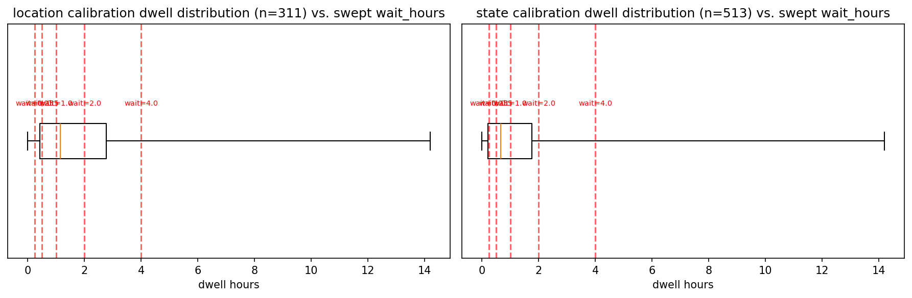

# Conformal coverage repair

**Question:** Does `conformal_decay_threshold` (a `DecayThreshold` variant
whose staleness threshold is split-conformal calibrated instead of hand-picked)
actually deliver its 1-alpha coverage guarantee once deployed?

**Setup:** Calibrate theta on the frozen scene's 4 train days, then check
realized coverage on the held-out eval day, at each of the 5 swept
`wait_hours` values (0.25h–4h), on both the location and state question
axes. Coverage means: among held-out historical dwell events the calibrated
theta would have judged "still trustworthy," what fraction actually stayed
that way at least that long.

## Headline numbers

Realized coverage against target 0.90 (alpha=0.1), after the Mondrian
per-wait-bucket calibration fix (the best version tried):

| axis     | wait=0.25h | wait=0.5h | wait=1.0h | wait=2.0h | wait=4.0h |
|----------|-----------|-----------|-----------|-----------|-----------|
| location | 0.896 (OK) | 0.688 | 0.562 | 0.415 | 0.143 |
| state    | 0.424 | 0.303 | 0.121 | 0.061 | 0.000 |

Only the shortest bucket (location, wait=0.25h) meets its target. Every
other cell misses, in several cases by more than 70 percentage points.

## Plot

Box plots of the natural historical dwell-time distribution used for
calibration, with the swept `wait_hours` values marked as red dashed lines.
Most of the calibration mass sits well to the left of the longer swept
waits — visual evidence for the covariate shift described below.

## What this means

The guarantee fails almost everywhere it is checked. The cause is a mismatch
between what calibration measures (validity at each historical event's own,
usually-short natural dwell time) and what deployment asks (validity at a
fixed, often much longer, wait_hours). Two plausible calibration-side fixes
were tried and ruled out: restricting calibration to only the categories
deployment actually asks about changed theta by under 0.001 (no effect);
adding the standard finite-sample quantile correction produced an identical
theta at this sample size. A proper group-conditional (Mondrian) recalibration
was implemented and tested — it recovers coverage only at the single shortest
bucket. The residual cause, confirmed directly by the kernel reliability
diagram (see `kernel_reliability.md`), is that the fitted TransitionKernel's
exponential-decay model does not match this scene's real dwell-time behavior:
it is under-confident at short horizons and over-confident at long ones on
the location axis, and over-confident at every horizon on the state axis.
No recalibration scheme fixes a threshold built on a model that doesn't
describe the process being queried.

## What is NOT yet supported by these numbers

- This is measured on one frozen scene. Whether the same miscalibration
  pattern (or its severity) holds on other scenes/profiles is unknown until
  the multi-scene pool lands.
- The Mondrian calibration code itself is verified correct (see its own
  unit tests) — the numbers above are not evidence the *code* is wrong, only
  that no calibration scheme can compensate for this kernel's model error.
- No alternative hazard model has been tried. This report does not claim a
  better-fitting model is easy, only that recalibrating the current one is
  not sufficient.

## Disposition

`conformal_decay_threshold` is dropped from E2's headline policy comparison.
The Mondrian calibration machinery is kept in the codebase for reuse against
a future, better-fitting hazard model.

**Traceability:** fingerprint `25e52eee014c3c72`, code_hash `05102535c7dbb01b`.
Full numbers: `../../CONFORMAL_COVERAGE_FINDING.md`. Underlying data:
`scripts/conformal_coverage_check.py` (rerun to reproduce).
