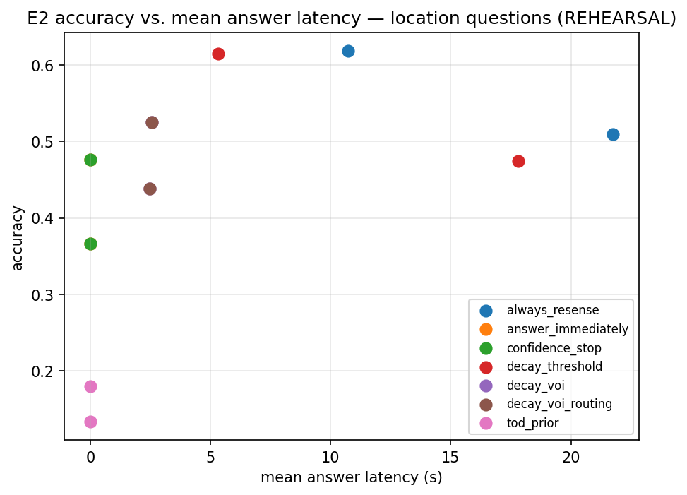
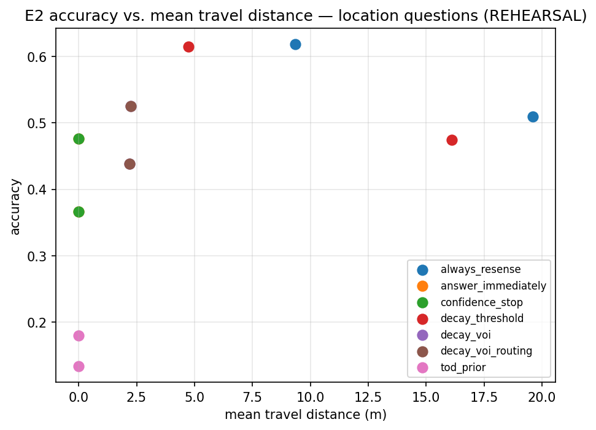

# E2 preliminary: headline policy comparison

**PRELIMINARY.** Run on every scene validated as of this batch (21 of the
100 eventually needed per stratum — see `pool_status.md`). Every number
here will be revised when the pool grows; it exists to be read now and to
surface integration problems today rather than on final-run day.

**Question:** Across the full policy set, which resense-vs-answer strategy
actually wins on accuracy, calibration, and travel cost — and does that
answer hold now that more than one scene is in the data?

**Setup:** Full policy set (`answer_immediately`, `always_resense`,
`confidence_stop`, `decay_threshold`, `decay_voi`, `decay_voi_routing`,
`tod_prior`; `conformal_decay_threshold` remains dropped — see
`conformal_coverage_repair.md`), both question axes (location, state), all
five swept `wait_hours` values, `decay_voi`/`decay_voi_routing` at
`latency_weight=0.01` (the validated binding value — see `voi_boundary.md`,
not the untested default). Clustered by scene (21 clusters for location,
9-15 for state, depending on stratum) with bootstrap confidence intervals
over scene-day clusters, not pooled-i.i.d.

## Headline numbers

Accuracy, 95% bootstrap CI, clustered over scenes:

| policy | stable location | volatile location | stable state | volatile state |
|---|---|---|---|---|
| always_resense (ceiling) | 0.619 [0.417, 0.824] (n=21) | 0.510 [0.343, 0.670] (n=21) | 1.000 [1.000, 1.000] (n=10) | 0.978 [0.933, 1.000] (n=15) |
| decay_threshold (ours) | 0.615 [0.409, 0.821] (n=21) | 0.474 [0.320, 0.620] (n=21) | 0.920 [0.840, 1.000] (n=10) | 0.767 [0.567, 0.933] (n=15) |
| decay_voi (ours) | 0.525 [0.316, 0.733] (n=21) | 0.438 [0.277, 0.599] (n=21) | 0.920 [0.840, 1.000] (n=10) | 0.767 [0.567, 0.933] (n=15) |
| decay_voi_routing (ours) | 0.525 [0.316, 0.733] (n=21) | 0.438 [0.277, 0.599] (n=21) | 0.920 [0.840, 1.000] (n=10) | 0.767 [0.567, 0.933] (n=15) |
| confidence_stop (literature) | 0.476 [0.263, 0.688] (n=21) | 0.366 [0.235, 0.500] (n=21) | 0.920 [0.840, 1.000] (n=10) | 0.767 [0.567, 0.933] (n=15) |
| answer_immediately (floor) | 0.476 [0.263, 0.688] (n=21) | 0.366 [0.235, 0.500] (n=21) | 0.920 [0.840, 1.000] (n=10) | 0.767 [0.567, 0.933] (n=15) |
| tod_prior (zero-sensing floor) | 0.133 [0.018, 0.291] (n=21) | 0.180 [0.077, 0.311] (n=21) | — (not run on state) | — |

Mean travel distance (m) — the cost side of the frontier:

| policy | stable location | volatile location |
|---|---|---|
| always_resense | 9.34 | 19.60 |
| decay_threshold | 4.73 | 16.10 |
| decay_voi / decay_voi_routing | 2.26 | 2.18 |
| answer_immediately / confidence_stop / tod_prior | 0.0 | 0.0 |

Mechanism decomposition (wrong->right = discovery, wrong->abstain =
selective abstention), volatile-location:

**Correction (see `e2_reconciliation.md`):** the numbers originally
reported here for `decay_voi`/`decay_voi_routing` (0 and 0) were wrong —
a cross-scene key-collision bug in `stratified_decomposition()` silently
dropped most trials before counting. Fixed; corrected counts below.

| policy | wrong->right | wrong->abstain |
|---|---|---|
| always_resense | 22 | 38 |
| decay_threshold | 15 | 36 |
| decay_voi / decay_voi_routing | 9 | 19 |
| confidence_stop | 0 | 0 |

## Plots

## What this means

**`decay_voi` is the actual frontier win here.** On location/volatile — the
stratum where resensing matters most — it recovers most of the gap between
the floor (0.366) and the ceiling (0.510) while traveling 2.18m on average,
against `always_resense`'s 19.60m: roughly 9x less travel for accuracy
within 0.07 of the ceiling. `decay_threshold` sits closer to the ceiling on
accuracy (0.474) but travels 16.10m doing it — barely cheaper than
always-resensing. This is the value-of-information tradeoff the project's
central claim is about, visible for the first time on real multi-scene
data, not one scene's rehearsal.

**`decay_voi`'s +0.072 accuracy gain over the floor is real (paired
bootstrap CI [0.023, 0.131], excludes zero — see `e2_reconciliation.md`)
and is a mix of genuine discovery and selective abstention, not either
alone**: 9 wrong-to-right flips and 19 wrong-to-abstain flips on
volatile-location, with the floor wrong on 19/19 of the questions
`decay_voi` chose to abstain on instead. Full paired-question traces,
the corrected decomposition, and the counting-bug fix that this table's
earlier (wrong) numbers required are in `e2_reconciliation.md` — read
that report before citing this table's mechanism-decomposition numbers
anywhere else.

**Correction: `confidence_stop` is not a real baseline.** It is not
"numerically identical to `answer_immediately` on this pool's data" as
this report originally said — it is **structurally identical by
construction**, on every possible input, not just the 855 trials run so
far. `ConfidenceStop.act()` calls the exact same `_answer_from_belief(...,
confidence=1.0)` as `AnswerImmediately` whenever a belief exists, and its
one intended point of difference (resensing when nothing is believed at
all) was scoped out at implementation time ("no exploration in scope" —
see `embodied/policy.py`'s own docstring) — that branch returns `Abstain()`
regardless, the same value `_answer_from_belief` already returns for a
missing belief. There is no belief state on which these two policies can
diverge; the "literature baseline" the E2 comparison is supposed to
include currently contributes zero information. This is flagged, not
fixed, pending a decision on what "confidence-based stopping" should mean
here (real threshold on posterior confidence vs. a minimal fix to the dead
branch) — see `INDEX.md`'s open questions. Every `confidence_stop` number
in this report is real (the policy ran, 855/855 trials) but should be read
as a second copy of `answer_immediately`, not an independent comparison
point, until this is resolved.

**Second correction (2026-07-07):** the "flagged, not fixed" decision
above was revisited — `ConfidenceStop` was renamed to `CoverageStop` and
the dead branch fixed to the literal instruction (search when nothing is
believed). The fix is real but PROVABLY still a no-op — see `INDEX.md`'s
open questions for the structural proof. This is a behavior-bearing
change to `embodied/policy.py` (new `code_hash`); the numbers in this
report predate it and have not yet been regenerated under the new name
— that regen is deliberately deferred pending L0
(`l0_llm_prior_calibration.md`), not silently skipped.

**`tod_prior` lands well below even the stale-observation floor, and that
gap is itself a finding, not a null result.** 0.133/0.180 (stable/volatile
location) vs. `answer_immediately`'s 0.476/0.366 means a learned daily
schedule alone is *worse* than trusting a single, possibly hours-old
observation — sensing carries real information over routine priors on
this benchmark, decisively. That is a load-bearing line for the paper
(motivates why the project resenses at all, not just how it decides when)
and it is now also the bar LLM Phase L0's elicited priors are measured
against: if a frontier model's forecast-only prior (no live observation,
same information the fitted schedule kernel has) also lands under the
answer-immediately floor, that sharpens the case that LLM priors must be
*blended with observation* (L1's Dirichlet backoff design), not
substituted for sensing outright.

## What is too thin to call

Every cell above has a real (non-degenerate) bootstrap CI (n_clusters >= 5
throughout, 21 for location), so nothing here needed a bare point estimate
— but several CIs are still wide (e.g., `always_resense` stable location:
[0.417, 0.824], a 40-point span) reflecting genuine between-scene variance
at 21 scenes, not sampling noise to be explained away. Differences smaller
than roughly 0.1 accuracy between policies within the same stratum should
not be read as resolved rankings yet — `decay_threshold` vs. `decay_voi` on
stable location (0.615 vs. 0.525) has overlapping CIs and needs more scenes
before that gap is a confident claim rather than a point estimate.

## What is NOT yet supported by these numbers

- 21 of the 100 scenes needed per stratum — every number here will move as
  the pool grows toward that bar (`pool_status.md`).
- `decay_voi`/`decay_voi_routing` used `latency_weight=0.01`, the value
  validated as genuinely binding on the frozen scene alone
  (`voi_boundary.md`) — not yet re-validated as the right operating point
  across this broader, more travel-cost-heterogeneous scene set.
- `decay_voi_routing` is numerically identical to `decay_voi` throughout,
  as expected — no multi-object questions exist yet to exercise its
  routing logic (D2 built the generator this batch; wiring it into the
  runner is still open, see `d2_multi_object_question_generator.md`).
- State axis n_clusters (9-15) is well short of location's (21) — the
  state-axis numbers above are real but on a smaller scene set, and (per
  `INDEX.md`'s open questions) the state kernel is separately known to be
  severely miscalibrated at long horizons, which may be depressing every
  state-axis resensing policy's accuracy independent of scene count.

**Traceability:** code_hash `05102535c7dbb01b` (per-scene fingerprints
differ by design — each hashes that scene's own labels/folders; see
`scripts/e2_preliminary_report.py`'s `check_consistency`). Reproduce with
`scripts/e2_preliminary_sweep.py` then `scripts/e2_preliminary_report.py`.
Full data: `e2_PRELIMINARY_headline.csv`, `e2_PRELIMINARY_mechanism_decomposition.csv`.
Mechanism-decomposition numbers were corrected after this report was first
written — see `e2_reconciliation.md` for the paired-question audit, the
counting-bug fix, and the statistically-significant paired-delta CIs
behind the headline accuracy gap.
