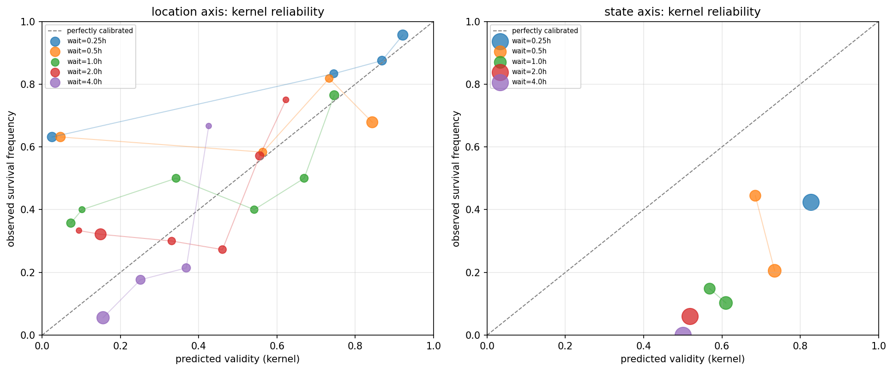

# Kernel reliability diagram

**Question:** When the fitted belief kernel predicts a validity (survival)
probability, how often is it actually right? This turns "the kernel is
probably misspecified" (an inference from the conformal coverage collapse)
into a direct measurement.

**Setup:** For every held-out (eval-day) historical dwell event, compute the
kernel's predicted validity at each swept `wait_hours` value, bin by
predicted value, and compare against the empirical fraction of events that
actually survived that long — the standard reliability-diagram construction
(predicted probability vs. observed frequency; a perfectly calibrated model
lies on the y=x diagonal).

## Headline numbers

Selected bins (full table: `kernel_reliability.csv`):

| axis     | wait  | predicted validity | observed survival | n  | direction |
|----------|-------|--------------------|--------------------|----|-----------|
| location | 0.25h | 0.025              | 0.632              | 19 | under-confident |
| location | 0.25h | 0.921              | 0.957              | 23 | ~calibrated |
| location | 4.0h  | 0.156              | 0.056              | 36 | over-confident |
| location | 4.0h  | 0.368              | 0.214              | 14 | over-confident |
| state    | 0.25h | 0.827              | 0.424              | 66 | over-confident |
| state    | 4.0h  | 0.501              | 0.000              | 66 | over-confident |

## Plot

Each point is one predicted-validity bin; point size scales with the number
of held-out events in that bin. The gray dashed line is perfect calibration.

## What this means

Location's kernel flips miscalibration direction with horizon: at short
waits it under-predicts survival (predicts near-zero chance, but most
objects are still where they were), and at long waits it over-predicts
survival (predicts noticeable chance, but almost nothing actually survived
that long). No single threshold can be right in both regimes at once — this
is the direct mechanism behind the conformal coverage collapse, not merely
correlated with it.

State's kernel is over-confident at every horizon measured, and severely so
at the long end: at wait=4h it predicts a coin flip's worth of survival
confidence (0.501) when the true rate in 66 held-out events was exactly
zero. This is more severe than location's miscalibration and matches the
earlier finding that state coverage misses even at the shortest wait_hours,
where location was still fine.

## What is NOT yet supported by these numbers

- The mechanism is *measured* for this one frozen scene only. Whether the
  under/over-confidence split-by-horizon pattern (location) or the
  uniformly-over-confident pattern (state) generalizes to other scenes is
  unknown.
- This diagram does not identify *which* modeling assumption is wrong
  (memorylessness, the dest_dist shape, the pooled/shrunk lambda estimate,
  or something else) — it measures that the model is wrong and by how much,
  not why.
- No corrected model has been fit or checked against this diagram yet.

**Traceability:** fingerprint `25e52eee014c3c72`, code_hash
`05102535c7dbb01b`. Reproduce with
`python3 scripts/kernel_reliability_diagram.py`. Full data:
`kernel_reliability.csv`.
