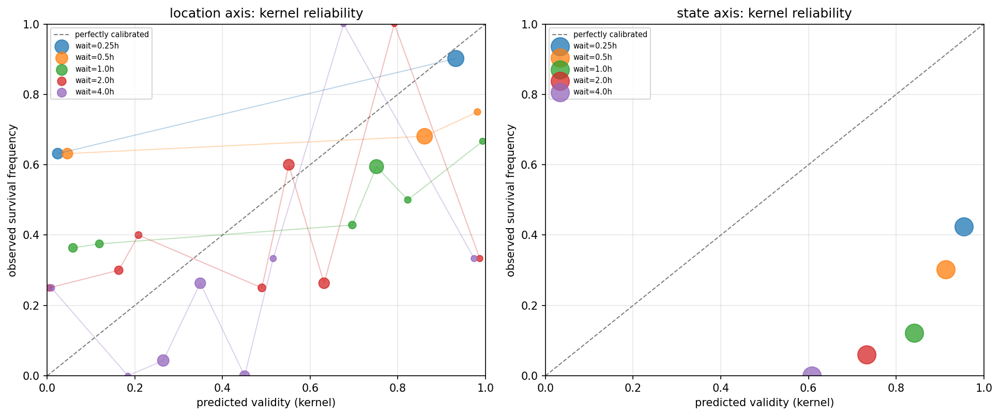
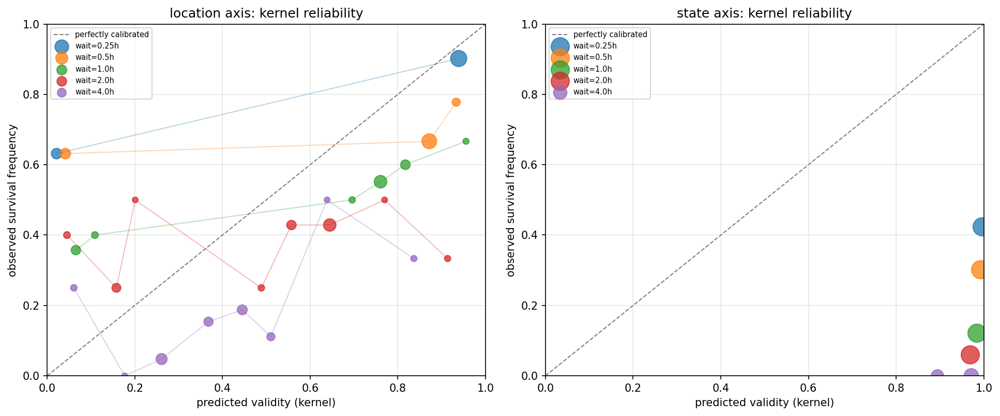

# L0 rerun: a clean fitted-kernel-vs-cross-family-LLM comparison

**VERDICT: Worse everywhere, and this time the comparison is clean.** The
fitted TransitionKernel beats every (model, mode) combination on the
location prior (Brier 0.787 vs. best clean cross-family result 0.907,
Phi-3/verbalized) and every combination on the state-axis long-horizon
cell, where it is not close (fitted: 50% predicted vs. 0% observed;
cross-family Phi-3: 54-97% predicted vs. 0% observed, depending on mode).
This is the same qualitative verdict as v1, but v1's verdict was not
trustworthy — three stacked confounds meant no real conclusion about LLM
priors was possible from it. All three are removed here; the verdict
survives.

**`l0_llm_prior_calibration.md` is SUPERSEDED by this report.** Keep it
only as the record of the three infrastructure bugs it found and fixed
(Qwen3 thinking-mode budget consumption, `verbalized()` bypassing the
chat template, location targets never getting a dynamics elicitation) —
those fixes are real and carried forward unchanged. Its verdict line and
headline numbers are not to be cited; they were computed under a
confounded elicitation.

## The three confounds, and how each was removed

**1. Room-inventory prompt omitted the categories being asked about.**
`env.inventory.inventory_for_generation` only tracks Tier-1 furniture and
assumed Tier-3 mobile items — never Tier-2b clutter (book, candle, cup,
...), which is most of what the 36 location targets ask about. v1's
prompt never told a model these categories existed in the household at
all. Verified directly in v1's transcripts: Mistral's own verbalized
reasoning cited "not mentioned in the provided room inventory" before
returning 100% OUTSIDE or an all-zero (unparseable) distribution.

*Fix:* `llm_prior/targets.py`'s `render_room_inventory` gained a
`known_categories` parameter — every location-axis category from
`enumerate_targets` is now listed as "Also present somewhere in the
household (exact current location not tracked here): book, bowl, candle,
cup, vase" (categories already in the furniture census, like keys/phone,
are not duplicated). This is standing category-presence inventory — what
a robot already knows exists in the home after a patrol — never a
location or a transition, which would be the actual leak. Verified fixed,
not just assumed: Phi-3's post-fix verbalized responses for "book" are
now real, non-degenerate distributions spread across every slot (e.g.
`{"bedroom": 0.15, "bedroom.bed": 0.25, ..., "OUTSIDE": 0.3}`), not the
100%-OUTSIDE or all-zero pattern v1 showed for the same category.
`PROMPT_VERSION` bumped `l0-v1` -> `l0-v2` (this is a real prompt content
change, invalidating every v1 cache entry per L0's own "prompt template
change = code change" rule).

**2. Cross-family model was undersized and non-reasoning.**
Mistral-7B-Instruct-v0.3 is smaller (7B vs. Qwen's 14B) and an older,
non-reasoning model — "cross-family fails" was confounded with
"undersized model fails," and no conclusion about cross-family priors
specifically was possible.

*Fix:* replaced with `microsoft/Phi-3-medium-4k-instruct` (14B) —
Microsoft lineage (genuinely different from both Qwen/Alibaba and
Mistral AI), matching Qwen's own parameter count almost exactly rather
than just picking a bigger model in the family already tested. Ungated
on the HF Hub, ordinary (non-thinking) chat template, verified via smoke
test before the real run.

**3. Same-family model is the literal generator.** Unchanged from v1,
correctly flagged there and kept the same way here: Qwen3-14B-AWQ is not
merely "same lineage" — it is the exact model
`scripts/expand_scene_pool.py` used to generate every pool scene's
ground truth. Qwen's numbers below are labeled **CONTAMINATED-REFERENCE**
throughout and are not the headline comparison; they exist only to size
the contamination gap against the clean cross-family (Phi-3) result.

## Setup

Unchanged from v1 except the two fixes above: frozen scene
(102343992_family_with_kids) only, 42 elicitation targets (36 location,
6 state), three elicitation modes each, `k=20` for sample_count,
temperature=0 and fixed seed everywhere a mode allows it. Both models
share `code_hash=712b6c47dd16bb4b`, `prompt_version=l0-v2`. 0 parse
failures across every (model, mode) combination this time (v1 had
6/36 for Mistral's verbalized mode, from the same inventory confound).

## Headline numbers

### Location prior — Brier score against empirical train-split frequency (lower is better)

| model | mode | Brier | n | status |
|---|---|---|---|---|
| **fitted kernel (reference)** | — | **0.787** | 36 | — |
| Phi-3 (clean cross-family) | verbalized | 0.907 | 36 | clean |
| uniform guessing (baseline) | — | 0.885 | 36 | — |
| Qwen | verbalized | 0.841 | 36 | CONTAMINATED-REFERENCE |
| Phi-3 (clean cross-family) | mcq_logprob | 1.269 | 36 | clean |
| Phi-3 (clean cross-family) | sample_count | 1.366 | 36 | clean |
| Qwen | mcq_logprob | 1.510 | 36 | CONTAMINATED-REFERENCE |
| Qwen | sample_count | 1.566 | 36 | CONTAMINATED-REFERENCE |

The clean comparison is fitted-kernel (0.787) vs. best-clean-cross-family
(Phi-3/verbalized, 0.907) — the fitted kernel still wins, by a wider
margin than v1's confounded 0.787-vs-0.852 gap. Phi-3's mcq_logprob
(1.269) is notably better than Qwen's own mcq_logprob (1.510) or v1's
Mistral mcq_logprob (1.445) — Phi-3 handles the MCQ-letter format more
informatively than either previous model, even though verbalized remains
the best mode for everyone. Qwen (contaminated) moved only slightly with
the inventory fix (0.852 -> 0.841) — the fix mattered much more for the
model that was actually producing the "not in inventory" reasoning
(Mistral, v1) than for Qwen, which is worth noting as a data point against
over-crediting the inventory fix alone for the entire location-prior gap.

### State axis, wait=4h — the cell L0 exists to check (fitted kernel: 50.1% predicted vs. 0% observed, n=66)

| model | mode | predicted survival | observed | status |
|---|---|---|---|---|
| **fitted kernel (reference)** | — | **50.1%** | 0% | — |
| Qwen | mcq_logprob | 50.5% | 0% | CONTAMINATED-REFERENCE |
| Qwen | sample_count | 50.5% | 0% | CONTAMINATED-REFERENCE |
| Qwen | verbalized | 60.8% | 0% | CONTAMINATED-REFERENCE |
| Phi-3 (clean cross-family) | mcq_logprob | 54-67% (binned) | 0% | clean |
| Phi-3 (clean cross-family) | sample_count | 61-70% (binned) | 0% | clean |
| Phi-3 (clean cross-family) | verbalized | 89-97% (binned) | 0% | clean |

**This survives the clean rerun, unambiguously — it is not a close
call.** The object's state changes within 4 hours in every one of 66
held-out instances; every model, every mode, predicts substantial
survival probability anyway. Phi-3 (the clean, size-matched,
genuinely-different-lineage peer) is not better than contaminated Qwen
here — its verbalized mode is dramatically worse (89-97% vs. Qwen's
50-61%), the single most confident wrong prediction in the whole table.

**Interpretation, per the guardrail this batch was given:** frame this as
long-horizon state being irreducibly observational, not as "LLMs are bad
at state." Whether a TV is still on 4 hours after being turned on depends
on what a specific resident did in the meantime — information no prior,
fitted or elicited, can recover without looking. This argues for the
resense loop's necessity at long horizons, not against the LLM prior's
competence. It is also consistent with (not contradicted by) the
location-axis result, where fixed structure (furniture layout, routine)
gives a prior something real to grab onto and the LLM comparison is at
least in the same neighborhood as the fitted kernel.

## Plots

Same `bin_reliability`/`write_plot` reuse as v1 — unchanged code, new data.

## What this means

With the confounds removed, the result holds: a fitted TransitionKernel,
built from four days of the same household's own observed transitions,
beats a 14B-class LLM's elicited prior on both axes tested, including the
clean cross-family case. This is not a claim that LLMs cannot help here —
it is a measurement that the three most obvious ways of asking (MCQ
logprobs, direct verbalized probabilities, empirical sampling), on the
household context actually available at elicitation time, do not on their
own beat a small amount of real per-household observation. This continues
to motivate L1's actual design (a Dirichlet pseudo-count blend into the
existing backoff hierarchy, weighted by how much either source should be
trusted) rather than a substitution of either source for the other — the
gate to L1 (this report's existence + E4's perturbation-sweep tolerance
curve) is unaffected by this rerun and remains open.

## What is too thin to call

- One scene, same caveat as v1 — not a blocker for the clean methodology,
  but a real scope limit. A second scene is future scale-up work, not
  something this rerun claims to have covered.
- Whether Phi-3's specific weaknesses (verbalized-mode overconfidence on
  the state axis) generalize to other 14B-class cross-family models, or
  are Phi-3-specific, is not established by a single cross-family model.

## What is NOT yet supported by these numbers

- L1's gate (E4's perturbation-sweep tolerance curve) is not evaluated
  here.
- No hosted frontier model was used — this environment has no API keys
  for any hosted provider (unchanged from v1). Phi-3 ran locally via the
  identical vLLM path as Qwen.
- `budget_matched_random`'s calibration and the E0-E2 regen for
  `CoverageStop` are unrelated, separate work streams proceeding on their
  own clock — not part of this report and not blocked by it.

**Traceability:** `code_hash=712b6c47dd16bb4b`, `prompt_version=l0-v2`
(both manifests agree). Reproduce with `llm_prior/elicit.py --model
{qwen,phi3}` then `llm_prior/report.py`. Manifests:
`results/reports/l0_manifests/l0_manifest_{qwen,phi3}.json`. Scores:
`results/reports/l0_scores_{qwen,phi3}.json`.
