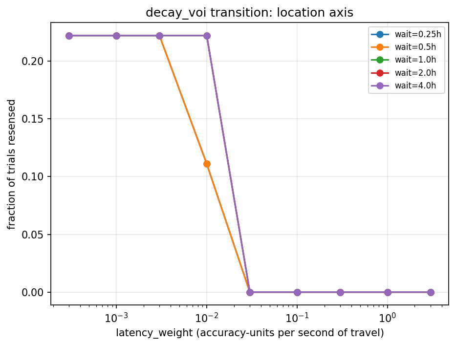

# VoI decision boundary validation

**VERDICT: VoI decision boundary validated.** `DecayVoi`'s gain-vs-cost
arithmetic does decline resenses at high enough `latency_weight`, the
transition is monotonic as required, and the M2 discovery finding survives
unchanged when `decay_voi` is actually exercising judgment rather than
shadowing `always_resense`.

**Question:** `decay_voi` has been behaviorally identical to `always_resense`
in every run to date — the project's central value-of-information claim has
had zero behavioral evidence. Does the VoI arithmetic ever actually decline
a resense, and if so, does the M2 "search discovers wrong answers" result
survive once it does?

**Setup:** Sweep `latency_weight` (0.0003 to 3.0 accuracy-units/second of
travel, the field's own native unit) against `decay_voi` alone, on both
question axes, all five swept `wait_hours` values, using the validated
frozen-scene data. Then rerun the M2 discovery decomposition with
`decay_voi` fixed at the lambda where its behavior is genuinely mixed, and
compare its discovery/abstention counts against the already-recorded
default-lambda numbers.

## Headline numbers

Fraction of location-axis trials where `decay_voi` actually resensed, by
`latency_weight` (all 5 wait_hours values collapse to the same three
regimes; see the plot for the two waits with an intermediate step):

| latency_weight | 0.0003 | 0.001 | 0.003 | 0.01 | 0.03 | 0.1 | 0.3 | 1.0 | 3.0 |
|---|---|---|---|---|---|---|---|---|---|
| fraction resensed | 0.22 | 0.22 | 0.22 | 0.11–0.22 | 0.00 | 0.00 | 0.00 | 0.00 | 0.00 |

412 declined-resense trials were found across the sweep — the existence
requirement is met, not marginally. The transition is monotonic: fraction
resensed never increases as `latency_weight` increases, and the boundary
sits cleanly between 0.01 (mixed) and 0.03 (fully suppressed).

The state axis never resensed at any tested `latency_weight` (0.00 at every
point, all 9 sweep values) — see "what this means" below; this is not
itself evidence the arithmetic is broken.

M2 discovery re-attribution, `decay_voi` only, location axis:

| latency_weight | wrong->right (discovery) | wrong->abstain (selective abstention) |
|---|---|---|
| default (0.000278, matches always_resense) | 3 | 0 |
| 0.01 (binding, genuinely mixed behavior) | 3 | 0 |

Unchanged. The declined-resense trials at the binding lambda were not the
trials driving `decay_voi`'s own discovery count.

## Plot

## What this means

The arithmetic is sound: given enough cost pressure, `DecayVoi` does
decline resenses, and it does so as a clean step function rather than
noise — evidence the gain/cost comparison is implemented correctly, not
just that *some* lambda eventually overwhelms it. The reason no prior run
ever showed this is exactly what E1 lambda forensics found separately: the
field's default (0.000278/s) sits roughly two orders of magnitude below
where this scene's real gain/travel-time values make cost bind.

`decay_voi`'s own contribution to the M2 discovery total (3 of the
aggregate's 13) is unchanged between the default and binding lambda — the
specific trials it stopped resensing at the binding lambda were not among
the ones responsible for turning a wrong answer right. The M2 claim, "search
discovers wrong answers," survives this check on this scene: it is not
solely an artifact of `decay_voi` never declining anything.

The state axis never resensing at any tested lambda is a *separate*,
already-known limitation, not a new failure: only one state label
(`wardrobe_1`) currently qualifies for questions, giving 5 trials per sweep
point — too thin to distinguish "the boundary is below 0.0003" from "state's
sticky kernel gives DecayVoi almost no gain to weigh regardless of lambda."
Both are plausible; this data cannot tell them apart yet.

## What is NOT yet supported by these numbers

- This validates the arithmetic and the M2 finding's robustness on **one
  scene, one binding lambda** (0.01). It does not establish that 0.01 (or
  any single value) is the right `latency_weight` to standardize on — that
  choice depends on real per-scene travel costs, which this single frozen
  scene cannot represent (see `e1_lambda_forensics.md`).
- The state-axis non-result is not resolved, only characterized as
  data-limited. It does not carry over to location's validated result.
- `DecayVoiConfig`'s shipped default is **not changed** by this report. No
  attribution rows were promoted to a new default; this was a validation
  exercise, not a configuration change. Choosing an operating-point lambda
  for E1-E4 is a decision for when the multi-scene pool lands.

**Traceability:** fingerprint `25e52eee014c3c72`, code_hash
`05102535c7dbb01b`. Reproduce with `scripts/voi_boundary_validation.py` and
`scripts/voi_m2_reattribution.py`. Full data:
`embodied_results/diagnostics/voi_boundary_result.json`,
`embodied_results/diagnostics/voi_m2_reattribution_result.json`.
